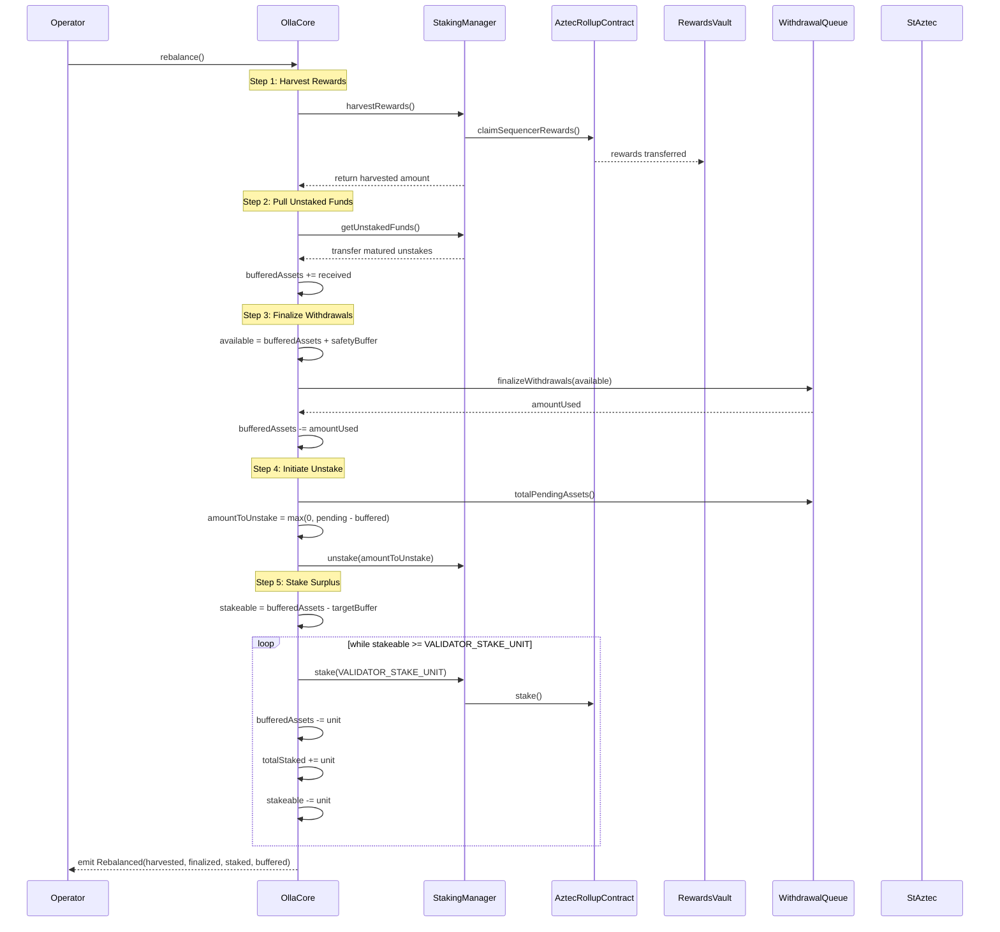

# Rebalance Flow Implementation Plan

This plan covers issues #62, #63, #64, #65, #66 for implementing the complete `rebalance()` flow in OllaCore.

## Overview

The `rebalance()` function is the core operational flow that optimizes capital allocation within the Olla protocol. It orchestrates five key steps:

1. **Harvest Rewards** - Claims sequencer rewards from the AztecRollup
2. **Pull Unstaked Funds** - Retrieves matured unstakes from StakingManager
3. **Finalize Withdrawals** - Processes pending user withdrawal requests using available liquidity
4. **Initiate Unstake** - Initiates rollup withdrawals for remaining shortfall
5. **Stake Surplus** - Stakes excess buffered assets above the target buffer

**Source of truth**: 
- `research/technical/architecture/flows.md` - Sequence diagrams
- `research/technical/architecture/components/olla-core.md` - Component spec
- `research/technical/architecture/milestones.md` - Milestone 8 (Rebalance Logic)

## Phase Summary

| Phase | Issue | Scope |
|-------|-------|-------|
| [Phase 1](./rebalance-phase1-harvest.md) | #64 | Harvest rewards step implementation |
| [Phase 2](./rebalance-phase2-pull-unstaked.md) | #63 | Pull unstaked funds step implementation |
| [Phase 3](./rebalance-phase3-finalize.md) | #66 | Finalize withdrawals step implementation |
| [Phase 4](./rebalance-phase4-unstake.md) | #159 | Initiate unstake step implementation |
| [Phase 5](./rebalance-phase5-stake-surplus.md) | #65 | Stake surplus step implementation |
| [Phase 6](./rebalance-phase6-integration.md) | #62 | End-to-end integration with summary event |

## Repo Status (based on current contracts)

- Phase 1: complete (harvest hook, `RewardsDelta` event, and rebalance tests in place).
- Phase 2: not started in OllaCore (StakingManager `getUnstakedFunds()` exists; core hook missing).
- Phase 3: partially complete (external `finalizeWithdrawals()` implemented; no `_finalizeWithdrawals()` hook and not wired into `rebalance()`).
- Phase 4: not started in OllaCore (no unstake initiation hook or event).
- Phase 5: not started (no `targetBuffer`, `VALIDATOR_STAKE_UNIT`, or `_stakeSurplus()` in OllaCore).
- Phase 6: not started (rebalance still stubbed, no integration tests).

## Architecture Context



## Key Interfaces

### StakingManager (IStakingManager.sol)

| Function | Returns | Description |
|----------|---------|-------------|
| `harvestRewards()` | `uint256 harvested` | Claims sequencer rewards to RewardsVault |
| `getUnstakedFunds()` | `uint256 received` | Claims matured unstakes to core |
| `stake(uint256 amount)` | - | Stakes assets using queued validator keys |
| `totalStaked()` | `uint256` | Current staked principal |

### WithdrawalQueue (IWithdrawalQueue.sol)

| Function | Arguments | Returns | Description |
|----------|-----------|---------|-------------|
| `finalizeWithdrawals(uint256 availableAssets)` | `availableAssets` | `uint256 usedAssets` | FIFO finalization based on liquidity |
| `previewFinalizeWithdrawals(uint256 available)` | `available` | `uint256 used` | Preview amount that would be used |
| `totalPendingAssets()` | - | `uint256` | Total assets in pending queue |

## Files to Create/Modify

### Modify

| File | Description |
|------|-------------|
| `contracts/src/core/OllaCore.sol` | Implement full `rebalance()` function and helper functions |
| `contracts/src/core/interfaces/IOllaCore.sol` | Update `Rebalanced` event signature |

### Test Files

| File | Description |
|------|-------------|
| `contracts/test/core/OllaCoreRebalance.t.sol` | Unit tests for rebalance steps |
| `contracts/test/integration/RebalanceIntegration.t.sol` | Integration tests for full flow |

## New State Variables Required

In `OllaCore.sol`:

```solidity
/// @notice Target buffer amount to keep liquid for withdrawals
uint256 public targetBuffer;

/// @notice The validator stake unit (typically 32 ETH equivalent)
uint256 public constant VALIDATOR_STAKE_UNIT = 32 ether;
```

## New Events

In `IOllaCore.sol`, update the existing `Rebalanced` event:

```solidity
/// @notice Emitted when a rebalance operation completes.
/// @param harvestedAmount Amount of rewards harvested.
/// @param finalizedAmount Amount of assets used for withdrawal finalization.
/// @param stakedAmount Amount of assets staked.
/// @param resultingBuffer Final buffered assets after rebalance.
event Rebalanced(
    uint256 harvestedAmount,
    uint256 finalizedAmount, 
    uint256 stakedAmount,
    uint256 resultingBuffer
);

/// @notice Emitted when unstaked funds are claimed.
/// @param amount The amount of unstaked funds received.
event UnstakedFundsClaimed(uint256 amount);

/// @notice Emitted when rewards are harvested during rebalance.
/// @param amount The amount of rewards harvested.
event RewardsHarvested(uint256 amount);
```

## New Errors

```solidity
/// @notice Thrown when target buffer is not set.
error OllaCore__ZeroTargetBuffer();

/// @notice Thrown when stake operation fails.
error OllaCore__StakeFailed(uint256 amount);
```

## Verification

```bash
# Run rebalance-specific tests
forge test --match-contract OllaCoreRebalanceTest -vvv

# Run integration tests
forge test --match-contract RebalanceIntegrationTest -vvv

# Check coverage
forge coverage --match-contract Rebalance
```

## Dependencies

- `StakingManager.getUnstakedFunds()` must be implemented (returns unstaked funds to caller)
- `StakingManager.harvestRewards()` must be implemented
- `WithdrawalQueue.finalizeWithdrawals()` must be implemented
- `SafetyModule` checks for queue ratio and rate drops

## Notes

1. **Order is critical**: Harvest → Pull unstaked → Finalize withdrawals → Initiate unstake → Stake surplus
2. **Withdrawals prioritized**: User withdrawals must be processed before staking surplus
3. **Idempotency**: The rebalance function should be idempotent when called repeatedly without state changes
4. **Safety checks**: All external calls should respect the `whenNotPaused` modifier and use `nonReentrant`
