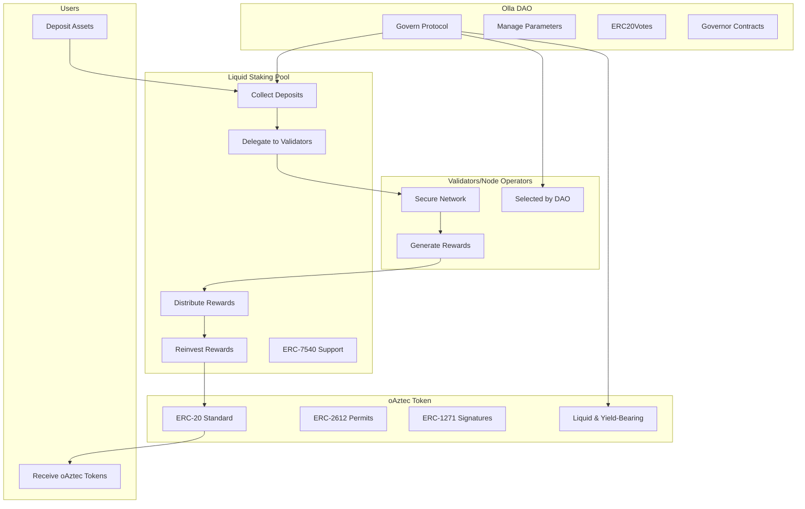

# Olla

*Pronounced O-Ya*

The Liquid staking protocol on Aztec network

## Overview

Olla enables decentralized staking with liquid tokens, automatic delegation, compounding, and reward tracking.

## Architecture

## Components

### Liquid Staking Pool

Collects deposits, delegates to validators, distributes and reinvests rewards. Supports ERC-7540 for async deposits/redemptions.

### oAztec Token

Yield-bearing ERC-20 tokens representing staked positions. Supports ERC-2612 and ERC-1271 for approvals and signatures.

### Olla DAO

Governs protocol parameters, validator selection, and upgrades. Uses ERC20Votes and Governor for on-chain voting.

### Node Operators

Run validators, secure network, generate rewards. Monitored by DAO for performance.

