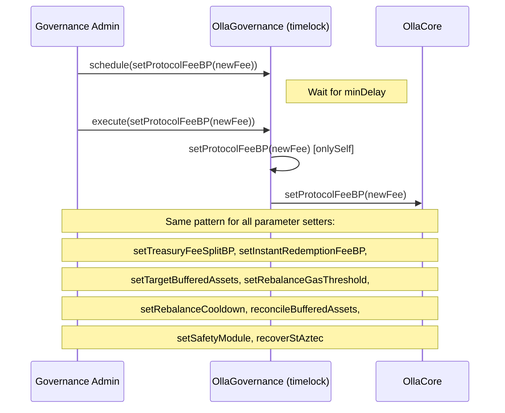
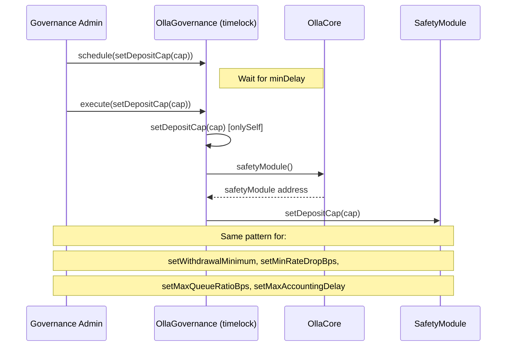
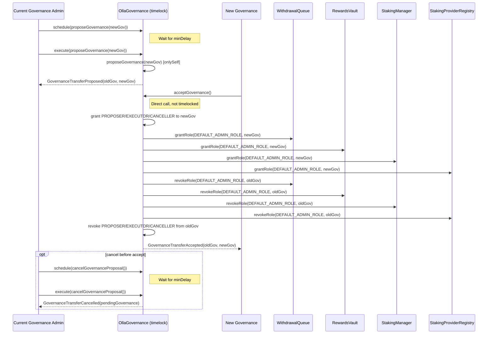
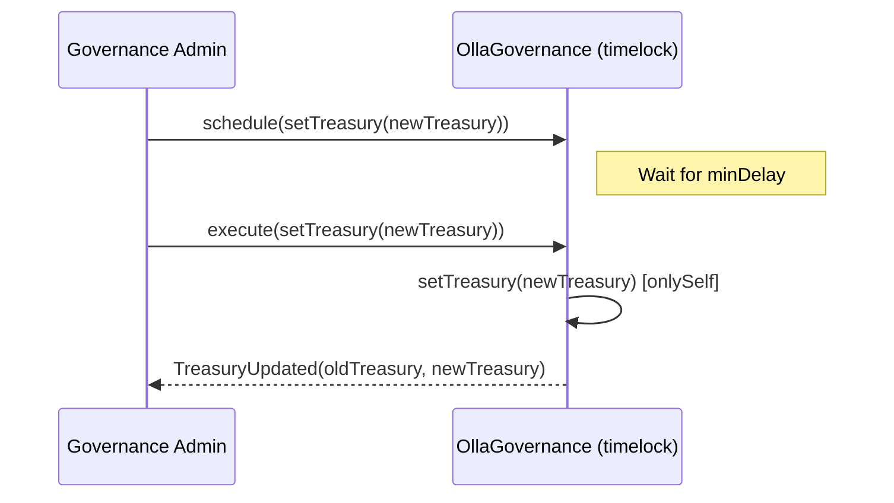
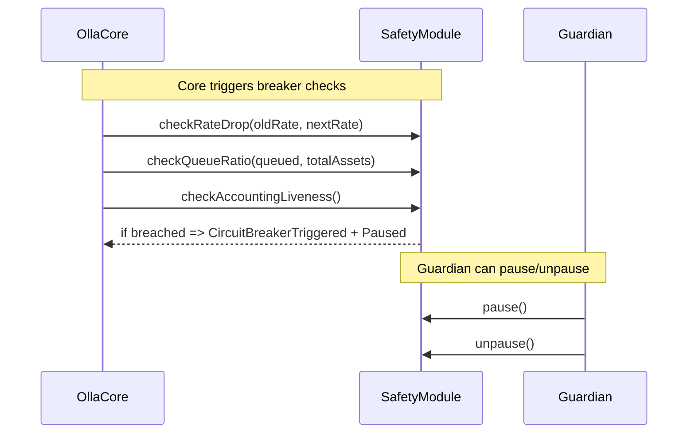
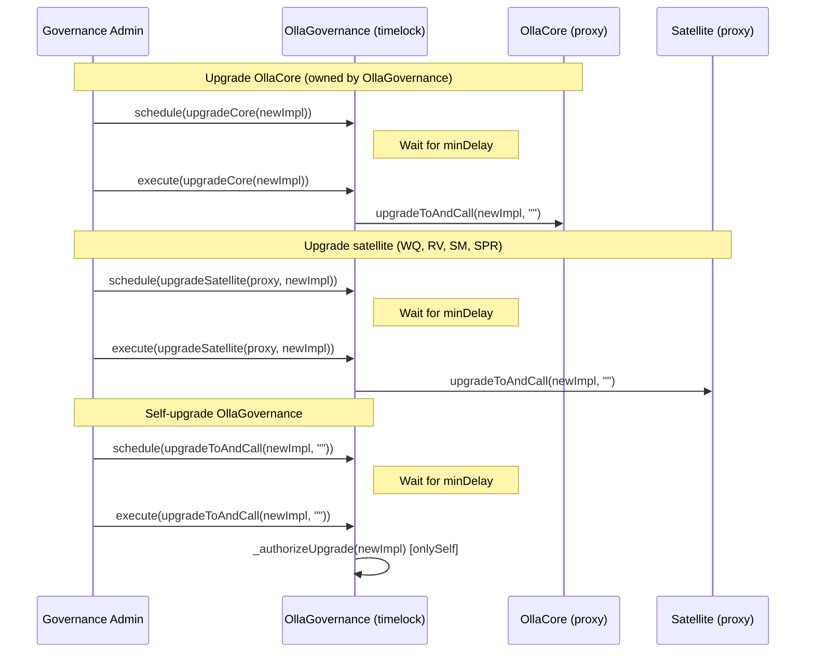

# Governance actions

This document summarizes governance and admin flows in Olla Core. All governance actions flow through the `OllaGovernance` contract, which inherits `TimelockControllerUpgradeable`. Actions must be scheduled, wait for the timelock delay, and then executed.

## Configuration

All parameter changes are timelocked passthroughs: `OllaGovernance` receives the call via timelock execute and forwards it to `OllaCore`.

## Safety module configuration

Safety module parameters are also timelocked passthroughs. `OllaGovernance` reads the safety module address from `OllaCore` and calls it directly.

## Governance transfer (two-step)

Governance transfer is initiated via the timelock but accepted directly by the new governance address. On acceptance, `OllaGovernance` atomically transfers timelock roles (proposer/executor/canceller) and propagates `DEFAULT_ADMIN_ROLE` changes to all satellite contracts.

## Treasury management

The treasury address (where instant redemption fees are sent) is managed by `OllaGovernance` via the timelock.

## Safety module circuit breaker

The safety module circuit breaker is triggered automatically by OllaCore during operations. The guardian can pause/unpause directly.

## Upgrades

All contract upgrades are timelocked. `OllaGovernance` has dedicated functions for upgrading OllaCore, satellite contracts, and itself.

