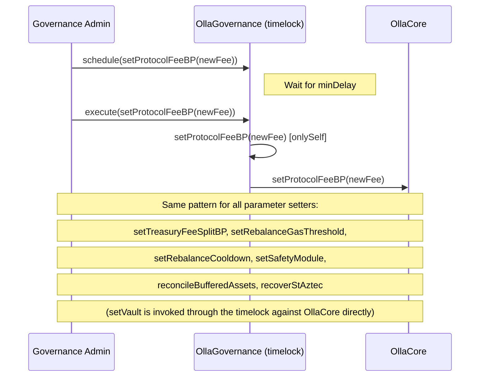
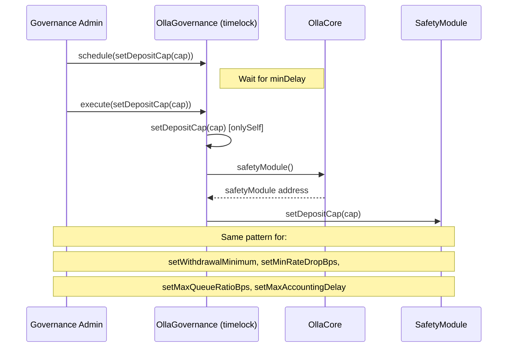
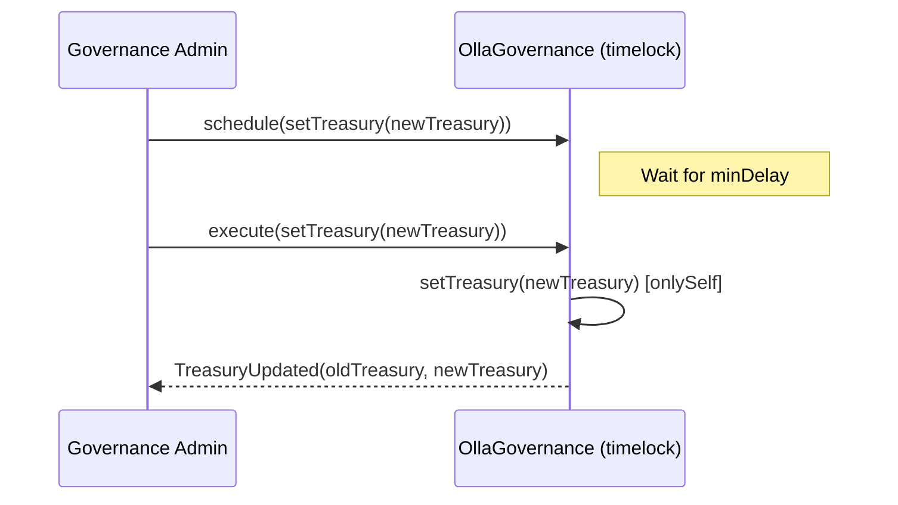
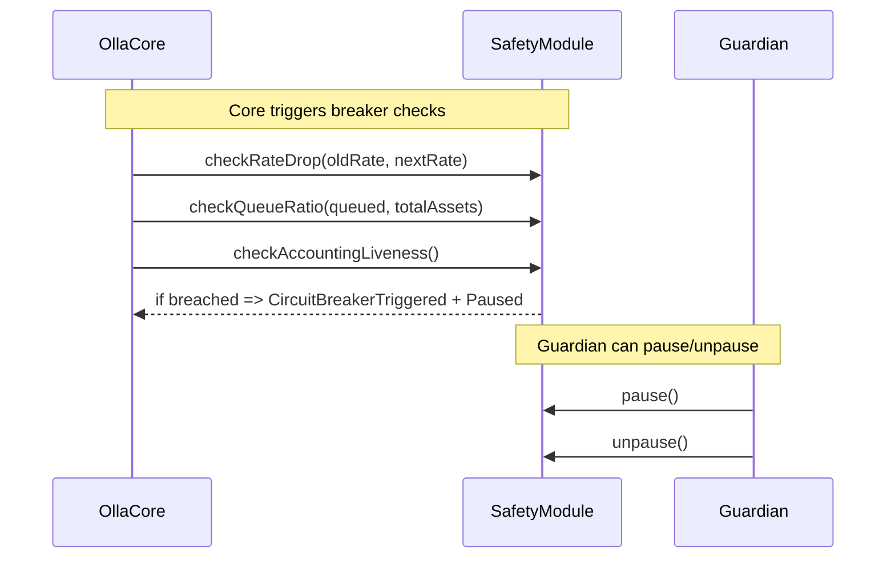
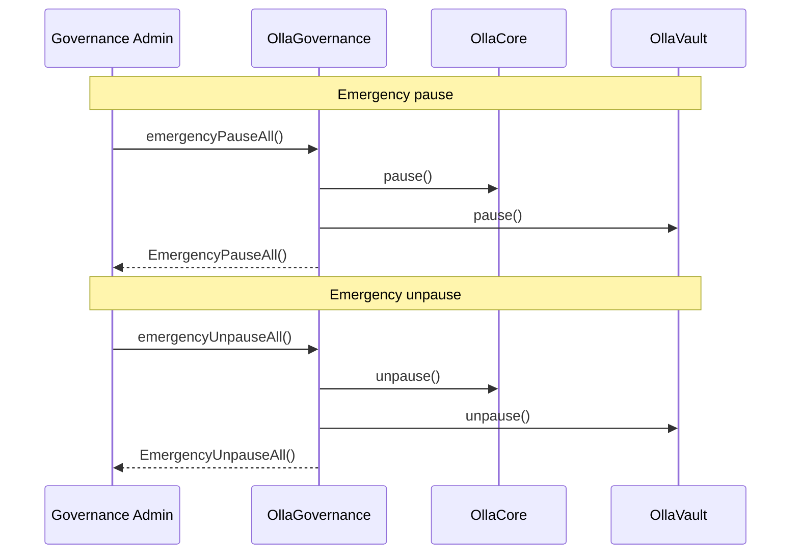

# Governance actions

This document summarizes governance and admin flows in Olla Core. All governance actions flow through the `OllaGovernance` contract, which inherits `TimelockControllerUpgradeable`. Actions must be scheduled, wait for the timelock delay, and then executed.

## Configuration

All parameter changes are timelocked passthroughs: `OllaGovernance` receives the call via timelock execute and forwards it to `OllaCore`.



## Safety module configuration

Safety module parameters are also timelocked passthroughs. `OllaGovernance` reads the safety module address from `OllaCore` and calls it directly.



## Governance transfer (two-step)

Governance transfer is initiated via the timelock but accepted directly by the new governance address. On acceptance, `OllaGovernance` atomically transfers timelock roles (proposer/executor/canceller) and `DEFAULT_ADMIN_ROLE` from the old governance admin to the new one.

The `OllaGovernance` *contract address itself* is the `DEFAULT_ADMIN_ROLE` holder on every satellite (`OllaCore`, `OllaVault`, `SafetyModule`, `RewardsAccumulator`, `StakingManager`, `StakingProviderRegistry`). Because the contract address does not change when the governance admin wallet is rotated, no per-satellite role propagation is needed; the new governance admin steers those roles by scheduling timelock actions on `OllaGovernance`, which holds them on every satellite.

```mermaid
sequenceDiagram
    participant GOV as Current Governance Admin
    participant OG as OllaGovernance (timelock)
    participant NEW as New Governance Admin

    GOV->>OG: schedule(proposeGovernance(newGov))
    Note right of OG: Wait for minDelay
    GOV->>OG: execute(proposeGovernance(newGov))
    OG->>OG: proposeGovernance(newGov) [onlySelf]
    OG-->>GOV: GovernanceTransferProposed(oldGov, newGov)

    NEW->>OG: acceptGovernance()
    Note right of OG: Direct call, not timelocked
    OG->>OG: grant PROPOSER/EXECUTOR/CANCELLER/DEFAULT_ADMIN_ROLE to newGov
    OG->>OG: revoke PROPOSER/EXECUTOR/CANCELLER/DEFAULT_ADMIN_ROLE from oldGov
    OG->>OG: governanceAdmin = newGov
    OG-->>NEW: GovernanceTransferAccepted(oldGov, newGov)
    Note right of OG: Satellites are unaffected; OllaGovernance itself remains their admin

    opt cancel before accept
        GOV->>OG: schedule(cancelGovernanceProposal())
        Note right of OG: Wait for minDelay
        GOV->>OG: execute(cancelGovernanceProposal())
        OG-->>GOV: GovernanceTransferCancelled(pendingGovernance)
    end
```

## Treasury management

The treasury address is managed by `OllaGovernance` via the timelock. The treasury receives the treasury share of protocol fees minted on each accounting update.



## Safety module circuit breaker

The safety module circuit breaker is triggered automatically by OllaCore during operations. The configured guardian wallet can pause/unpause the SafetyModule directly. This path is not timelocked.



## Emergency pause / unpause

The governance admin can pause or unpause both `OllaCore` and `OllaVault` in a single call. These functions are **not timelocked** -- they are callable directly by the governance admin for rapid incident response. This works because `OllaGovernance` holds `GUARDIAN_ROLE` on `OllaCore` and `OllaVault` in the default deployment.



## Upgrades

All contract upgrades are timelocked. `OllaGovernance` has dedicated functions for upgrading OllaCore, satellite contracts, and itself.

```mermaid
sequenceDiagram
    participant GOV as Governance Admin
    participant OG as OllaGovernance (timelock)
    participant C as OllaCore (proxy)
    participant SAT as Satellite (proxy)

    Note over GOV,C: Upgrade OllaCore (owned by OllaGovernance)
    GOV->>OG: schedule(upgradeCore(newImpl))
    Note right of OG: Wait for minDelay
    GOV->>OG: execute(upgradeCore(newImpl))
    OG->>C: upgradeToAndCall(newImpl, "")

    Note over GOV,SAT: Upgrade satellite (OllaVault, RewardsAccumulator, StakingManager, StakingProviderRegistry)
    Note over GOV,SAT: SafetyModule is non-UUPS; replace via OllaCore.setSafetyModule instead
    GOV->>OG: schedule(upgradeSatellite(proxy, newImpl))
    Note right of OG: Wait for minDelay
    GOV->>OG: execute(upgradeSatellite(proxy, newImpl))
    OG->>SAT: upgradeToAndCall(newImpl, "")

    Note over GOV,OG: Self-upgrade OllaGovernance
    GOV->>OG: schedule(upgradeToAndCall(newImpl, ""))
    Note right of OG: Wait for minDelay
    GOV->>OG: execute(upgradeToAndCall(newImpl, ""))
    OG->>OG: _authorizeUpgrade(newImpl) [onlySelf]
```
