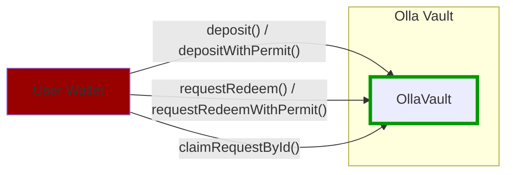
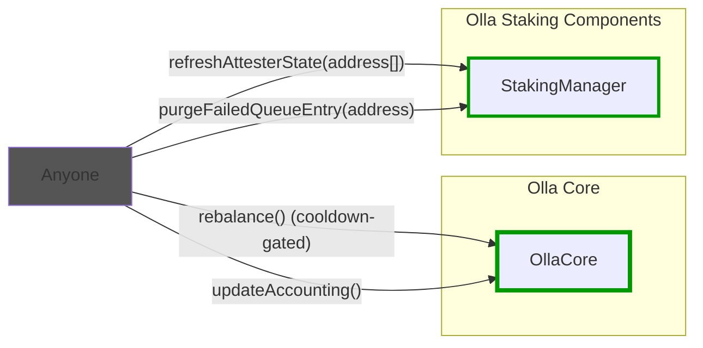
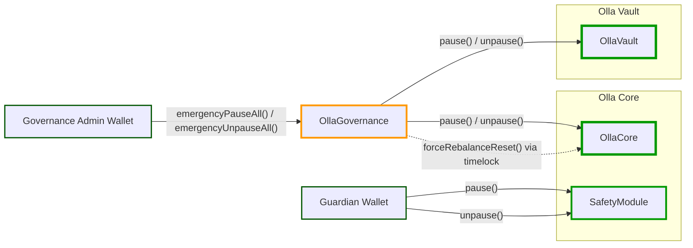
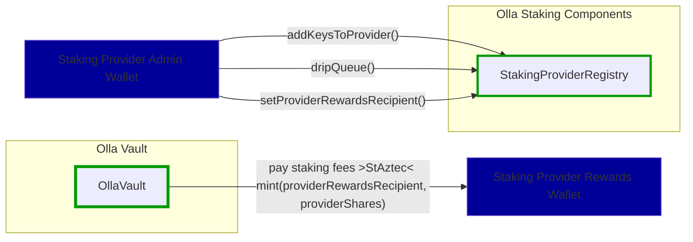
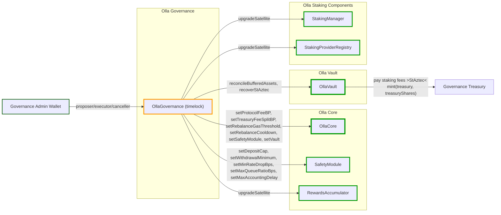

# Olla Protocol Overview

Olla is a liquid staking protocol for Aztec. The protocol is composed of the following contract groups:

- **Vault** (`contracts/src/vault/`): `OllaVault` is the ERC-7540/ERC-4626 vault that holds user assets, mints `StAztec`, and manages async redemptions through an embedded queue.
- **Core** (`contracts/src/core/`): `OllaCore` is the orchestration and accounting engine that coordinates rebalancing, staking, and fee computation. `RewardsAccumulator` receives sequencer rewards from the rollup and forwards them to `OllaCore` during rebalance.
- **Staking** (`contracts/src/staking/`): `StakingManager` interacts with the canonical Aztec rollup to stake, unstake, harvest rewards, and track per-attester state. `StakingProviderRegistry` manages the pool of attester keys eligible for staking.
- **Safety module** (`contracts/src/safetymodule/`): `SafetyModule` enforces deposit caps, withdrawal minimums, queue-ratio limits, accounting-liveness checks, and rate-drop circuit breakers.
- **Governance** (`contracts/src/governance/`): `OllaGovernance` is the timelocked governance contract (inherits `TimelockControllerUpgradeable`). It owns `OllaCore` and `OllaVault` via `Ownable2Step` and holds `DEFAULT_ADMIN_ROLE` on the satellite contracts.
- **Bridge** (`contracts/src/bridge/`): `StAztecOFTAdapter` is the LayerZero V2 OFT adapter that bridges `StAztec` to destination chains.

`OllaCore` instructs `OllaVault` via `CORE_ROLE` during rebalance cycles; `OllaVault` delegates pricing to `OllaCore` through view calls.

## Architecture overview

```mermaid
---
config:
  layout: elk
---
flowchart LR

subgraph "Actors"
    user[User]
    anyone[Anyone]
    governanceActor[Governance]
    guardianActor[Guardian]
    stakingProviderActor[Staking Provider Admin]
end

subgraph "Wallets"
    userWallet[User]
    stakingProviderAdminWallet[Staking Provider Admin]
    stakingProviderRewardsWallet[Staking Provider Rewards]
    guardianWallet[Guardian]
    governanceAdminWallet[Governance Admin]
    treasury[Governance Treasury]
    user --- userWallet
    stakingProviderActor --- stakingProviderAdminWallet
    stakingProviderActor --- stakingProviderRewardsWallet
    guardianActor --- guardianWallet
    governanceActor --- treasury
    governanceActor --- governanceAdminWallet
end

subgraph "Olla Governance"
    ollaGov["OllaGovernance (timelock)"]
end

governanceAdminWallet -->|"proposer/executor/canceller"| ollaGov

subgraph "Olla Vault"
    vault[OllaVault]
    stAztec[StAztec]
end

subgraph "Cross-Chain Bridge"
    oftAdapter["StAztecOFTAdapter (home chain)"]
    oftDest["StAztecOFT (destination chains)"]
end

subgraph "Olla Core"
    core[OllaCore]
    safety[SafetyModule]
    rewards[RewardsAccumulator]
end
subgraph "Olla Staking Components"
    stkMan[StakingManager]
    spr[StakingProviderRegistry]
end

stakingProviderAdminWallet -->|"admin functions"| spr

subgraph "Aztec Contracts"
    rollupRegistry[AztecRollupRegistry]
    rollup["AztecRollup (canonical)"]
end

ollaGov -. "GUARDIAN_ROLE" .-> core
ollaGov -. "GUARDIAN_ROLE" .-> vault
guardianWallet -. "GUARDIAN_ROLE" .-> safety

stakingProviderAdminWallet -. "STAKING_PROVIDER_ADMIN_ROLE" .-> spr
ollaGov -->|"owner (Ownable2Step)"| core
ollaGov -->|"owner (Ownable2Step)"| vault
ollaGov -. "DEFAULT_ADMIN_ROLE" .-> core
ollaGov -. "DEFAULT_ADMIN_ROLE" .-> vault
ollaGov -. "DEFAULT_ADMIN_ROLE" .-> safety
ollaGov -. "DEFAULT_ADMIN_ROLE" .-> rewards
ollaGov -. "DEFAULT_ADMIN_ROLE" .-> stkMan
ollaGov -. "DEFAULT_ADMIN_ROLE" .-> spr

%% User flows (asset + call-path)
userWallet -->|"deposit / depositWithPermit / requestRedeem / requestRedeemWithPermit / claimRequestById"| vault

vault -->|"convertToShares / convertToAssets / totalAssets"| core
vault -->|"mint / burn"| stAztec
vault -->|"checkDepositAllowed / checkWithdrawalMinimum"| safety

%% Permissionless operations (anyone can call)
anyone -->|"refreshAttesterState(address[])"| stkMan
anyone -->|"purgeFailedQueueEntry(address)"| stkMan
anyone -->|"rebalance() (cooldown-gated)"| core
anyone -->|"updateAccounting()"| core

%% refreshAttesterState finalizes exits via rollup
stkMan -->|"finalizeWithdraw >Aztec< transferFrom(rollup, StakingManager, exitAmount)"| rollup

%% Emergency control
governanceAdminWallet -->|"emergencyPauseAll / emergencyUnpauseAll (not timelocked)"| ollaGov
ollaGov -->|"pause / unpause"| core
ollaGov -->|"pause / unpause"| vault
ollaGov -. "forceRebalanceReset() via timelock" .-> core
guardianWallet -->|"pause / unpause"| safety

%% Core instructs Vault via CORE_ROLE during rebalance
core -->|"transferToCore / receiveUnstaked / finalizeWithdrawals / mintFees (CORE_ROLE)"| vault

%% Core <-> SafetyModule
core -->|"checkQueueRatio / checkAccountingLiveness / checkRateDrop"| safety

%% Staking principal (AZTEC token) movements
core -->|"stake >Aztec< transferFrom(vault, StakingManager, stakeAmount)"| stkMan
stkMan -->|"getAttesterKeystore()"| spr
stkMan -->|"deposit >Aztec< transferFrom(StakingManager, AztecRollup, stakeAmount)"| rollup

core -->|"unstake(amount)"| stkMan
stkMan -->|"initiateWithdraw"| rollup

core -->|"getUnstakedFunds >Aztec< transferFrom(StakingManager, vault, unstakedAmount)"| stkMan

core -->|"harvestRewards()"| stkMan
stkMan -->|"getCanonicalRollup()"| rollupRegistry
rollupRegistry -->|"canonical rollup"| rollup
stkMan -->|"claimSequencerRewards(coinbase=rewardsAccumulator)"| rollup
rollup -->|"rewards >Aztec< transferFrom(rollup, rewardsAccumulator, amount)"| rewards
core -->|"recordBalance(expectedRewards)"| rewards
core -->|"balance()"| rewards

%% Fee minting (Core calculates, Vault mints via CORE_ROLE)
vault -->|"pay staking fees >StAztec< mint(treasury, treasuryShares)"| treasury
vault -->|"pay staking fees >StAztec< mint(providerRewardsRecipient, providerShares)"| stakingProviderRewardsWallet

%% Cross-chain bridge (LayerZero V2)
userWallet -->|"approve + send (bridge out)"| oftAdapter
oftAdapter <-->|"LayerZero messages"| oftDest


style user fill:#900
style anyone fill:#555
style stakingProviderActor fill:#009
style rollup stroke:#ff6,stroke-width:2px
style core stroke:#090,stroke-width:4px
style vault stroke:#090,stroke-width:4px
style stAztec stroke:#090,stroke-width:3px
style safety stroke:#090,stroke-width:3px
style rewards stroke:#090,stroke-width:3px
style stkMan stroke:#090,stroke-width:3px
style spr stroke:#090,stroke-width:3px
style rollupRegistry stroke:#ff6,stroke-width:2px
style guardianActor stroke:#050,stroke-width:2px
style governanceActor stroke:#050,stroke-width:2px
style ollaGov stroke:#090,stroke-width:3px
style oftAdapter stroke:#09f,stroke-width:3px
style oftDest stroke:#09f,stroke-width:3px
```

## Contract architecture

```mermaid
---
config:
  layout: elk
---
flowchart LR

subgraph "Olla Governance"
    ollaGov["OllaGovernance (timelock)"]
end

subgraph "Olla Vault"
    vault[OllaVault]
    stAztec[StAztec]
end

subgraph "Cross-Chain Bridge (LayerZero V2)"
    oftAdapter["StAztecOFTAdapter (Ethereum)"]
    oftDest["StAztecOFT (destination chains)"]
end

subgraph "Olla Core"
    core[OllaCore]
    safety[SafetyModule]
    rewards[RewardsAccumulator]
end

subgraph "Olla Staking Components"
    stkMan[StakingManager]
    spr[StakingProviderRegistry]
end

subgraph "Aztec Contracts"
    rollupRegistry[AztecRollupRegistry]
    rollup["AztecRollup (canonical)"]
end

%% Governance -> contracts
ollaGov -->|"owner (Ownable2Step)"| core
ollaGov -->|"owner (Ownable2Step)"| vault
ollaGov -. "DEFAULT_ADMIN_ROLE" .-> safety
ollaGov -. "DEFAULT_ADMIN_ROLE" .-> rewards
ollaGov -. "DEFAULT_ADMIN_ROLE" .-> stkMan
ollaGov -. "DEFAULT_ADMIN_ROLE" .-> spr

%% Vault <-> Core pricing
vault -->|"convertToShares / convertToAssets / totalAssets"| core

%% Core instructs Vault via CORE_ROLE
core -->|"transferToCore / receiveUnstaked / finalizeWithdrawals / mintFees (CORE_ROLE)"| vault

%% Vault <-> StAztec
vault -->|"mint / burn"| stAztec

%% Vault <-> SafetyModule
vault -->|"checkDepositAllowed / checkWithdrawalMinimum"| safety

%% Core <-> SafetyModule
core -->|"checkQueueRatio / checkAccountingLiveness / checkRateDrop"| safety

%% Staking: stake flow
core -->|"stake >Aztec< transferFrom(vault, StakingManager, stakeAmount)"| stkMan
stkMan -->|"getAttesterKeystore()"| spr
stkMan -->|"deposit >Aztec< transferFrom(StakingManager, AztecRollup, stakeAmount)"| rollup

%% Staking: unstake flow
core -->|"unstake(amount)"| stkMan
stkMan -->|"initiateWithdraw"| rollup

%% Sweep unstaked funds during rebalance (exits finalized via refreshAttesterState)
core -->|"getUnstakedFunds >Aztec< transferFrom(StakingManager, vault, balance)"| stkMan

%% Rewards harvesting
core -->|"harvestRewards()"| stkMan
stkMan -->|"getCanonicalRollup()"| rollupRegistry
rollupRegistry -->|"canonical rollup"| rollup
stkMan -->|"claimSequencerRewards(coinbase=rewardsAccumulator)"| rollup
rollup -->|"rewards >Aztec< transferFrom(rollup, rewardsAccumulator, amount)"| rewards
core -->|"recordBalance(expectedRewards)"| rewards
core -->|"balance()"| rewards

%% Cross-chain bridge
oftAdapter <-->|"LayerZero V2 messages"| oftDest
ollaGov -. "owner (setPeer, DVN config)" .-> oftAdapter

style ollaGov stroke:#090,stroke-width:3px
style core stroke:#090,stroke-width:4px
style vault stroke:#090,stroke-width:4px
style stAztec stroke:#090,stroke-width:3px
style safety stroke:#090,stroke-width:3px
style rewards stroke:#090,stroke-width:3px
style stkMan stroke:#090,stroke-width:3px
style spr stroke:#090,stroke-width:3px
style rollup stroke:#ff6,stroke-width:2px
style rollupRegistry stroke:#ff6,stroke-width:2px
style oftAdapter stroke:#09f,stroke-width:3px
style oftDest stroke:#09f,stroke-width:3px
```

## User

No special role required. Any address can call these functions. Users interact with **OllaVault**, which implements ERC-7540 (async redemptions) and ERC-4626 (sync deposits).

## Permissionless Operations

No special role required. Anyone can call these functions (rebalance is cooldown-gated).

## Guardian

Emergency authority is split by module:

- `OllaGovernance` holds `GUARDIAN_ROLE` on `OllaCore` and `OllaVault` by default. The governance admin can call `emergencyPauseAll()` and `emergencyUnpauseAll()` directly on `OllaGovernance`; those functions are not timelocked and forward `pause()`/`unpause()` to Core and Vault.
- The configured guardian wallet holds `GUARDIAN_ROLE` on `SafetyModule` by default and can pause/unpause the SafetyModule directly.
- `OllaCore.forceRebalanceReset()` is gated by Core's `GUARDIAN_ROLE`. In the default deployment that role is held by `OllaGovernance`, so the reset is a governance/timelock action unless governance grants Core's `GUARDIAN_ROLE` to a separate emergency wallet.

## Staking Provider Admin

Requires `STAKING_PROVIDER_ADMIN_ROLE` on StakingProviderRegistry.

## Governance

The governance admin wallet holds proposer, executor, and canceller roles on `OllaGovernance`, which inherits `TimelockControllerUpgradeable`. All governance actions (parameter changes, upgrades, governance transfers) must be scheduled, wait for the timelock delay, and then executed. `OllaGovernance` is the owner of `OllaCore` and `OllaVault` (via `Ownable2Step`) and holds `DEFAULT_ADMIN_ROLE` on all satellite contracts. Because the `OllaGovernance` contract is itself the satellite admin, transferring the governance admin to a new wallet does not require re-granting any roles on satellite contracts.

## Action references

- User flows: [docs/user-actions.md](docs/user-actions.md)
- Operator flows: [docs/operator-actions.md](docs/operator-actions.md)
- Governance flows: [docs/governance-actions.md](docs/governance-actions.md)
