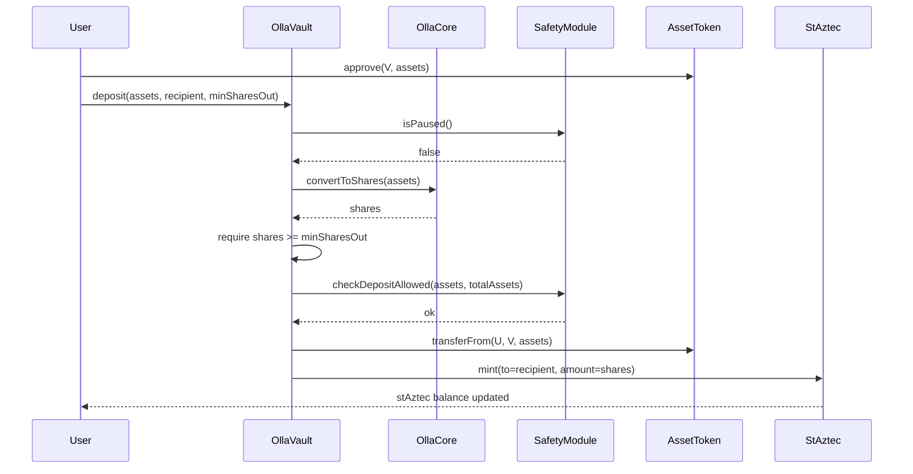
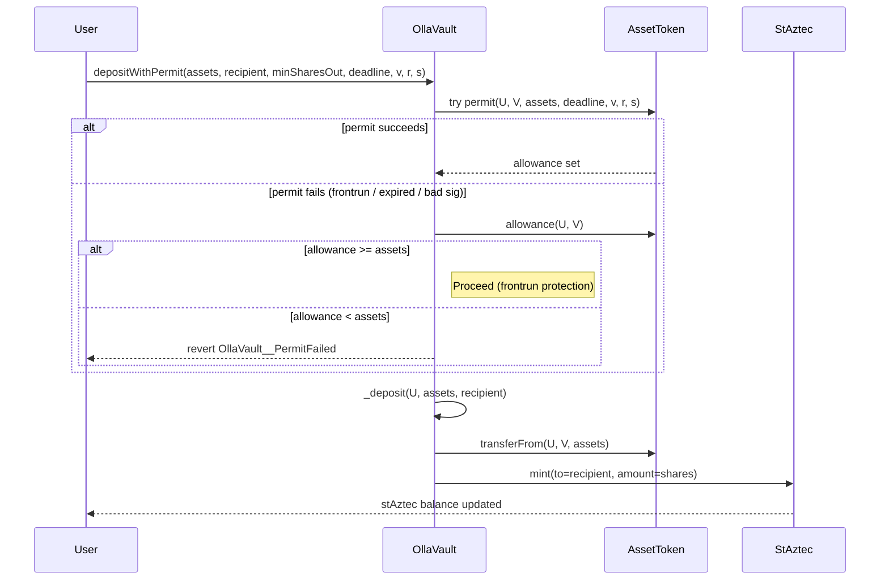
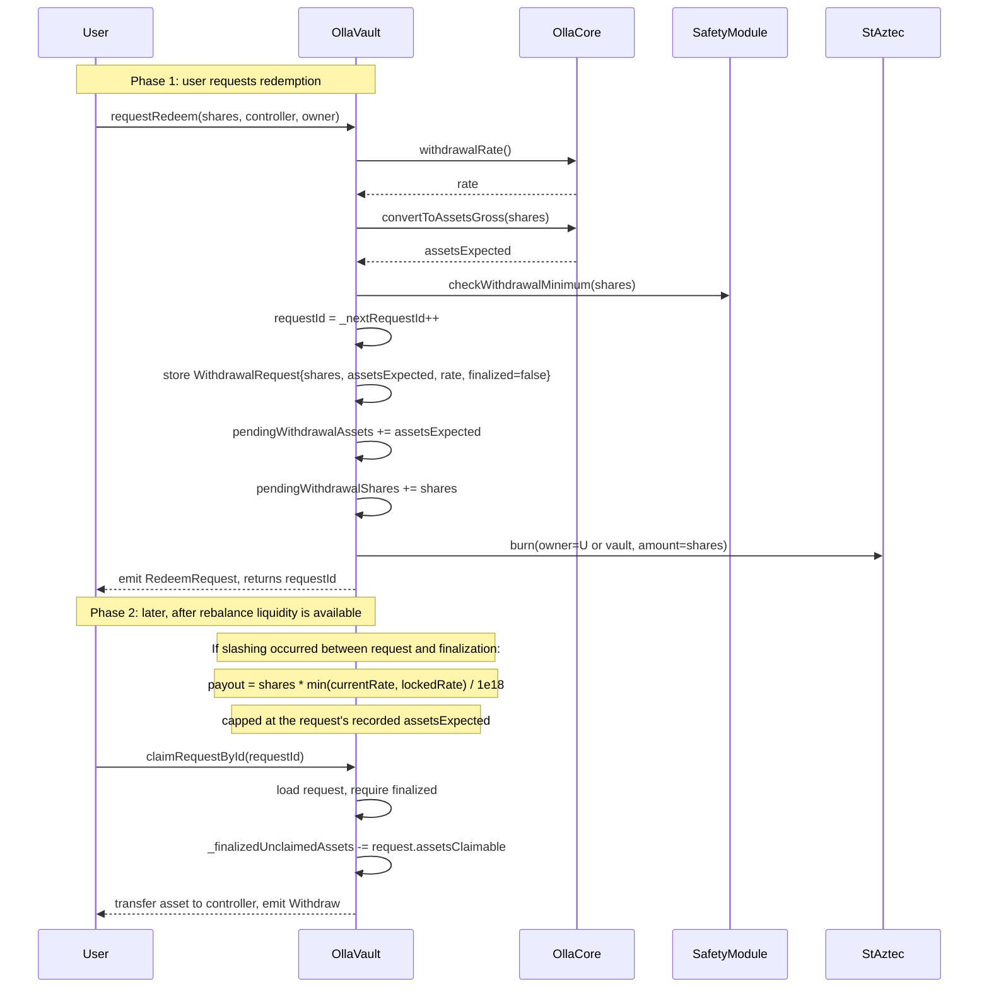
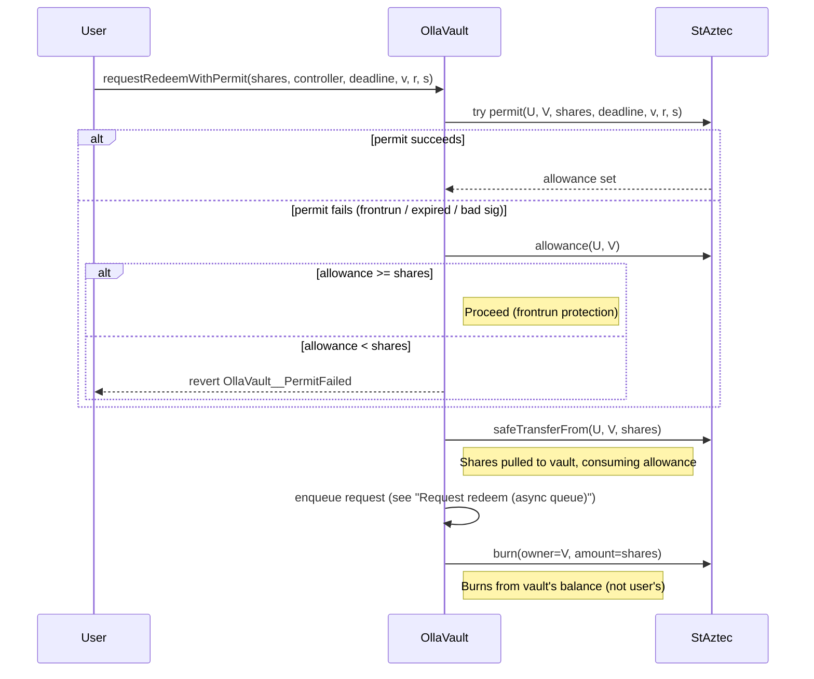

# User actions

This document summarizes user-facing flows in Olla Core.

## Deposit

## Deposit with permit

## Request redeem (async queue)

The redemption queue lives inside `OllaVault`. A request is locked at the current `withdrawalRate`, the shares are burned immediately, and the user later claims when the rebalance loop has finalized the request and made assets available.

## Request redeem with permit

`requestRedeemWithPermit` consumes an EIP-2612 permit on `stAztec` to set the vault's allowance, then pulls the shares to the vault before queuing the request. If the permit was frontrun but the resulting allowance is sufficient, the request still proceeds.

