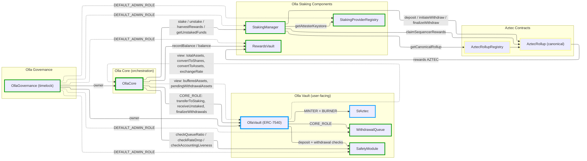
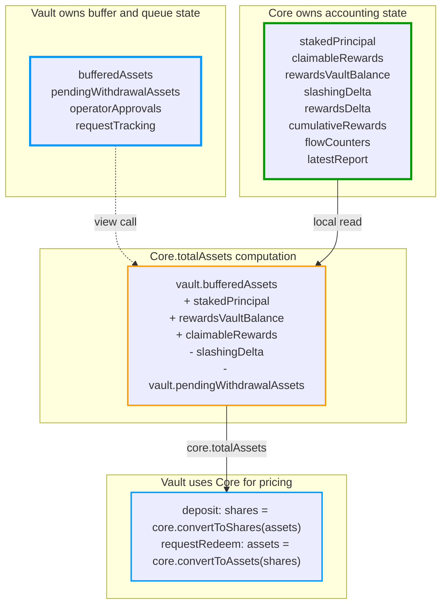
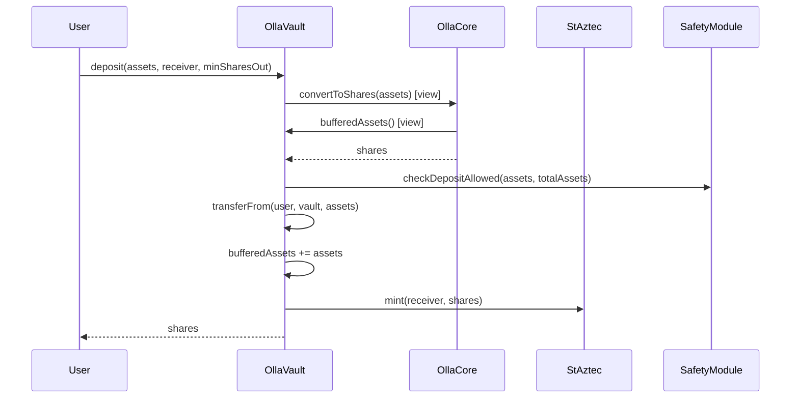
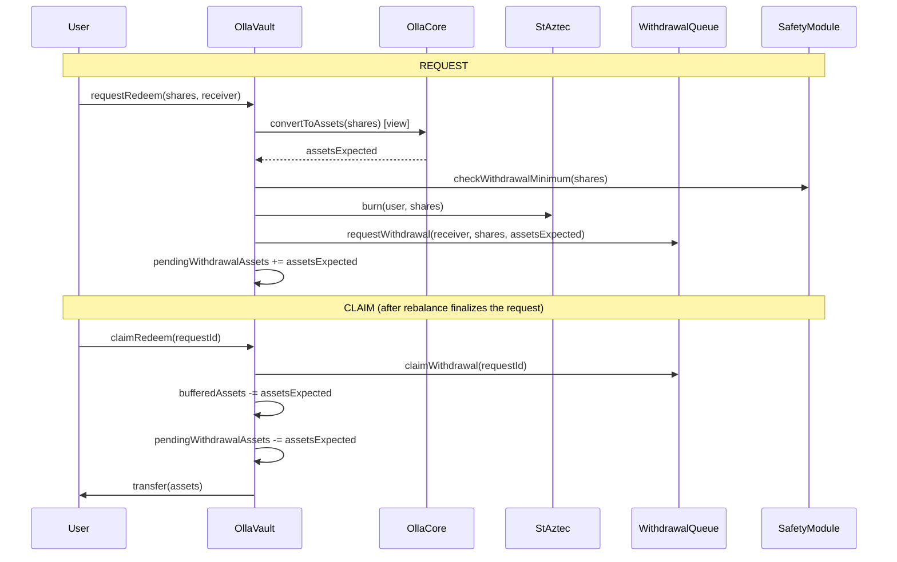
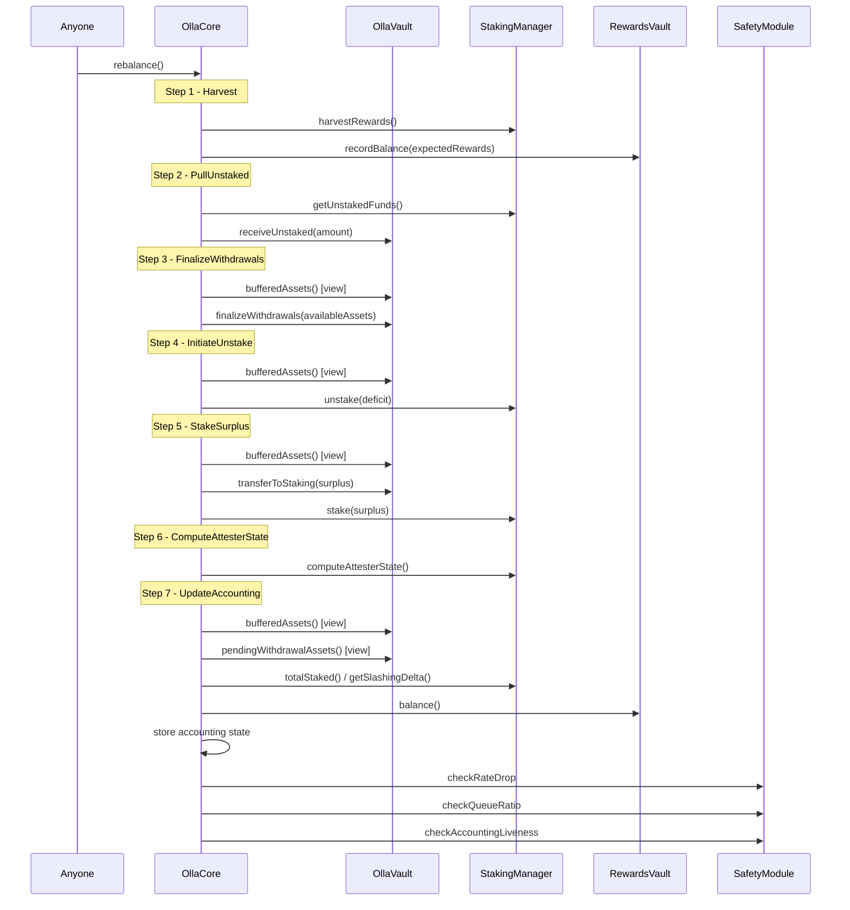
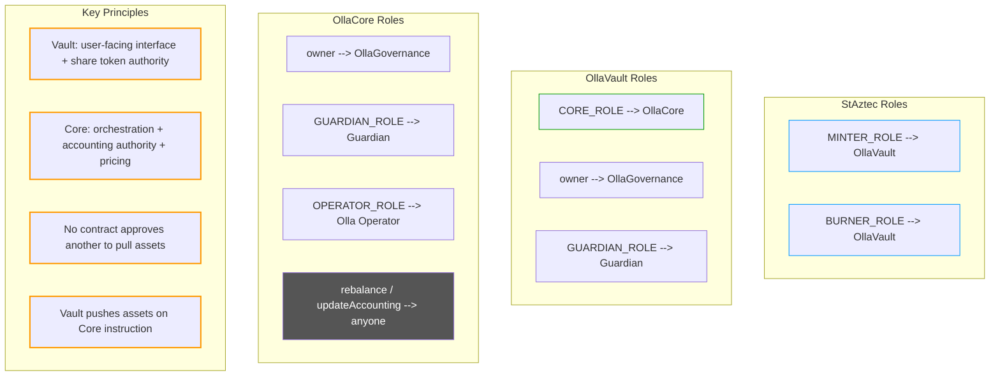
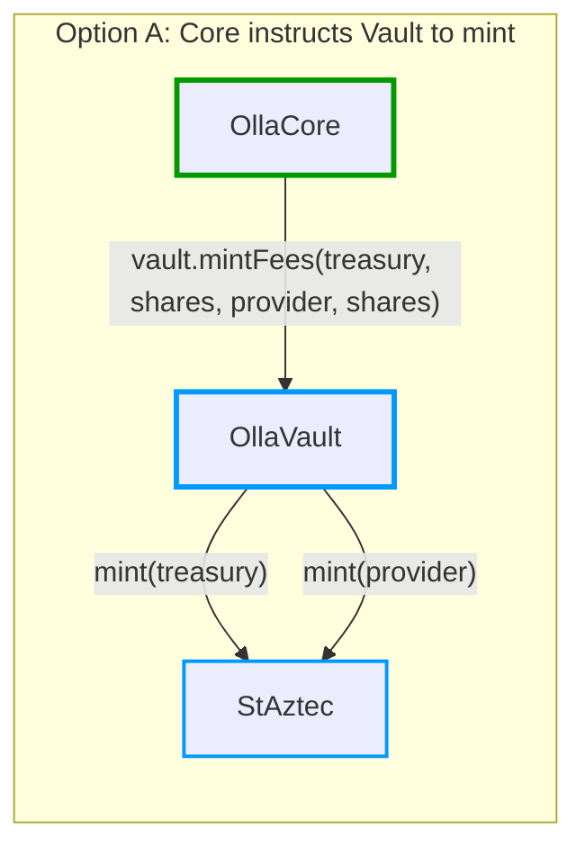

# Proposed Architecture: Vault + Core Split

## Architecture overview

```mermaid
---
config:
  layout: elk
---
flowchart LR

subgraph Actors
    user[User]
    anyone[Anyone]
    governanceActor[Governance]
    guardianActor[Guardian]
    ollaOperatorActor[Olla Protocol Operator]
    stakingProviderActor[Staking Provider Admin]
end

subgraph Wallets
    userWallet[User]
    stakingProviderAdminWallet[Staking Provider Admin]
    stakingProviderRewardsWallet[Staking Provider Rewards]
    guardianWallet[Guardian]
    ollaOperatorWallet[Olla Protocol Operator]
    governanceAdminWallet[Governance Admin]
    treasury[Governance Treasury]
    user --- userWallet
    stakingProviderActor --- stakingProviderAdminWallet
    stakingProviderActor --- stakingProviderRewardsWallet
    guardianActor --- guardianWallet
    ollaOperatorActor --- ollaOperatorWallet
    governanceActor --- treasury
    governanceActor --- governanceAdminWallet
end

subgraph OllaGov[Olla Governance]
    ollaGov["OllaGovernance (timelock)"]
end

governanceAdminWallet -->|"proposer/executor/canceller"| ollaGov

subgraph OllaVaultGroup["Olla Vault (user-facing)"]
    vault["OllaVault (ERC-7540 / ERC-7575 / ERC-4626)"]
    stAztec[StAztec]
    withdrawQ[WithdrawalQueue]
    safety[SafetyModule]
end

subgraph OllaCoreGroup["Olla Core (orchestration + accounting)"]
    core[OllaCore]
end

subgraph OllaStaking[Olla Staking Components]
    rewards[RewardsVault]
    stkMan[StakingManager]
    spr[StakingProviderRegistry]
end

subgraph AztecContracts[Aztec Contracts]
    rollupRegistry[AztecRollupRegistry]
    rollup["AztecRollup (canonical)"]
end

ollaGov -->|"owner"| vault
ollaGov -->|"owner"| core
ollaGov -. "DEFAULT_ADMIN_ROLE" .-> safety
ollaGov -. "DEFAULT_ADMIN_ROLE" .-> withdrawQ
ollaGov -. "DEFAULT_ADMIN_ROLE" .-> rewards
ollaGov -. "DEFAULT_ADMIN_ROLE" .-> stkMan
ollaGov -. "DEFAULT_ADMIN_ROLE" .-> spr

userWallet -->|"deposit / mint"| vault
userWallet -->|"requestRedeem"| vault
userWallet -->|"claimRedeem / instantRedeem"| vault

vault -->|"mint on deposit"| stAztec
vault -->|"burn on redeem"| stAztec
vault -->|"request / claim / finalize withdrawal"| withdrawQ
vault -->|"deposit + withdrawal checks"| safety
vault -.->|"view: totalAssets / convertToShares / convertToAssets"| core

core -.->|"view: bufferedAssets / pendingWithdrawalAssets"| vault
core -->|"CORE_ROLE: transferToStaking / receiveUnstaked / finalizeWithdrawals"| vault
core -->|"checkQueueRatio / checkRateDrop / checkAccountingLiveness"| safety

anyone -->|"rebalance (cooldown-gated)"| core
anyone -->|"updateAccounting"| core
anyone -->|"finalizeExits"| stkMan
anyone -->|"computeAttesterState"| stkMan

guardianWallet -->|"pause / unpause / forceRebalanceReset"| core
guardianWallet -->|"pause / unpause"| vault
guardianWallet -. "GUARDIAN_ROLE" .-> safety

ollaOperatorWallet -->|"setRebalanceGasThreshold"| core
ollaOperatorWallet -->|"setAttesterStateMaxAge"| stkMan
stakingProviderAdminWallet -->|"addKeysToProvider / dripQueue"| spr

core -->|"stake via vault.transferToStaking"| stkMan
stkMan -->|"getAttesterKeystore"| spr
stkMan -->|"deposit"| rollup

core -->|"unstake"| stkMan
stkMan -->|"initiateWithdraw / finalizeWithdraw"| rollup

core -->|"getUnstakedFunds, route to vault"| stkMan
core -->|"harvestRewards"| stkMan
stkMan -->|"getCanonicalRollup"| rollupRegistry
rollupRegistry --> rollup
stkMan -->|"claimSequencerRewards coinbase=rewardsVault"| rollup
rollup -->|"rewards AZTEC"| rewards
core -->|"recordBalance / balance"| rewards

core -->|"mintFees stAztec to treasury"| treasury
core -->|"mintFees stAztec to provider"| stakingProviderRewardsWallet

style user fill:#900
style anyone fill:#555
style ollaOperatorActor stroke:#050,stroke-width:2px
style stakingProviderActor fill:#009
style rollup stroke:#ff6,stroke-width:2px
style rollupRegistry stroke:#ff6,stroke-width:2px
style vault stroke:#09f,stroke-width:4px
style core stroke:#090,stroke-width:4px
style safety stroke:#090,stroke-width:3px
style rewards stroke:#090,stroke-width:3px
style stkMan stroke:#090,stroke-width:3px
style spr stroke:#090,stroke-width:3px
style withdrawQ stroke:#090,stroke-width:3px
style stAztec stroke:#09f,stroke-width:3px
style ollaGov stroke:#090,stroke-width:3px
style guardianActor stroke:#050,stroke-width:2px
style governanceActor stroke:#050,stroke-width:2px
```

## Contract architecture

## Accounting and pricing data flow

## User flows: deposit

## User flows: async withdrawal

## Rebalance flow

## Role model

## fee minting

Core computes protocol fees during `updateAccounting` but only Vault holds the `MINTER_ROLE` on StAztec.

