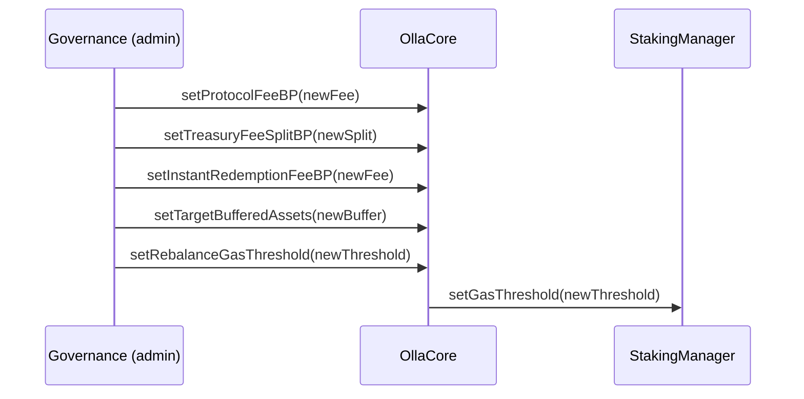
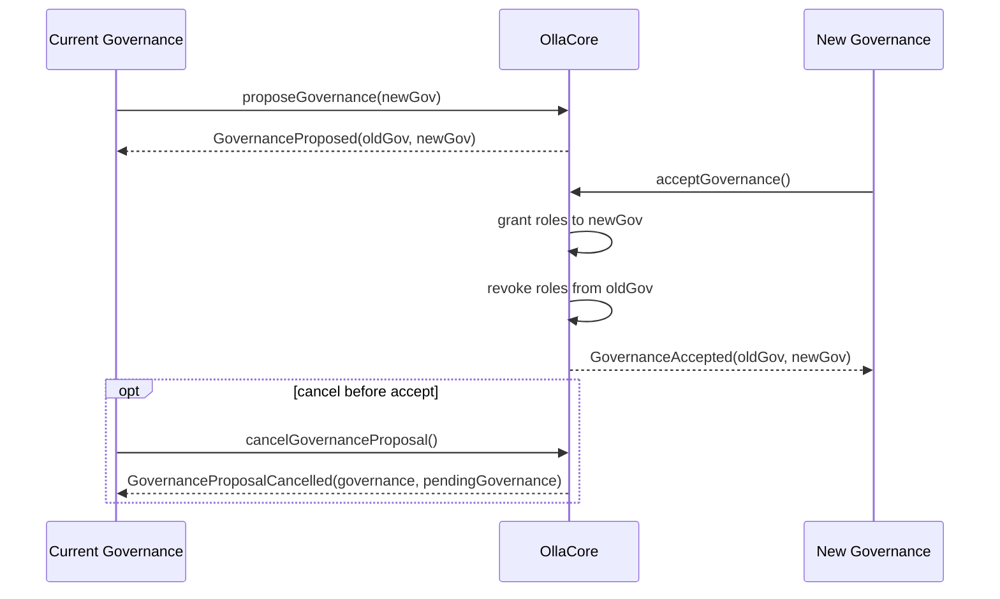
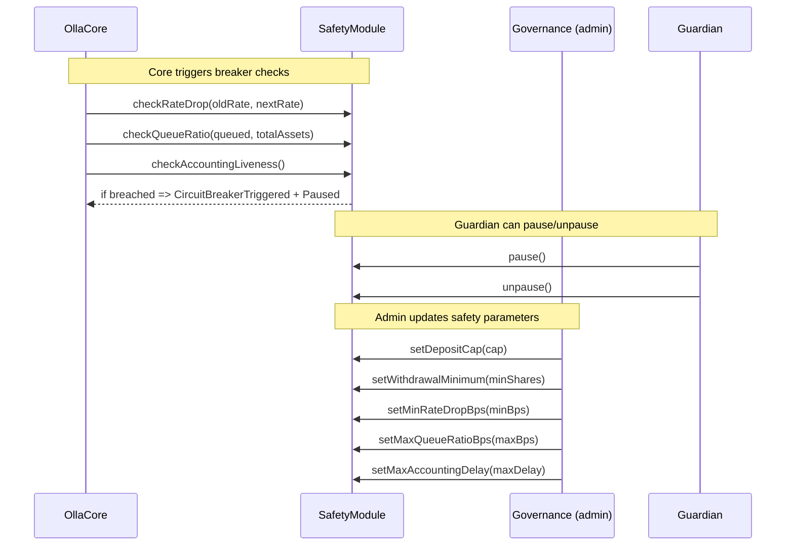
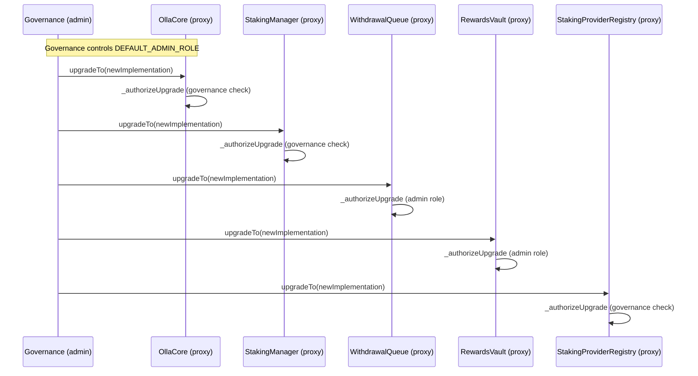

# Governance actions

This document summarizes governance and admin flows in Olla Core.

## Configuration

## Roles and safety

### Governance transfer (two-step)

### Safety module circuit breaker

## Upgrades

