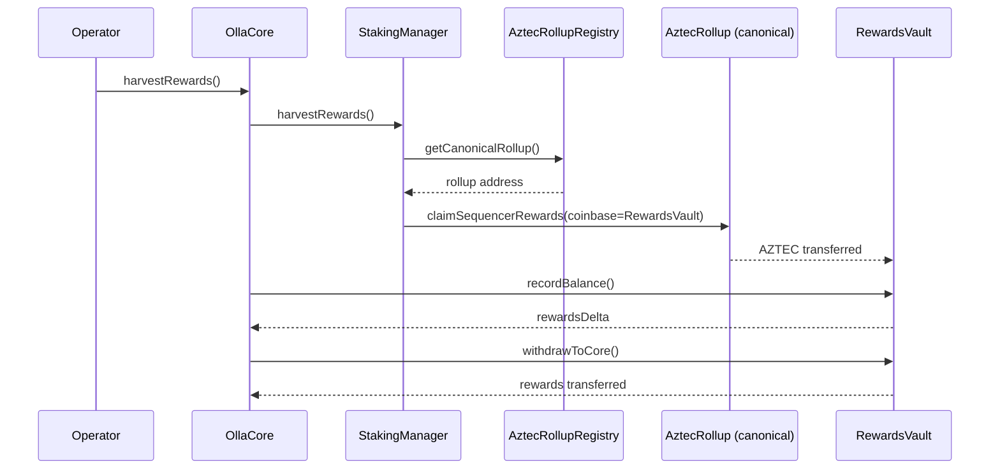
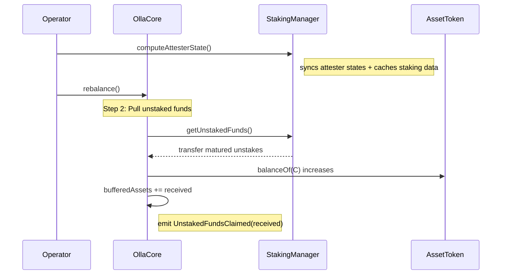
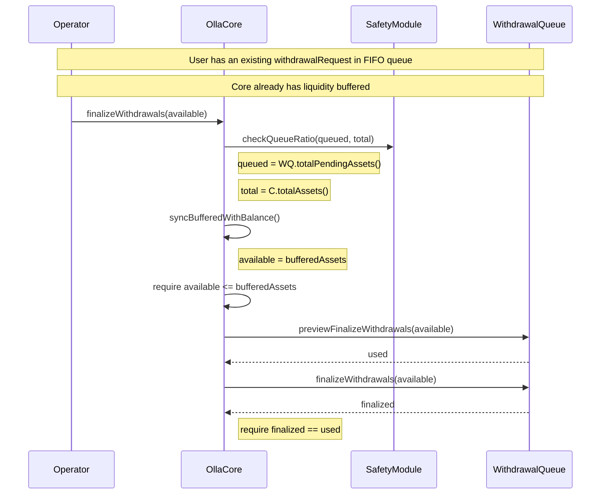
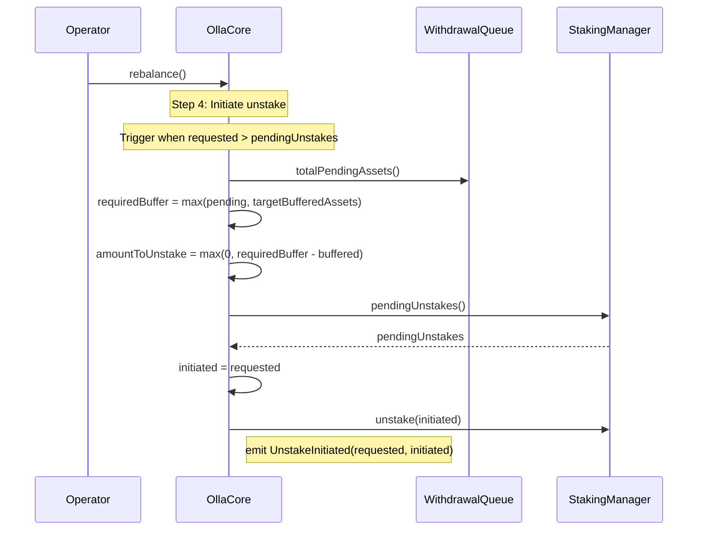
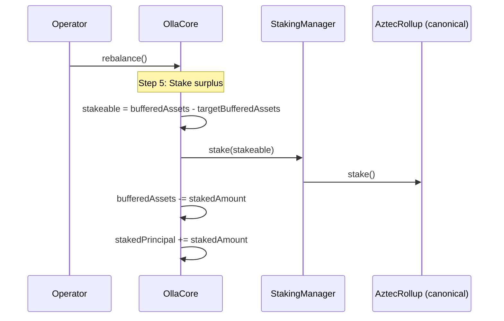
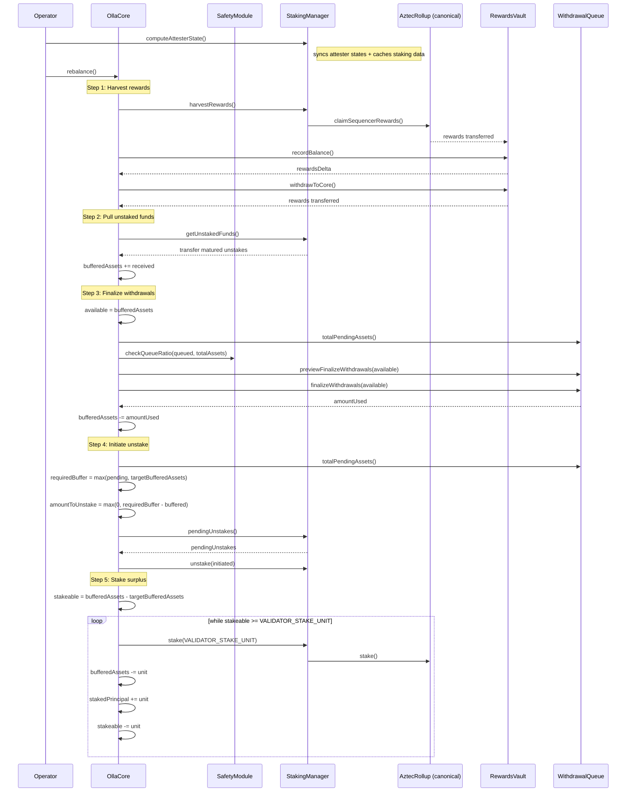
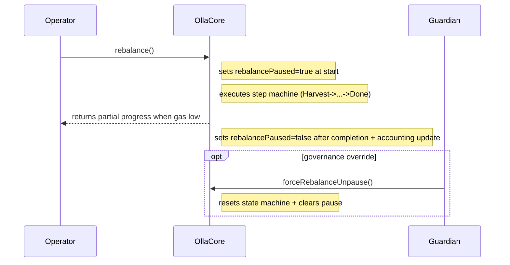
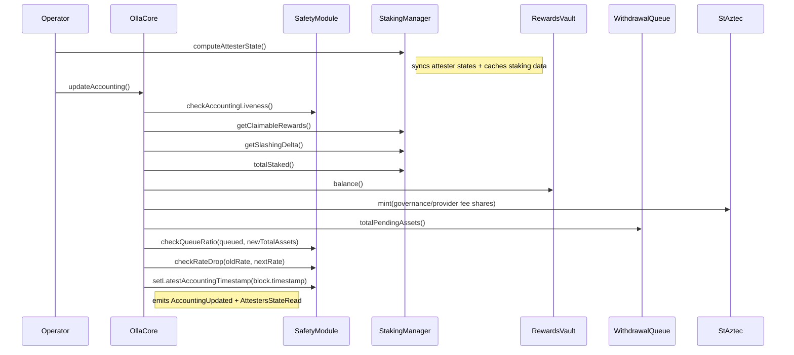

# Operator actions

This document summarizes operator flows in Olla Core.

## Rebalance

### Harvest rewards

### Pull unstaked funds

### Process user withdrawal requests

### Initiate unstake

### Stake surplus

### Rebalance (full flow)

### Rebalance pause state machine

## Accounting

