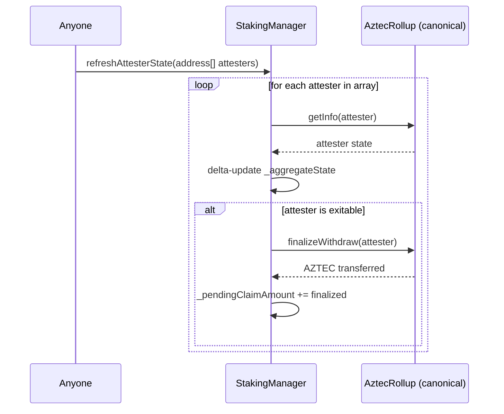
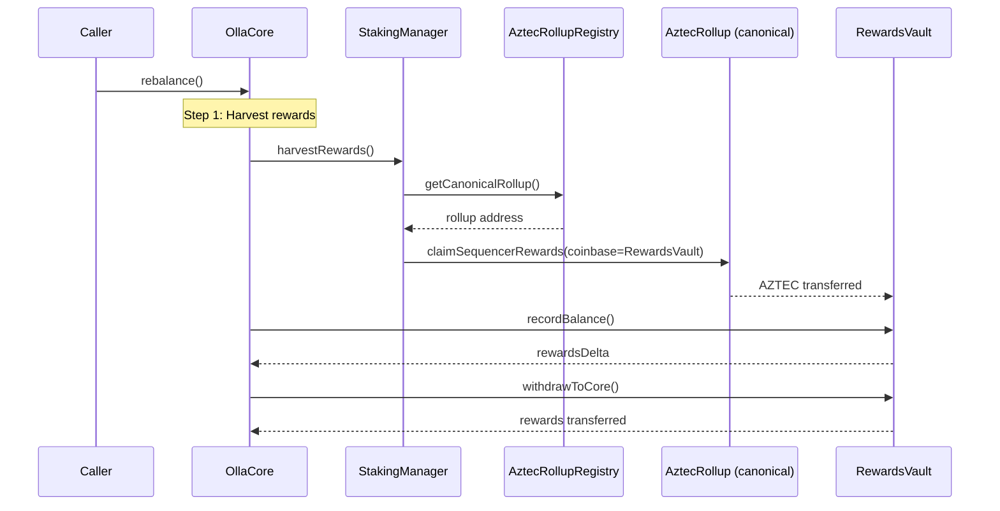
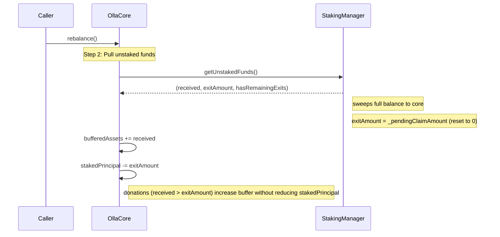
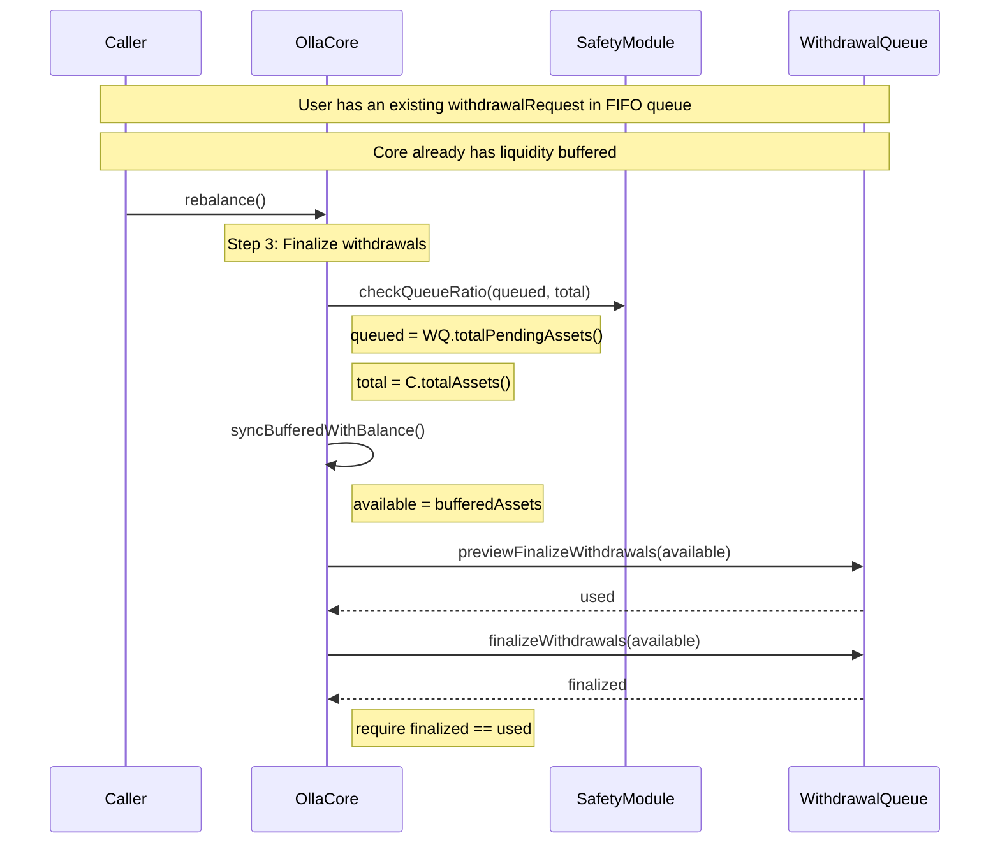
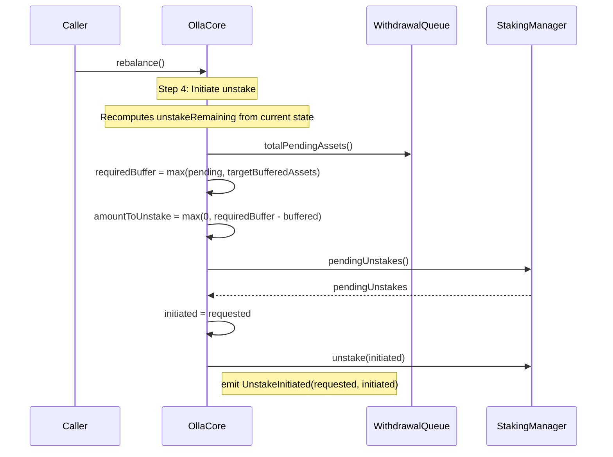
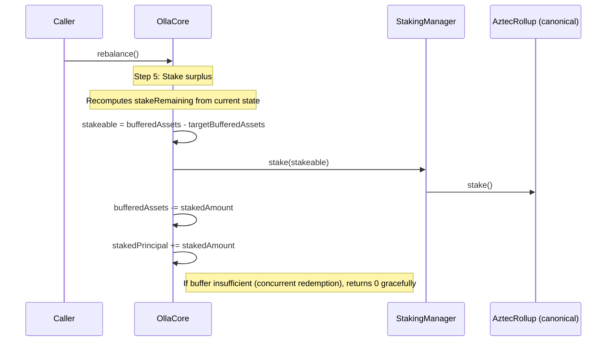
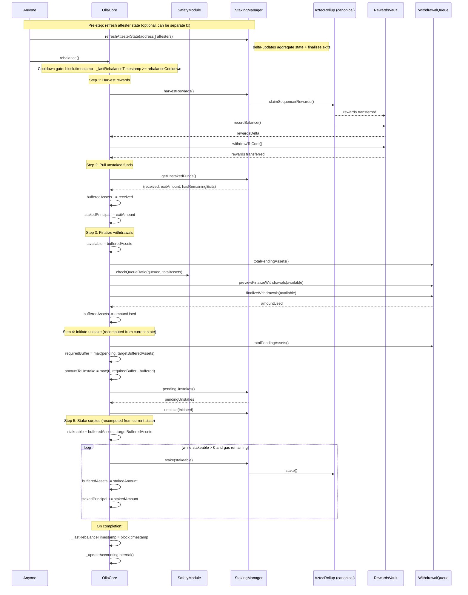
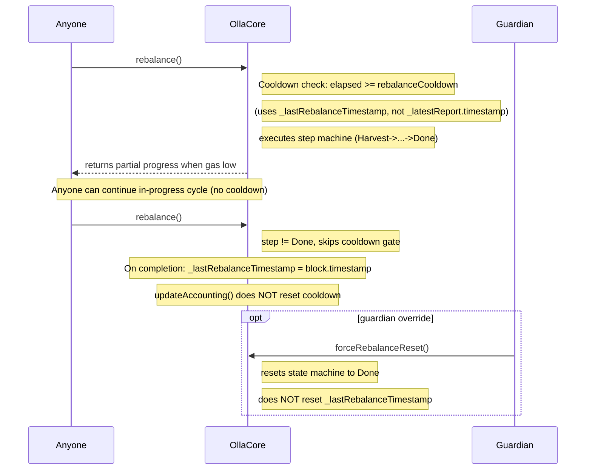
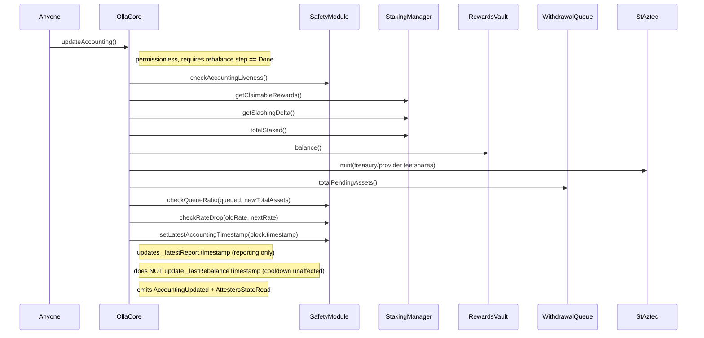

# Operator actions

This document summarizes rebalance and accounting flows in Olla Core.

> **Note:** `rebalance()`, `updateAccounting()`, and `refreshAttesterState(address[])` are **permissionless** — anyone can call them. The diagrams below use "Caller" to represent any address. New rebalance cycles are rate-limited by a cooldown (`_lastRebalanceTimestamp + rebalanceCooldown`); continuing in-progress cycles has no cooldown.

## Rebalance

### Refresh attester state (separate from rebalance)

### Harvest rewards

### Pull unstaked funds

### Process user withdrawal requests

### Initiate unstake

### Stake surplus

### Rebalance (full flow)

### Rebalance cooldown and state machine

## Accounting

