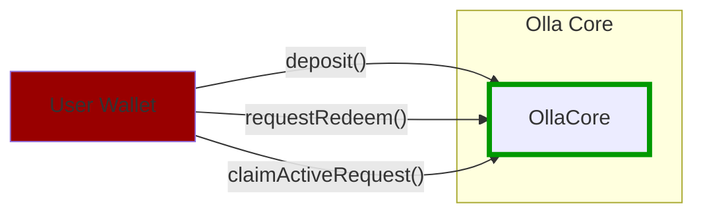
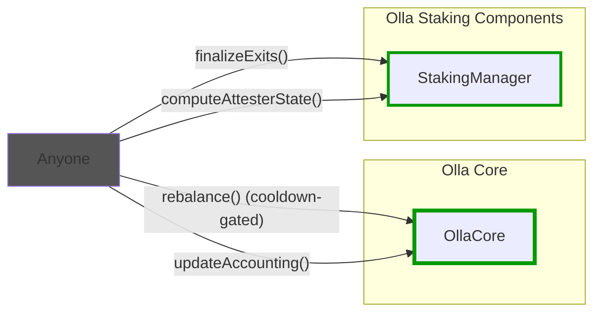
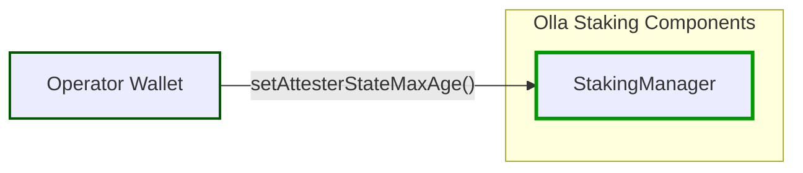
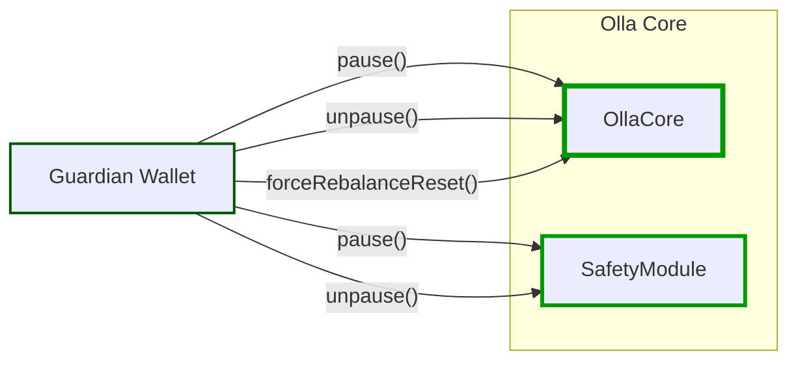
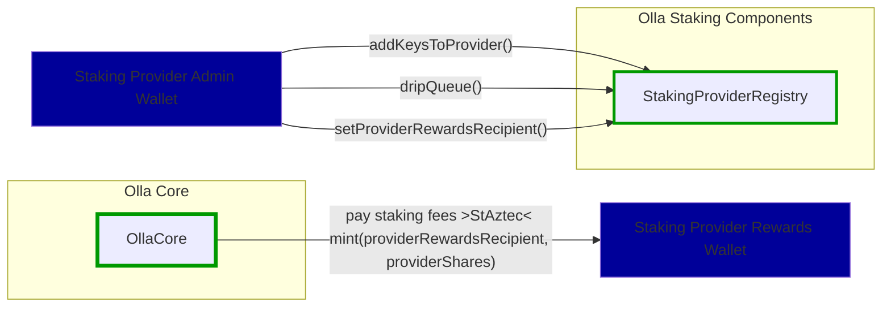
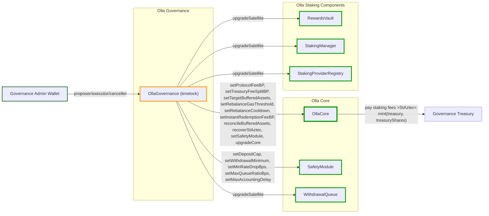

# Olla Protocol Overview

Olla Core is the on-chain vault and staking coordinator for liquid staking on Aztec. It accepts user deposits, manages async withdrawals, and delegates staking operations to Aztec rollup contracts via the staking manager.

## Architecture overview

```mermaid
---
config:
  layout: elk
---
flowchart LR

subgraph "Actors"
    user[User]
    anyone[Anyone]
    governanceActor[Governance]
    guardianActor[Guardian]
    ollaOperatorActor[Olla Protocol Operator]
    stakingProviderActor[Staking Provider Admin]
end

subgraph "Wallets"
    userWallet[User]
    stakingProviderAdminWallet[Staking Provider Admin]
    stakingProviderRewardsWallet[Staking Provider Rewards]
    guardianWallet[Guardian]
    ollaOperatorWallet[Olla Protocol Operator]
    governanceAdminWallet[Governance Admin]
    treasury[Governance Treasury]
    user --- userWallet
    stakingProviderActor --- stakingProviderAdminWallet
    stakingProviderActor --- stakingProviderRewardsWallet
    guardianActor --- guardianWallet
    ollaOperatorActor --- ollaOperatorWallet
    governanceActor --- treasury
    governanceActor --- governanceAdminWallet
end

subgraph "Olla Governance"
    ollaGov["OllaGovernance (timelock)"]
end

governanceAdminWallet -->|"proposer/executor/canceller"| ollaGov

subgraph "Olla Core"
    core[OllaCore]
    safety[SafetyModule]
    withdrawQ[WithdrawalQueue]
end
subgraph "Olla Staking Components"
    rewards[RewardsVault]
    stkMan[StakingManager]
    spr[StakingProviderRegistry]
end

stakingProviderAdminWallet -->|"admin functions"| spr

subgraph "Aztec Contracts"
    rollupRegistry[AztecRollupRegistry]
    rollup["AztecRollup (canonical)"]
end

subgraph "Cross-Chain Bridge"
    oftAdapter["StAztecOFTAdapter (home chain)"]
    oftDest["StAztecOFT (destination chains)"]
end

guardianWallet -. "GUARDIAN_ROLE" .-> core
guardianWallet -. "GUARDIAN_ROLE" .-> safety

stakingProviderAdminWallet -. "STAKING_PROVIDER_ADMIN_ROLE" .-> spr
ollaGov -->|"owner (Ownable2Step)"| core
ollaGov -. "DEFAULT_ADMIN_ROLE" .-> core
ollaGov -. "DEFAULT_ADMIN_ROLE" .-> safety
ollaGov -. "DEFAULT_ADMIN_ROLE" .-> withdrawQ
ollaGov -. "DEFAULT_ADMIN_ROLE" .-> rewards
ollaGov -. "DEFAULT_ADMIN_ROLE" .-> stkMan
ollaGov -. "DEFAULT_ADMIN_ROLE" .-> spr

%% User flows (asset + call-path)
userWallet -->|"deposit/requestRedeem/claimActiveRequest"| core

core -->|"request-,claim-,finalize-withdrawal"| withdrawQ

core -->|"checkDepositAllowed / checkWithdrawalMinimum / checkQueueRatio / checkAccountingLiveness"| safety

%% Permissionless operations (anyone can call)
anyone -->|"finalizeExits()"| stkMan
anyone -->|"computeAttesterState()"| stkMan
anyone -->|"rebalance() (cooldown-gated)"| core
anyone -->|"updateAccounting()"| core

%% Operator-only
ollaOperatorWallet -->|"setRebalanceGasThreshold()"| core
ollaOperatorWallet -->|"setAttesterStateMaxAge()"| stkMan

%% Guardian control
guardianWallet -->|"forceRebalanceReset()"| core

%% Staking principal (AZTEC token) movements
core -->|"stake >Aztec< transferFrom(core, StakingManager, stakeAmount)"| stkMan
stkMan -->|"getAttesterKeystore()"| spr
stkMan -->|"deposit >Aztec< transferFrom(StakingManager, AztecRollup, stakeAmount)"| rollup

core -->|"unstake(amount)"| stkMan
stkMan -->|"initiateWithdraw"| rollup

core -->|"claimUnstakedFunds >Aztec< transferFrom(StakingManager, core, unstakedAmount)"| stkMan
stkMan -->|"finalizeWithdraw >Aztec< transferFrom(rollup, StakingManager, unstakedAmount)"| rollup

core -->|"harvestRewards()"| stkMan
stkMan -->|"getCanonicalRollup()"| rollupRegistry
rollupRegistry -->|"canonical rollup"| rollup
stkMan -->|"claimSequencerRewards(coinbase=rewardsVault)"| rollup
rollup -->|"rewards >Aztec< transferFrom(rollup, rewardsVault, amount)"| rewards
core -->|"recordBalance(expectedRewards)"| rewards

core -->|"finalizeWithdrawals(available)"| withdrawQ

core -->|"balance()"| rewards

core -->|"pay staking fees >StAztec< mint(treasury, treasuryShares)"| treasury
core -->|"pay staking fees >StAztec< mint(providerRewardsRecipient, providerShares)"| stakingProviderRewardsWallet

%% Cross-chain bridge (LayerZero V2)
userWallet -->|"approve + send (bridge out)"| oftAdapter
oftAdapter <-->|"LayerZero messages"| oftDest

%% Staking provider admin (control-plane)

style user fill:#900
style anyone fill:#555
style ollaOperatorActor stroke:#050,stroke-width:2px
style stakingProviderActor fill:#009
style rollup stroke:#ff6,stroke-width:2px
style core stroke:#090,stroke-width:4px
style safety stroke:#090,stroke-width:3px
style rewards stroke:#090,stroke-width:3px
style stkMan stroke:#090,stroke-width:3px
style spr stroke:#090,stroke-width:3px
style withdrawQ stroke:#090,stroke-width:3px
style rollupRegistry stroke:#ff6,stroke-width:2px
style guardianActor stroke:#050,stroke-width:2px
style governanceActor stroke:#050,stroke-width:2px
style ollaGov stroke:#090,stroke-width:3px
style oftAdapter stroke:#09f,stroke-width:3px
style oftDest stroke:#09f,stroke-width:3px
```

## Contract architecture

```mermaid
---
config:
  layout: elk
---
flowchart LR

subgraph "Olla Governance"
    ollaGov["OllaGovernance (timelock)"]
end

subgraph "Olla Core"
    core[OllaCore]
    safety[SafetyModule]
    withdrawQ[WithdrawalQueue]
end

subgraph "Olla Staking Components"
    rewards[RewardsVault]
    stkMan[StakingManager]
    spr[StakingProviderRegistry]
end

subgraph "Aztec Contracts"
    rollupRegistry[AztecRollupRegistry]
    rollup["AztecRollup (canonical)"]
end

subgraph "Cross-Chain Bridge (LayerZero V2)"
    oftAdapter["StAztecOFTAdapter (Ethereum)"]
    oftDest["StAztecOFT (destination chains)"]
end

%% Governance -> contracts
ollaGov -->|"owner (Ownable2Step)"| core
ollaGov -. "DEFAULT_ADMIN_ROLE" .-> safety
ollaGov -. "DEFAULT_ADMIN_ROLE" .-> withdrawQ
ollaGov -. "DEFAULT_ADMIN_ROLE" .-> rewards
ollaGov -. "DEFAULT_ADMIN_ROLE" .-> stkMan
ollaGov -. "DEFAULT_ADMIN_ROLE" .-> spr

%% OllaCore <-> WithdrawalQueue
core -->|"request-,claim-,finalize-withdrawal"| withdrawQ

%% OllaCore <-> SafetyModule
core -->|"checkDepositAllowed / checkWithdrawalMinimum / checkQueueRatio / checkAccountingLiveness"| safety

%% Staking: stake flow
core -->|"stake >Aztec< transferFrom(core, StakingManager, stakeAmount)"| stkMan
stkMan -->|"getAttesterKeystore()"| spr
stkMan -->|"deposit >Aztec< transferFrom(StakingManager, AztecRollup, stakeAmount)"| rollup

%% Staking: unstake flow
core -->|"unstake(amount)"| stkMan
stkMan -->|"initiateWithdraw"| rollup

%% Finalize exits (permissionless, separate from rebalance)
stkMan -->|"finalizeWithdraw >Aztec< transferFrom(rollup, StakingManager, exitAmount)"| rollup

%% Sweep unstaked funds during rebalance
core -->|"getUnstakedFunds >Aztec< transferFrom(StakingManager, core, balance)"| stkMan

%% Rewards harvesting
core -->|"harvestRewards()"| stkMan
stkMan -->|"getCanonicalRollup()"| rollupRegistry
rollupRegistry -->|"canonical rollup"| rollup
stkMan -->|"claimSequencerRewards(coinbase=rewardsVault)"| rollup
rollup -->|"rewards >Aztec< transferFrom(rollup, rewardsVault, amount)"| rewards
core -->|"recordBalance(expectedRewards)"| rewards
core -->|"balance()"| rewards

%% Finalize withdrawals
core -->|"finalizeWithdrawals(available)"| withdrawQ

%% Cross-chain bridge
oftAdapter <-->|"LayerZero V2 messages"| oftDest
ollaGov -. "owner (setPeer, DVN config)" .-> oftAdapter

style ollaGov stroke:#090,stroke-width:3px
style core stroke:#090,stroke-width:4px
style safety stroke:#090,stroke-width:3px
style rewards stroke:#090,stroke-width:3px
style stkMan stroke:#090,stroke-width:3px
style spr stroke:#090,stroke-width:3px
style withdrawQ stroke:#090,stroke-width:3px
style rollup stroke:#ff6,stroke-width:2px
style rollupRegistry stroke:#ff6,stroke-width:2px
style oftAdapter stroke:#09f,stroke-width:3px
style oftDest stroke:#09f,stroke-width:3px
```

## User

No special role required. Any address can call these functions.

## Permissionless Operations

No special role required. Anyone can call these functions (rebalance is cooldown-gated).

## Olla Protocol Operator

Requires `OPERATOR_ROLE` on StakingManager for operational configuration.

## Guardian

Requires `GUARDIAN_ROLE` on OllaCore and SafetyModule.

## Staking Provider Admin

Requires `STAKING_PROVIDER_ADMIN_ROLE` on StakingProviderRegistry.

## Governance

The governance admin wallet holds proposer, executor, and canceller roles on `OllaGovernance`, which inherits `TimelockControllerUpgradeable`. All governance actions (parameter changes, upgrades, governance transfers) must be scheduled, wait for the timelock delay, and then executed. `OllaGovernance` is the owner of `OllaCore` (via `Ownable2Step`) and holds `DEFAULT_ADMIN_ROLE` on all satellite contracts.

## Action references

- User flows: [docs/user-actions.md](docs/user-actions.md)
- Operator flows: [docs/operator-actions.md](docs/operator-actions.md)
- Governance flows: [docs/governance-actions.md](docs/governance-actions.md)
