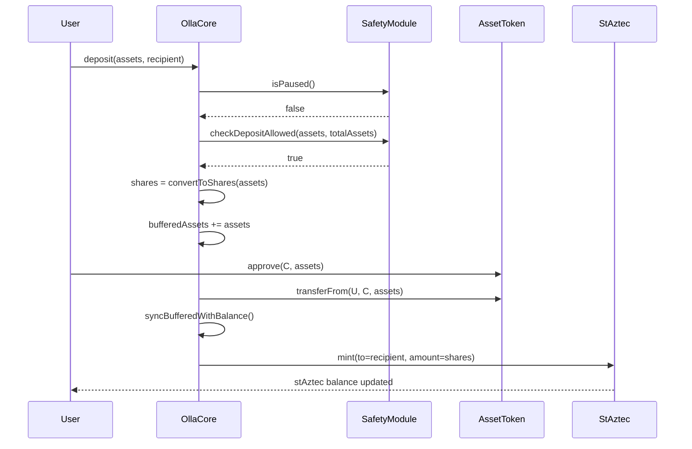
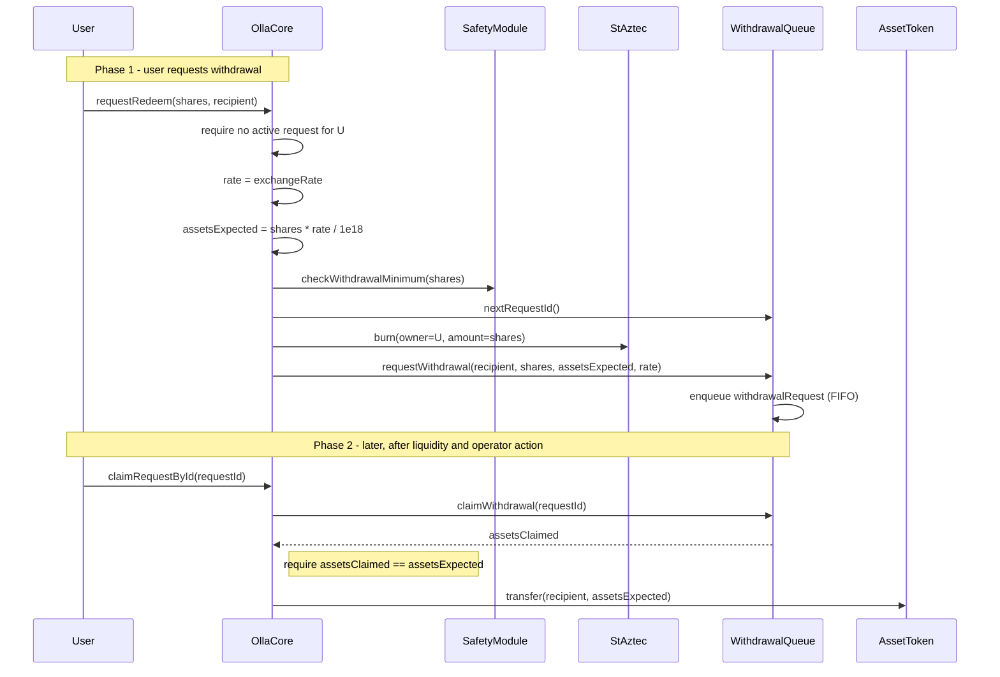
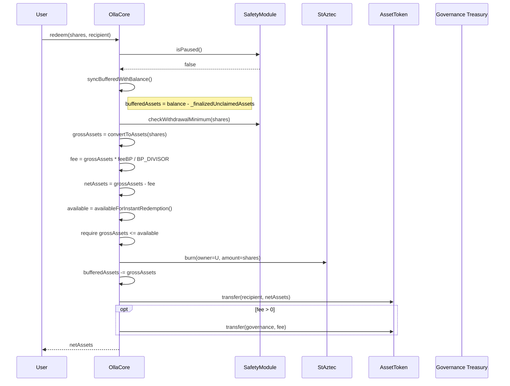

# User actions

This document summarizes user-facing flows in Olla Core.

## Deposit

```mermaid
sequenceDiagram
    participant U as User
    participant C as OllaCore
    participant SAF as SafetyModule
    participant AZ as AssetToken
    participant ST as StAztec

    U->>C: deposit(assets, recipient)
    C->>SAF: isPaused()
    SAF-->>C: false
    C->>SAF: checkDepositAllowed(assets, totalAssets)
    SAF-->>C: true
    C->>C: shares = convertToShares(assets)
    C->>C: bufferedAssets += assets
    U->>AZ: approve(C, assets)
    C->>AZ: transferFrom(U, C, assets)
    C->>C: syncBufferedWithBalance()
    C->>ST: mint(to=recipient, amount=shares)
    ST-->>U: stAztec balance updated
```

## Withdrawal (queue)

```mermaid
sequenceDiagram
    participant U as User
    participant C as OllaCore
    participant SAF as SafetyModule
    participant ST as StAztec
    participant WQ as WithdrawalQueue
    participant AZ as AssetToken

    Note over U,C: Phase 1 - user requests withdrawal

    U->>C: requestRedeem(shares, recipient)
    C->>C: require no active request for U
    C->>C: rate = exchangeRate
    C->>C: assetsExpected = shares * rate / 1e18
    C->>SAF: checkWithdrawalMinimum(shares)
    C->>WQ: nextRequestId()
    C->>ST: burn(owner=U, amount=shares)
    C->>WQ: requestWithdrawal(recipient, shares, assetsExpected, rate)
    WQ->>WQ: enqueue withdrawalRequest (FIFO)

    Note over U,WQ: Phase 2 - later, after liquidity and operator action

    U->>C: claimRequestById(requestId)
    C->>WQ: claimWithdrawal(requestId)
    WQ-->>C: assetsClaimed
    Note right of C: require assetsClaimed == assetsExpected
    C->>AZ: transfer(recipient, assetsExpected)
```

## Instant redemption

```mermaid
sequenceDiagram
    participant U as User
    participant C as OllaCore
    participant SAF as SafetyModule
    participant ST as StAztec
    participant AZ as AssetToken
    participant GOV as Governance Treasury

    U->>C: redeem(shares, recipient)
    C->>SAF: isPaused()
    SAF-->>C: false
    C->>C: syncBufferedWithBalance()
    Note right of C: bufferedAssets = balance - _finalizedUnclaimedAssets
    C->>SAF: checkWithdrawalMinimum(shares)
    C->>C: grossAssets = convertToAssets(shares)
    C->>C: fee = grossAssets * feeBP / BP_DIVISOR
    C->>C: netAssets = grossAssets - fee
    C->>C: available = availableForInstantRedemption()
    C->>C: require grossAssets <= available
    C->>ST: burn(owner=U, amount=shares)
    C->>C: bufferedAssets -= grossAssets
    C->>AZ: transfer(recipient, netAssets)
    opt fee > 0
        C->>AZ: transfer(governance, fee)
    end
    C-->>U: netAssets
```
