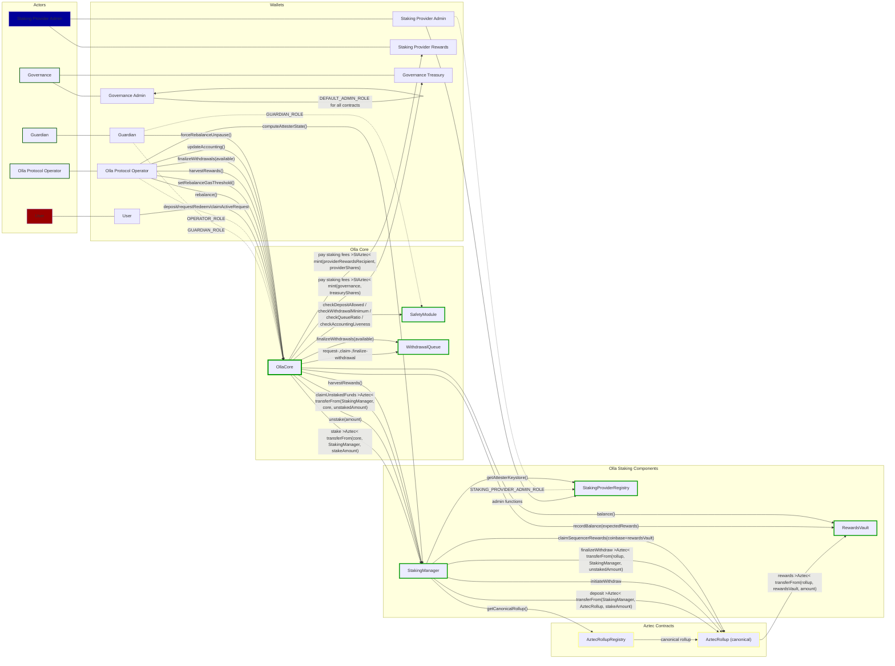
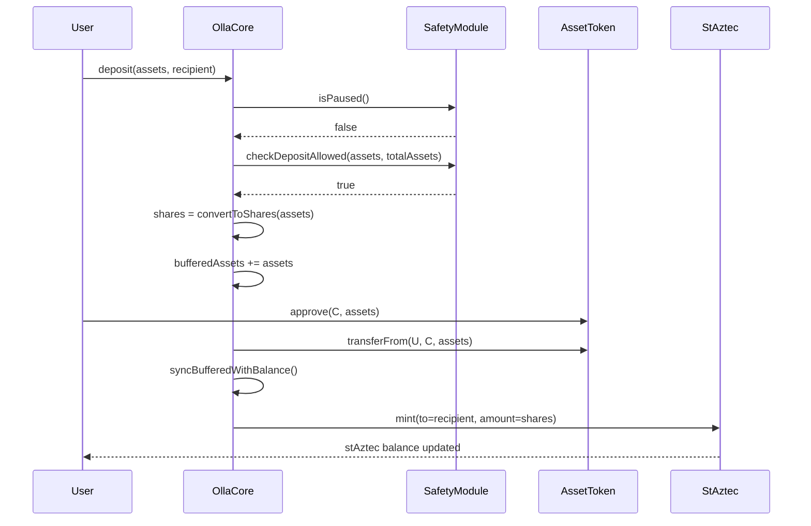
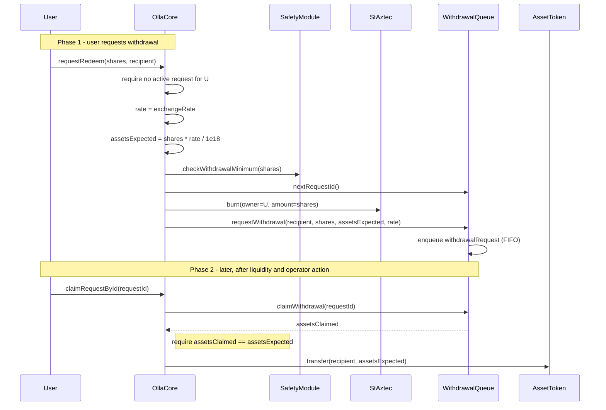
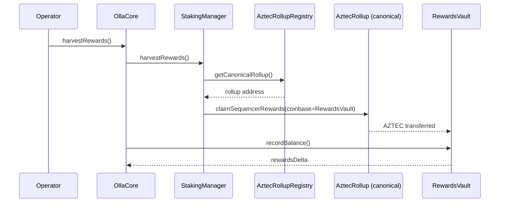
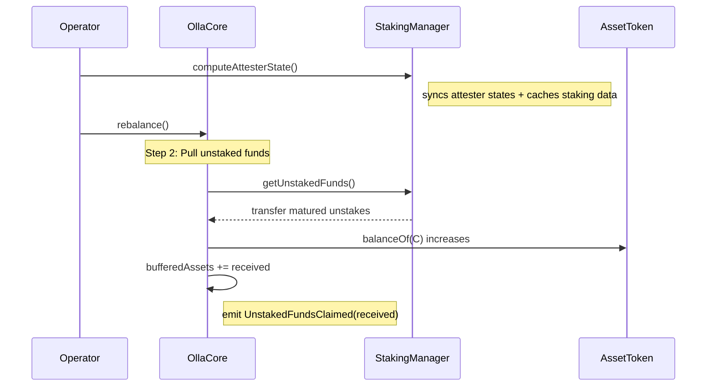
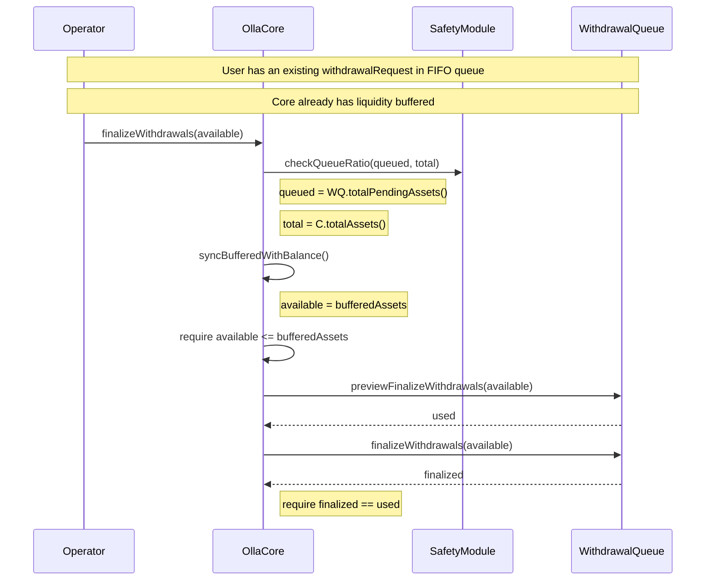
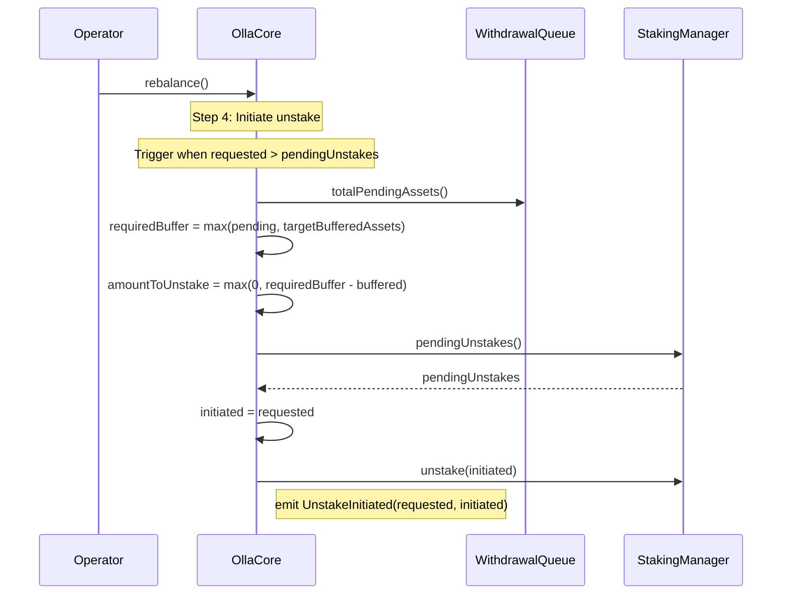
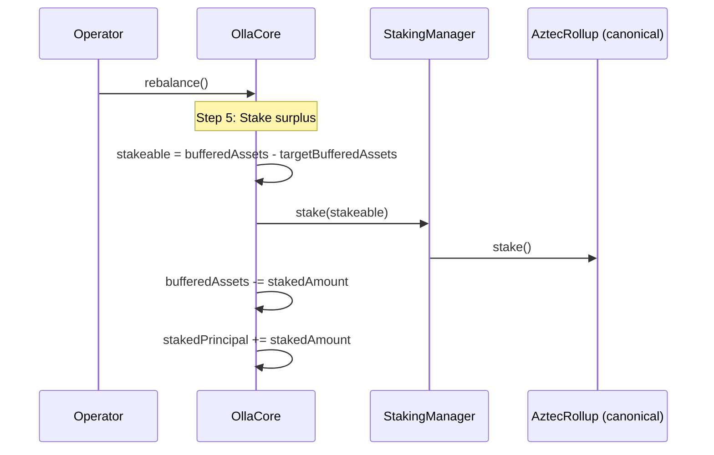
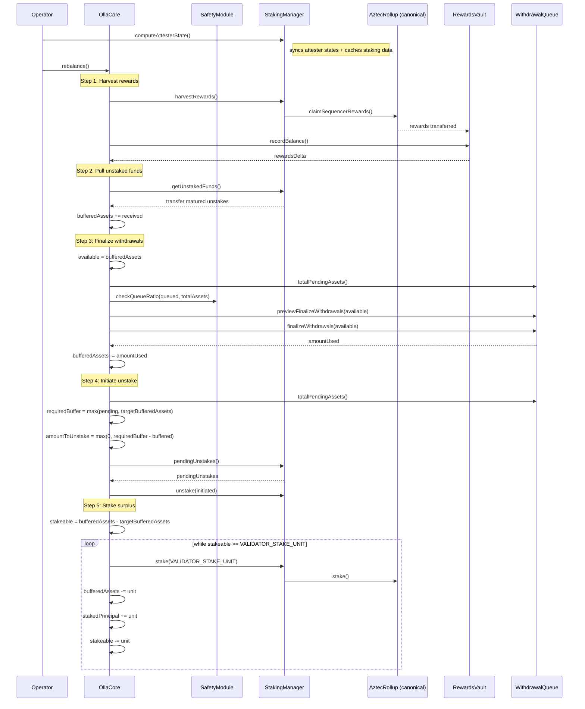
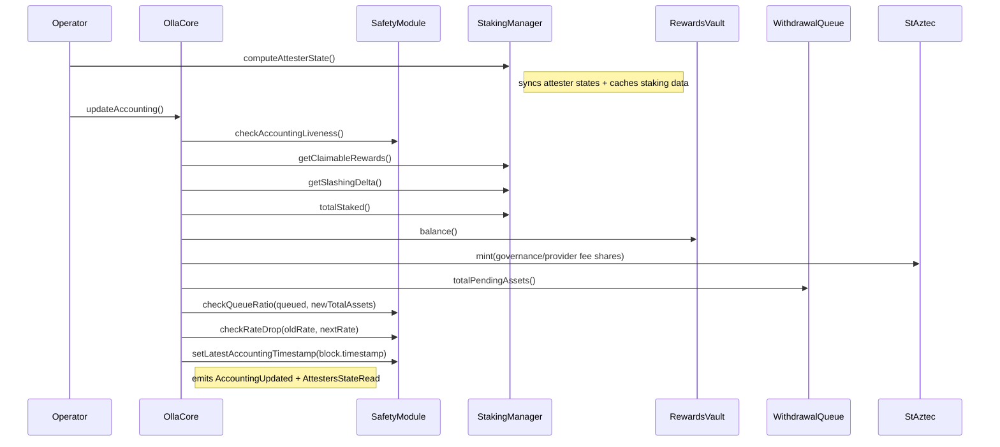

# Architecture and Flows

## Top-level diagram

## Activity diagrams

### Deposit

### Withdrawal

### Rebalance use cases

#### Harvest rewards

#### Pull unstaked funds

#### Process user withdrawal requests

#### Initiate unstake

#### Stake surplus

#### Rebalance (full flow)

#### Update accounting

