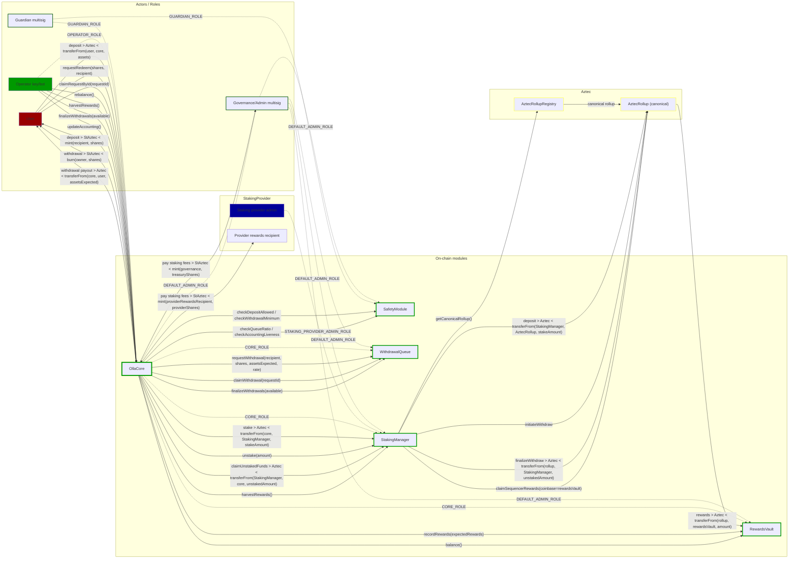
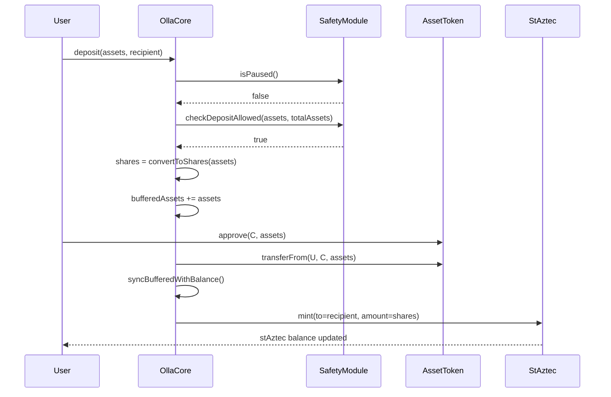
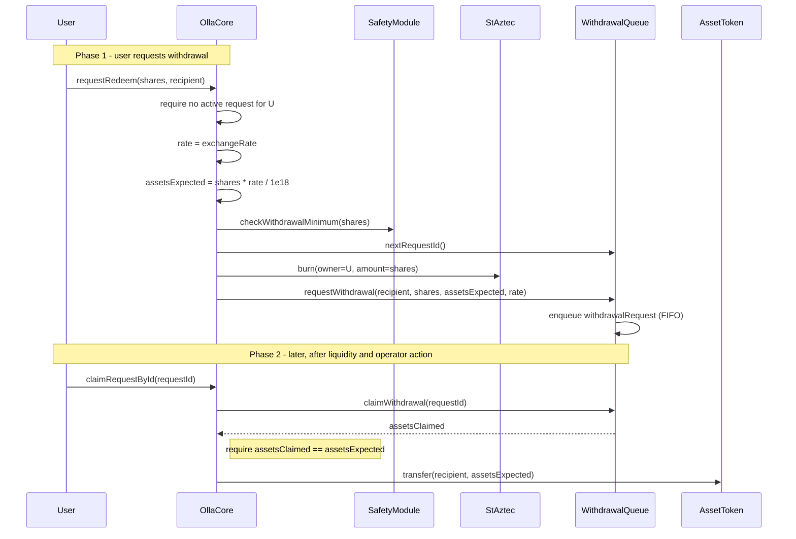
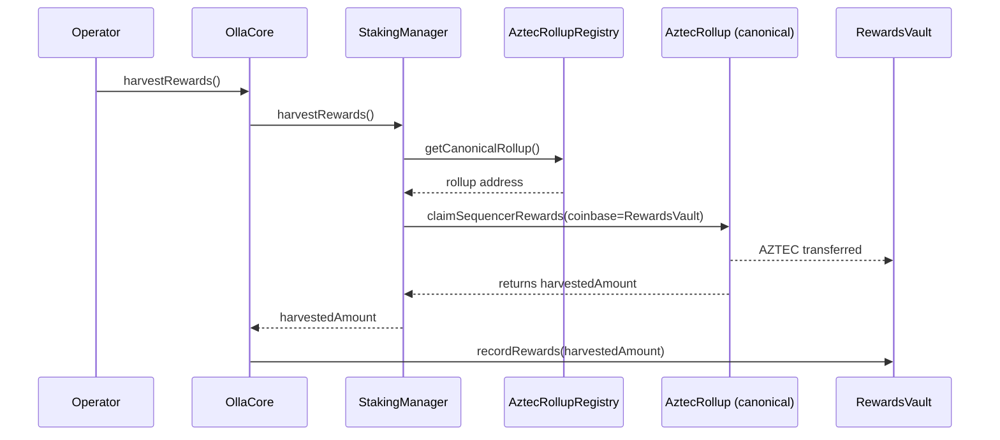
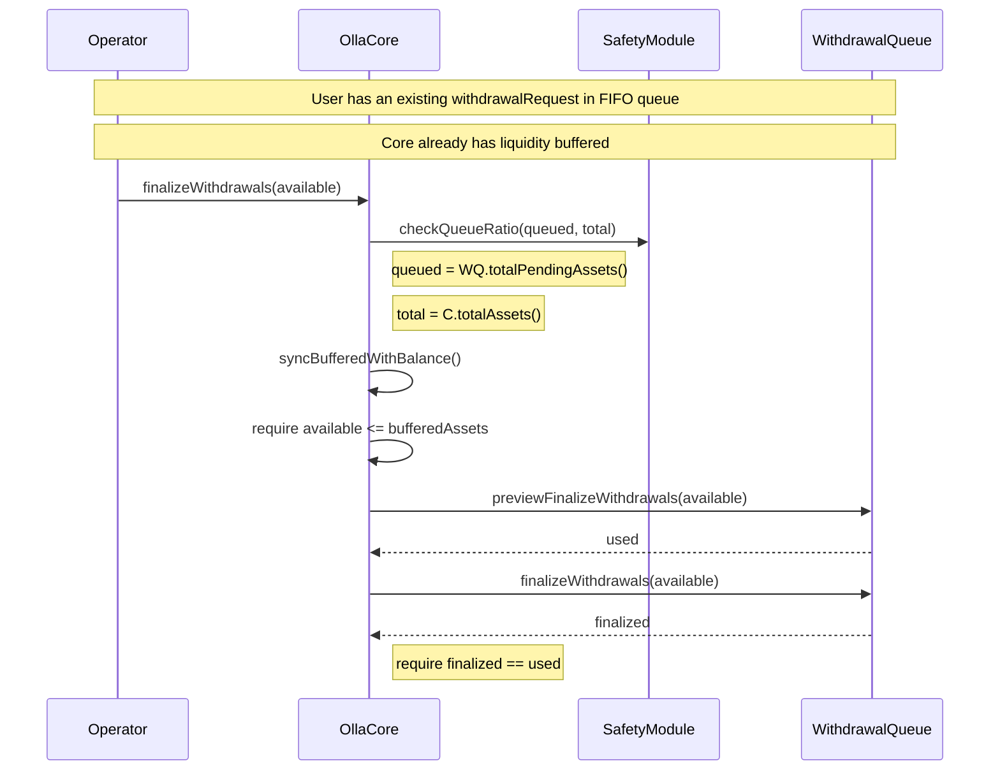
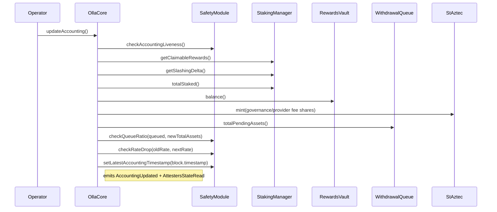

# Architecture and Flows

## Top-level diagram

## Activity diagrams

### Deposit

### Withdrawal

### Rebalance use cases

#### Harvest rewards

#### Process user withdrawal requests

#### Update accounting

