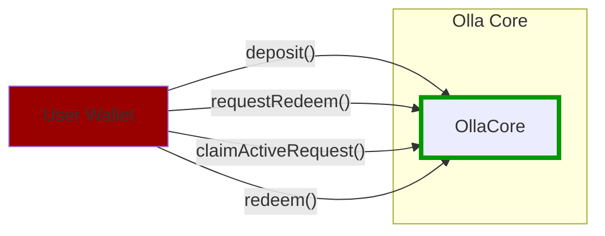
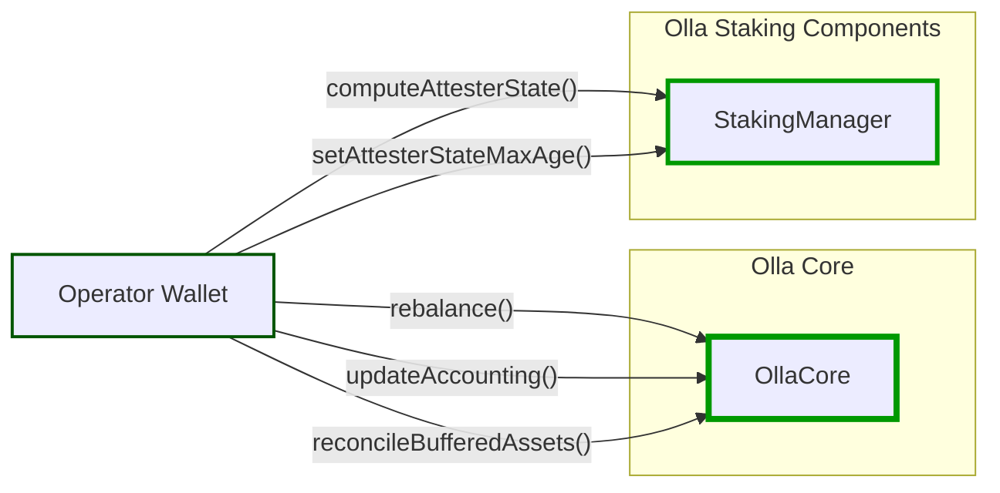
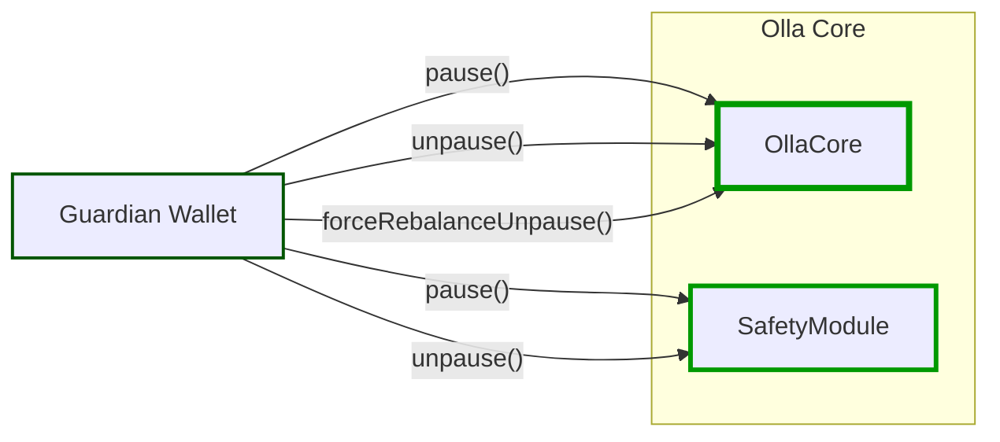
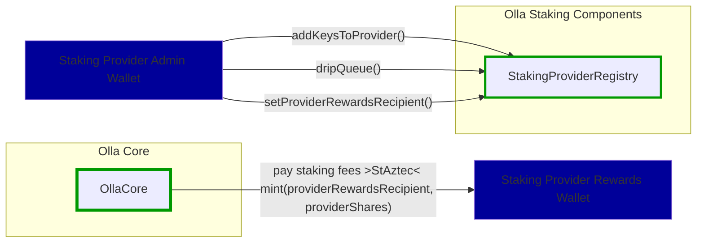
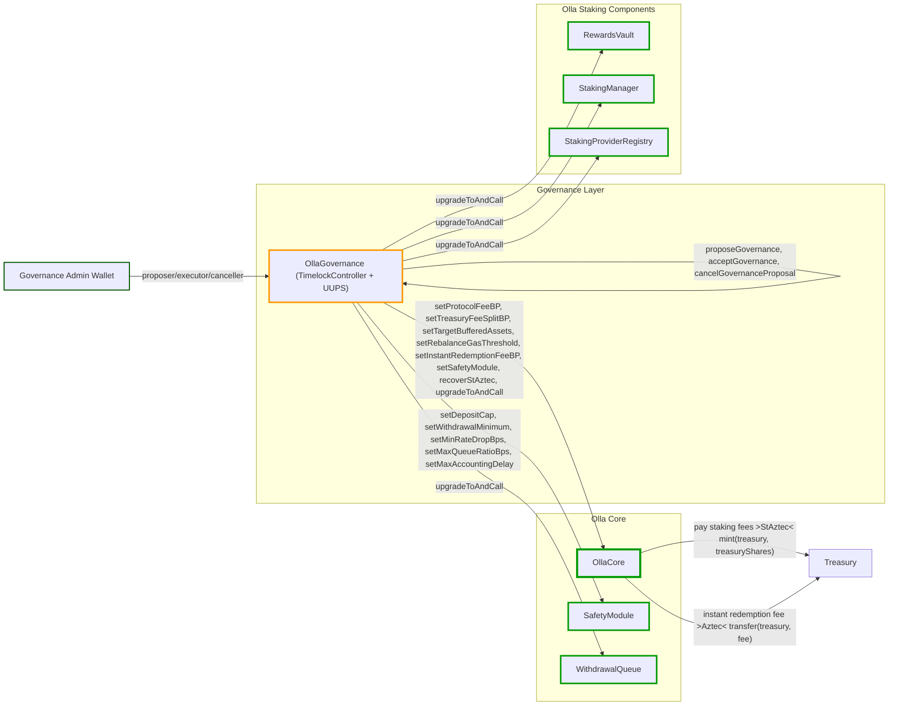

# Olla Protocol Overview (Post-Governance Extraction)

Olla Core is the on-chain vault and staking coordinator for liquid staking on Aztec. It accepts user deposits, manages async withdrawals, and delegates staking operations to Aztec rollup contracts via the staking manager.

This document reflects the architecture after extracting governance into a dedicated `OllaGovernance` contract and separating the treasury address from governance authority.

## Architecture overview

```mermaid
---
config:
  layout: elk
---
flowchart LR

subgraph "Actors"
    user[User]
    governanceActor[Governance]
    guardianActor[Guardian]
    ollaOperatorActor[Olla Protocol Operator]
    stakingProviderActor[Staking Provider Admin]
end

subgraph "Wallets"
    userWallet[User]
    stakingProviderAdminWallet[Staking Provider Admin]
    stakingProviderRewardsWallet[Staking Provider Rewards]
    guardianWallet[Guardian]
    ollaOperatorWallet[Olla Protocol Operator]
    governanceAdminWallet[Governance Admin]
    treasuryWallet[Treasury]
    user --- userWallet
    stakingProviderActor --- stakingProviderAdminWallet
    stakingProviderActor --- stakingProviderRewardsWallet
    guardianActor --- guardianWallet
    ollaOperatorActor --- ollaOperatorWallet
    governanceActor --- governanceAdminWallet
    governanceActor --- treasuryWallet
end

subgraph "Governance Layer"
    gov[OllaGovernance]
end

subgraph "Olla Core"
    core[OllaCore]
    safety[SafetyModule]
    withdrawQ[WithdrawalQueue]
end
subgraph "Olla Staking Components"
    rewards[RewardsVault]
    stkMan[StakingManager]
    spr[StakingProviderRegistry]
end

stakingProviderAdminWallet -->|"admin functions"| spr

subgraph "Aztec Contracts"
    rollupRegistry[AztecRollupRegistry]
    rollup["AztecRollup (canonical)"]
end

guardianWallet -. "GUARDIAN_ROLE" .-> core
guardianWallet -. "GUARDIAN_ROLE" .-> safety

ollaOperatorWallet -. "OPERATOR_ROLE" .-> core
stakingProviderAdminWallet -. "STAKING_PROVIDER_ADMIN_ROLE" .-> spr

governanceAdminWallet -->|"owner"| gov
gov -->|"parameter setters, upgrades"| core
gov -->|"DEFAULT_ADMIN_ROLE"| safety
gov -->|"DEFAULT_ADMIN_ROLE"| withdrawQ
gov -->|"DEFAULT_ADMIN_ROLE"| rewards
gov -->|"DEFAULT_ADMIN_ROLE"| stkMan
gov -->|"DEFAULT_ADMIN_ROLE"| spr

%% User flows (asset + call-path)
userWallet -->|"deposit/requestRedeem/claimActiveRequest/redeem"| core

core -->|"request-,claim-,finalize-withdrawal"| withdrawQ

core -->|"checkDepositAllowed / checkWithdrawalMinimum / checkQueueRatio / checkAccountingLiveness"| safety

%% Operator cycle (end-state orchestration)
ollaOperatorWallet -->|"computeAttesterState()"| stkMan
ollaOperatorWallet -->|"rebalance()"| core
ollaOperatorWallet -->|"updateAccounting()"| core

%% Guardian control
guardianWallet -->|"forceRebalanceUnpause()"| core

%% Staking principal (AZTEC token) movements
core -->|"stake >Aztec< transferFrom(core, StakingManager, stakeAmount)"| stkMan
stkMan -->|"getAttesterKeystore()"| spr
stkMan -->|"deposit >Aztec< transferFrom(StakingManager, AztecRollup, stakeAmount)"| rollup

core -->|"unstake(amount)"| stkMan
stkMan -->|"initiateWithdraw"| rollup

core -->|"claimUnstakedFunds >Aztec< transferFrom(StakingManager, core, unstakedAmount)"| stkMan
stkMan -->|"finalizeWithdraw >Aztec< transferFrom(rollup, StakingManager, unstakedAmount)"| rollup

core -->|"harvestRewards()"| stkMan
stkMan -->|"getCanonicalRollup()"| rollupRegistry
rollupRegistry -->|"canonical rollup"| rollup
stkMan -->|"claimSequencerRewards(coinbase=rewardsVault)"| rollup
rollup -->|"rewards >Aztec< transferFrom(rollup, rewardsVault, amount)"| rewards
core -->|"recordBalance(expectedRewards)"| rewards

core -->|"finalizeWithdrawals(available)"| withdrawQ

core -->|"balance()"| rewards

core -->|"pay staking fees >StAztec< mint(treasury, treasuryShares)"| treasuryWallet
core -->|"pay staking fees >StAztec< mint(providerRewardsRecipient, providerShares)"| stakingProviderRewardsWallet
core -->|"instant redemption fee >Aztec< transfer(treasury, fee)"| treasuryWallet

style user fill:#900
style ollaOperatorActor stroke:#050,stroke-width:2px
style stakingProviderActor fill:#009
style rollup stroke:#ff6,stroke-width:2px
style core stroke:#090,stroke-width:4px
style safety stroke:#090,stroke-width:3px
style rewards stroke:#090,stroke-width:3px
style stkMan stroke:#090,stroke-width:3px
style spr stroke:#090,stroke-width:3px
style withdrawQ stroke:#090,stroke-width:3px
style gov stroke:#f90,stroke-width:3px
style rollupRegistry stroke:#ff6,stroke-width:2px
style guardianActor stroke:#050,stroke-width:2px
style governanceActor stroke:#050,stroke-width:2px
```

## Contract architecture

```mermaid
---
config:
  layout: elk
---
flowchart LR

subgraph "Governance Layer"
    gov[OllaGovernance]
end

subgraph "Olla Core"
    core[OllaCore]
    safety[SafetyModule]
    withdrawQ[WithdrawalQueue]
end

subgraph "Olla Staking Components"
    rewards[RewardsVault]
    stkMan[StakingManager]
    spr[StakingProviderRegistry]
end

subgraph "Aztec Contracts"
    rollupRegistry[AztecRollupRegistry]
    rollup["AztecRollup (canonical)"]
end

%% Governance -> all contracts
gov -->|"owner (parameter setters, upgrades)"| core
gov -->|"DEFAULT_ADMIN_ROLE"| safety
gov -->|"DEFAULT_ADMIN_ROLE (upgrades)"| withdrawQ
gov -->|"DEFAULT_ADMIN_ROLE (upgrades)"| rewards
gov -->|"DEFAULT_ADMIN_ROLE (upgrades)"| stkMan
gov -->|"DEFAULT_ADMIN_ROLE (upgrades)"| spr

%% OllaCore <-> WithdrawalQueue
core -->|"request-,claim-,finalize-withdrawal"| withdrawQ

%% OllaCore <-> SafetyModule
core -->|"checkDepositAllowed / checkWithdrawalMinimum / checkQueueRatio / checkAccountingLiveness"| safety

%% Staking: stake flow
core -->|"stake >Aztec< transferFrom(core, StakingManager, stakeAmount)"| stkMan
stkMan -->|"getAttesterKeystore()"| spr
stkMan -->|"deposit >Aztec< transferFrom(StakingManager, AztecRollup, stakeAmount)"| rollup

%% Staking: unstake flow
core -->|"unstake(amount)"| stkMan
stkMan -->|"initiateWithdraw"| rollup

%% Staking: claim unstaked funds
core -->|"claimUnstakedFunds >Aztec< transferFrom(StakingManager, core, unstakedAmount)"| stkMan
stkMan -->|"finalizeWithdraw >Aztec< transferFrom(rollup, StakingManager, unstakedAmount)"| rollup

%% Rewards harvesting
core -->|"harvestRewards()"| stkMan
stkMan -->|"getCanonicalRollup()"| rollupRegistry
rollupRegistry -->|"canonical rollup"| rollup
stkMan -->|"claimSequencerRewards(coinbase=rewardsVault)"| rollup
rollup -->|"rewards >Aztec< transferFrom(rollup, rewardsVault, amount)"| rewards
core -->|"recordBalance(expectedRewards)"| rewards
core -->|"balance()"| rewards

%% Finalize withdrawals
core -->|"finalizeWithdrawals(available)"| withdrawQ

style gov stroke:#f90,stroke-width:3px
style core stroke:#090,stroke-width:4px
style safety stroke:#090,stroke-width:3px
style rewards stroke:#090,stroke-width:3px
style stkMan stroke:#090,stroke-width:3px
style spr stroke:#090,stroke-width:3px
style withdrawQ stroke:#090,stroke-width:3px
style rollup stroke:#ff6,stroke-width:2px
style rollupRegistry stroke:#ff6,stroke-width:2px
```

## User

No special role required. Any address can call these functions.

## Olla Protocol Operator

Requires `OPERATOR_ROLE` on OllaCore and StakingManager. `harvestRewards()` and `finalizeWithdrawals()` are permissionless but are called by the operator as part of the orchestration cycle.

## Guardian

Requires `GUARDIAN_ROLE` on OllaCore and SafetyModule.

## Staking Provider Admin

Requires `STAKING_PROVIDER_ADMIN_ROLE` on StakingProviderRegistry.

## Governance

The governance admin wallet owns the `OllaGovernance` contract, which acts as the single entry point for all governance operations. OllaGovernance owns OllaCore (via `Ownable2Step`) and holds `DEFAULT_ADMIN_ROLE` on all satellite contracts. The treasury address is stored in OllaGovernance and is independently configurable.

OllaGovernance inherits `TimelockController` to enforce minimum delays on governance operations. The governance admin wallet holds the proposer, executor, and canceller roles on the timelock.

## Action references

- User flows: [docs/user-actions.md](docs/user-actions.md)
- Operator flows: [docs/operator-actions.md](docs/operator-actions.md)
- Governance flows: [docs/governance-actions.md](docs/governance-actions.md)
