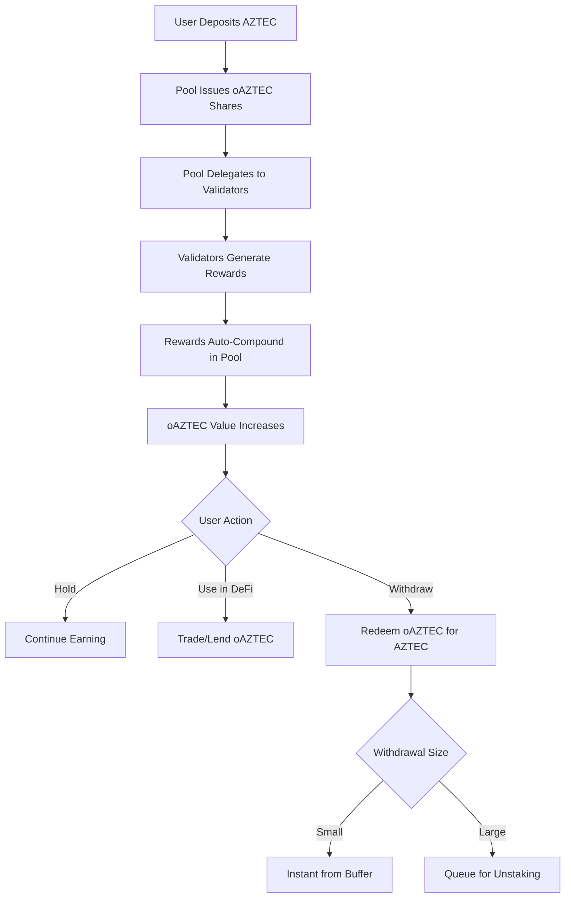

# Liquid Staking Mechanics

## Overview
Olla's liquid staking pool is the core mechanism that enables users to stake Aztec tokens while maintaining liquidity through the [[oAztec-token-design|oAztec token]].

## Core Mechanics

### Staking Pool Operation
The staking pool serves as an automated intermediary between users and Aztec validators:

1. **User Deposits** - Users deposit Aztec tokens into the pool
2. **Automatic Delegation** - Pool delegates tokens to selected validators via [[validator-delegation-strategy|DelegationRouter]]
3. **Reward Collection** - Validators earn staking rewards on delegated tokens
4. **Reward Distribution** - Rewards flow back to the pool and are automatically reinvested
5. **Exchange Rate Updates** - Pool share value increases as rewards compound

### Key Components

#### RewardsCollector
- **Function**: Handles periodic reward collection from validators and updates exchange rates
- **Mechanism**: Automatically compounds rewards by reinvesting them into the pool
- **Integration**: Links to PerformanceOracle for validator performance data
- **Updates**: Triggers exchange rate recalculation when rewards are collected
- **Frequency**: Configurable collection intervals (e.g., daily, weekly)
- **Gas Optimization**: Batches multiple validator reward collections into single transaction

#### Withdrawal Buffer
- **Purpose**: Maintains liquid Aztec reserves for immediate withdrawals
- **Management**: Queue logic handles larger redemptions that require unstaking
- **Target**: Maintains minimum buffer size to handle 95%+ of withdrawal requests instantly
- **Integration**: Works with ERC-7540 async redemption system
- **Dynamic Sizing**: Buffer size adjusts based on historical withdrawal patterns
- **Related to**: [[risk-assessment|withdrawal risk management]]

#### Fee Structure
- Protocol fees taken from staking rewards
- Split between stakers, operators, and treasury
- Governance-controlled via [[dao-governance|Olla DAO]] parameters
- Insurance fund allocation for [[risk-assessment|slashing protection]]

## User Flow

## Technical Implementation

### ERC-7540 Integration
- **Asynchronous Operations**: Support for delayed deposits/withdrawals during high demand
- **Share-based Accounting**: Non-rebasing token model for clean DeFi integration
- **Request/Claim Flow**: Two-step process for large operations

### Exchange Rate Calculation
- **Initial Rate**: 1 AZTEC = 1 oAZTEC at protocol launch  
- **Reward Accrual**: Exchange rate increases as rewards are added to pool
- **Formula**: `exchangeRate = (totalAztecInPool + accumulatedRewards) / totalOAztecSupply`
- **Oracle Integration**: Rate updates triggered by [[oracle-design|PerformanceOracle]] checkpoints

### Delegation Strategy
- **Multi-Operator**: Diversification across multiple validators reduces risk
- **Weight-Based**: Delegation amounts based on operator performance and caps
- **Rebalancing**: Automated rebalancing via [[validator-delegation-strategy|DelegationRouter]]
- **Performance Monitoring**: Continuous tracking via [[node-operator-framework|OperatorRegistry]]

## Risks and Mitigations

### Validator Risk
- **Slashing Risk**: Validators may be penalized for misbehavior
- **Mitigation**: Insurance fund and diversified delegation
- **Related**: [[risk-assessment|Comprehensive Risk Analysis]]

### Liquidity Risk  
- **Withdrawal Queues**: Large redemptions may require unstaking period
- **Mitigation**: Withdrawal buffer and queue management
- **Related**: [[emergency-procedures|Emergency Response]]

### Smart Contract Risk
- **Code Risk**: Bugs in staking contracts could affect funds
- **Mitigation**: Audits, formal verification, gradual rollout
- **Related**: [[security-model|Security Framework]]

## Development Phases

### Phase 0 - MVP
- **No oAZTEC Token**: Phase 0 operates without the liquid staking ERC-20 token
- **AZTEC Token Staking**: Native AZTEC tokens are deposited and staked with validators
- **Internal Accounting**: User positions tracked via internal ledger system
- **Single Internal Operator**: Protocol team runs the initial validator
- **Reward Distribution**: Staking rewards from validators flow back to users proportionally
- **Simple UI**: Basic deposit/withdraw interface without token transfers
- Related: [[phase-development-analysis|Development Roadmap]]

### Phase 1 - Multi-Operator
- OperatorRegistry for validator management
- Performance monitoring and slashing
- Risk management improvements

### Phase 2 - Tokenization  
- Full ERC-7540 implementation
- oAZTEC token launch
- DeFi integration readiness

### Phase 3 - Decentralized Governance
- Full DAO control
- Formal parameter management
- Emergency procedures

---

**Tags:** #liquid-staking #protocol-mechanics #aztec-network #staking-pool #rewards #delegation

**Links:**
- [[oAztec-token-design]] - The liquid staking token
- [[validator-delegation-strategy]] - Delegation mechanisms  
- [[dao-governance]] - Protocol governance
- [[risk-assessment]] - Risk analysis
- [[oracle-design]] - Off-chain components

**Last Updated:** 2025-10-15
