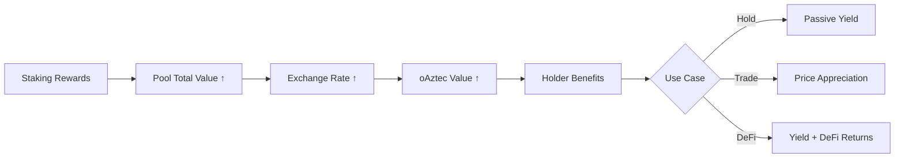

# oAztec Token Design

## Overview
oAztec is the liquid representation of staked Aztec tokens - a yield-bearing, transferable ERC-20 token that maintains full DeFi composability while earning staking rewards. The token represents shares in an ERC-7540 vault that holds the underlying Aztec tokens.

## Token Mechanics

### Core Properties
- **ERC-20 Standard**: Standard token interface for oAztec shares
- **Non-Rebasing**: Share-based model where token value increases over time via exchange rate
- **Yield-Bearing**: Automatically accrues staking rewards without user action
- **Transferable**: Full liquidity and DeFi composability maintained
- **Redeemable**: Can always be exchanged back for underlying Aztec tokens
- **Vault Integration**: Minted/burned by ERC-7540 vault as users deposit/withdraw

### Token Architecture

#### Relationship with ERC-7540 Vault
- **oAztec Token**: ERC-20 token representing shares in the liquid staking pool
- **ERC-7540 Vault**: The underlying vault contract that holds Aztec tokens and implements async deposit/redemption
- **Rate Adapter**: Interface for external protocols to read oAztec exchange rates
- **Minting/Burning**: oAztec tokens are minted when users deposit Aztec, burned when they withdraw

#### Exchange Rate Mechanism
- **Initial Rate**: 1 AZTEC = 1 oAZTEC at protocol launch
- **Appreciation**: As rewards compound, 1 oAZTEC represents >1 AZTEC
- **Formula**: `exchangeRate = (totalAztecInPool + accumulatedRewards) / totalOAztecSupply`
- **Updates**: Rate recalculated when RewardsCollector processes validator rewards

### Value Accrual Model


### Exchange Rate Mechanism
- **Initial Rate**: 1 AZTEC = 1 oAZTEC at launch
- **Appreciation**: As rewards compound, 1 oAZTEC represents >1 AZTEC
- **Transparent**: Rate calculation visible on-chain via [[oracle-design|Rate Oracle]]
- **Updated**: Regular updates based on [[liquid-staking-mechanics|reward collection cycles]]

## ERC Standards Implementation

### ERC-20: Basic Token Standard
```solidity
// Core ERC-20 functions with yield-bearing semantics
function balanceOf(address account) external view returns (uint256)
function transfer(address to, uint256 amount) external returns (bool)
function approve(address spender, uint256 amount) external returns (bool)
```

**Implementation Notes:**
- Balance represents oAztec shares, not underlying Aztec value
- Transfer moves shares, preserving proportional yield rights
- Standard approval mechanisms for DeFi integrations

### ERC-2612: Permit (Gasless Approvals)
```solidity
function permit(
    address owner, address spender, uint256 value,
    uint256 deadline, uint8 v, bytes32 r, bytes32 s
) external
```

**Benefits:**
- Gasless approvals via off-chain signatures
- Better UX for DeFi interactions
- Meta-transaction support for account abstraction

### ERC-1271: Smart Wallet Support
```solidity
function isValidSignature(bytes32 hash, bytes memory signature) 
    external view returns (bytes4 magicValue)
```

**Use Cases:**
- Multisig wallets can interact with oAztec
- Smart contract wallets supported
- DAO treasuries can hold and use oAztec
- Related: [[dao-governance|governance voting]]

### ERC-7540: Async Deposit/Redemption
```solidity
// Asynchronous operations for large amounts
function requestDeposit(uint256 assets, address receiver) external returns (uint256 requestId)
function requestRedeem(uint256 shares, address receiver) external returns (uint256 requestId)
function claimDeposit(address receiver) external returns (uint256 shares)
function claimRedeem(address receiver) external returns (uint256 assets)
```

**Key Features:**
- Handles large deposits/withdrawals that require validator unstaking
- Two-phase commit for improved UX during high demand
- Queue management for fair ordering
- Related: [[liquid-staking-mechanics|withdrawal buffer]]

## DeFi Integration Scenarios

### Trading and Arbitrage
- **Secondary Markets**: oAztec can trade on DEXs with potential premium/discount
- **Arbitrage**: Price discovery mechanism between oAztec and underlying Aztec
- **Liquidity**: Market makers can provide oAztec liquidity

### Lending Protocols
- **Collateral**: Use oAztec as collateral while earning staking rewards
- **Lending**: Lend out oAztec to earn additional yield on top of staking
- **Leveraging**: Borrow against oAztec to increase staking exposure

### Yield Strategies
- **Farming**: Provide oAztec liquidity in yield farms
- **Compounding**: Protocols can build yield strategies on top of oAztec
- **Risk Management**: Diversified yield sources beyond pure staking

## Rate Oracle Integration

### Rate Adapter Contract
```solidity
interface IRateAdapter {
    function getExchangeRate() external view returns (uint256)
    function getUnderlyingBalance(uint256 shares) external view returns (uint256)
    function getSharesForUnderlying(uint256 assets) external view returns (uint256)
}
```

**Purpose:**
- Standard interface for DeFi protocols to read oAztec value
- Real-time rate information for pricing and liquidations
- Historical rate data for analytics
- Links to: [[oracle-design|Oracle Architecture]]

### Integration Examples
- **Price Feeds**: Chainlink-style feeds for oAztec/Aztec rate
- **DEX Pricing**: AMMs can use accurate pricing for swaps  
- **Lending Protocols**: Accurate collateral valuations
- **Portfolio Trackers**: Real-time position values

## Risk Considerations

### Depeg Risk
- **Causes**: High withdrawal demand, validator slashing, smart contract issues
- **Monitoring**: Track oAztec market price vs. exchange rate
- **Mitigation**: Adequate withdrawal buffers, insurance mechanisms
- **Related**: [[risk-assessment|Comprehensive Risk Analysis]]

### Smart Contract Risk
- **Token Contract**: Bugs could affect transfers or rate calculations
- **Integration Risk**: DeFi protocols may mishandle yield-bearing tokens
- **Mitigation**: Thorough audits, formal verification, gradual rollout

### Liquidity Risk
- **Market**: oAztec secondary markets may have limited liquidity
- **Protocol**: Large redemptions may face delays during unstaking
- **Mitigation**: Market maker programs, withdrawal buffer management

## Development Roadmap

### Phase 0 - MVP (No oAZTEC Token)
- **No ERC-20 Token**: Phase 0 operates without the oAZTEC liquid staking token
- **Native AZTEC Staking**: Users deposit native AZTEC tokens directly
- **Internal Ledger**: User positions tracked via internal accounting system
- **Reward Distribution**: Staking rewards from validators distributed proportionally
- **No Liquidity**: Users cannot transfer or trade their staking positions
- **Proof of Concept**: Validates core staking mechanics before tokenization

### Phase 1 - Multi-Operator
- Enhanced risk management
- Performance monitoring
- Slashing protection

### Phase 2 - Token Launch  
- **Full ERC-7540 Implementation**: Async deposit/redeem
- **ERC-2612 Permits**: Gasless approvals  
- **Rate Oracle**: External rate adapter
- **DeFi Readiness**: Integration documentation and tools

### Phase 3 - Advanced Features
- **ERC-1271 Support**: Smart wallet compatibility
- **Advanced Oracle**: Multi-source rate validation
- **Integration Partnerships**: Major DeFi protocol integrations

---

**Tags:** #tokenomics #erc-standards #liquid-staking #defi-integration #yield-bearing #aztec-network

**Links:**
- [[liquid-staking-mechanics]] - Core protocol mechanics
- [[dao-governance]] - Governance token vs utility token
- [[oracle-design]] - Rate oracle architecture
- [[risk-assessment]] - Token-specific risks
- [[defi-integrations]] - Integration possibilities

**Last Updated:** 2025-10-15
