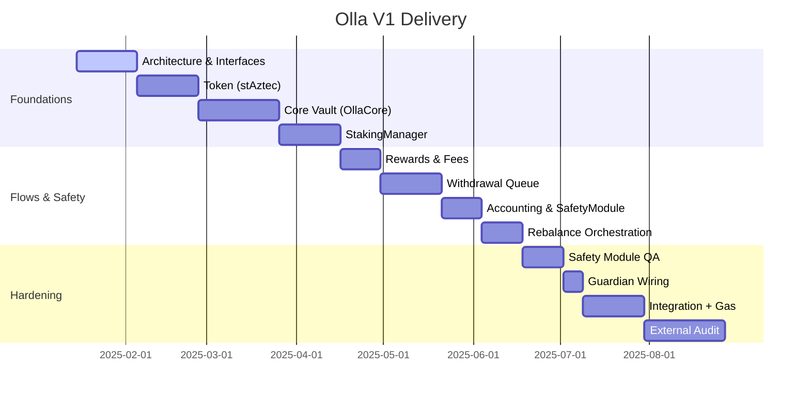

# Development Plan (V1)

This replaces the legacy phase-based roadmap. The authoritative build plan is the 12-milestone sequence in `research/technical/architecture/milestones.md`.

## Snapshot timeline (conceptual)

## Execution guardrails
- **Single validator, single operator** in V1; defer multi-validator routing to V2.
- **No oracle contract**: rely on Aztec rollup state directly.
- **Protocol fee** minted as synthetic shares during accounting; fee split 50/50 treasury vs provider.
- **Safety first**: caps, circuit breakers, and guardian pause must be live before raising limits.

## Deliverable mapping
- Component specs: `research/technical/architecture/components/*.md`
- Interfaces/roles: `research/technical/architecture/interfaces-and-roles.md`
- Safety and ops runbooks: `research/technical/architecture/operations-and-controls.md`
- Launch constraints: `research/technical/architecture/launch-constraints.md`
