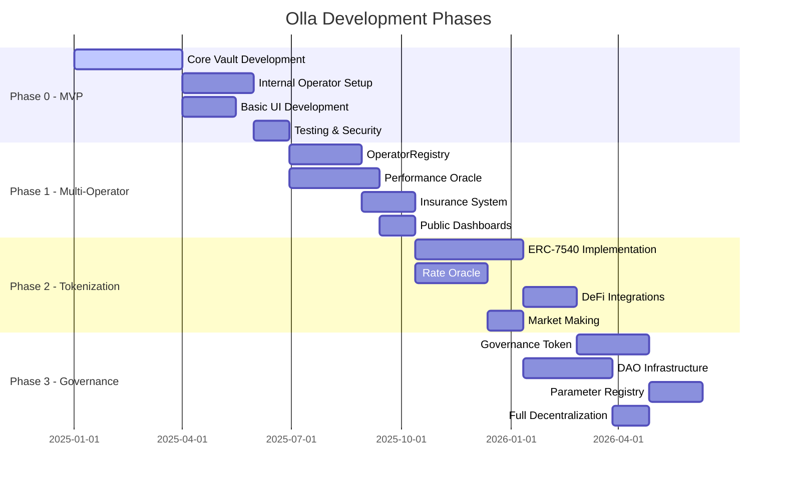

# Phase Development Analysis

## Overview
Detailed analysis of Olla's four-phase development roadmap, from MVP to full decentralized governance, including technical requirements, risks, and success criteria for each phase.

## Development Timeline



## Phase 0 - MVP (No oAZTEC Token)

### Goals
- **Primary**: Prove end-to-end staking mechanics work reliably
- **Secondary**: Establish basic operational procedures and monitoring
- **Validation**: Demonstrate stable rewards flow and clean withdrawals

### Token Architecture
- **No oAZTEC Token**: Phase 0 operates without the liquid staking token
- **AZTEC Tokens Present**: Native AZTEC tokens are still staked and earn rewards
- **Internal Accounting**: User positions tracked via internal ledger system
- **Reward Distribution**: Staking rewards from validators flow back to users proportionally

### Technical Scope

#### Core Contracts
```solidity
// Simplified vault without oAZTEC ERC-20 token
// Handles AZTEC token deposits and staking rewards
contract MinimalVault {
    IERC20 public immutable aztecToken;               // AZTEC token contract
    mapping(address => uint256) public userShares;    // Internal ledger
    mapping(address => uint256) public pendingWithdrawals;
    
    uint256 public totalShares;
    uint256 public totalAssets;                       // Total AZTEC tokens staked
    uint256 public accumulatedRewards;                // Rewards from staking
    address public internalOperator;                  // Single operator
    
    constructor(address _aztecToken, address _operator) {
        aztecToken = IERC20(_aztecToken);
        internalOperator = _operator;
    }
    
    function deposit(uint256 amount) external {
        require(amount > 0, "Invalid amount");
        
        // Transfer AZTEC tokens from user to vault
        aztecToken.transferFrom(msg.sender, address(this), amount);
        
        uint256 shares = calculateShares(amount);
        userShares[msg.sender] += shares;
        totalShares += shares;
        totalAssets += amount;
        
        // Delegate AZTEC tokens to internal operator for staking
        aztecToken.transfer(internalOperator, amount);
        delegateToOperator(internalOperator, amount);
        
        emit Deposited(msg.sender, amount, shares);
    }
    
    function withdraw(uint256 shares) external {
        require(userShares[msg.sender] >= shares, "Insufficient shares");
        
        uint256 assets = calculateAssets(shares);
        userShares[msg.sender] -= shares;
        totalShares -= shares;
        
        // Try immediate withdrawal from buffer
        if (withdrawalBuffer >= assets) {
            withdrawalBuffer -= assets;
            aztecToken.transfer(msg.sender, assets);
        } else {
            // Queue for later processing
            pendingWithdrawals[msg.sender] += assets;
            requestUnstaking(assets);
        }
        
        emit Withdrawn(msg.sender, assets, shares);
    }
    
    // Process staking rewards (called by internal operator)
    function processRewards(uint256 newRewards) external {
        require(msg.sender == internalOperator, "Not operator");
        accumulatedRewards += newRewards;
        totalAssets += newRewards;
        // Rewards automatically increase share value for all users
        emit RewardsProcessed(newRewards);
    }
    
    // Calculate shares based on current exchange rate
    function calculateShares(uint256 assets) public view returns (uint256) {
        if (totalShares == 0) {
            return assets; // 1:1 ratio for first deposit
        }
        return (assets * totalShares) / totalAssets;
    }
    
    // Calculate assets from shares
    function calculateAssets(uint256 shares) public view returns (uint256) {
        if (totalShares == 0) return 0;
        return (shares * totalAssets) / totalShares;
    }
    
    // Events
    event Deposited(address indexed user, uint256 assets, uint256 shares);
    event Withdrawn(address indexed user, uint256 assets, uint256 shares);
    event RewardsProcessed(uint256 rewards);
}
```

#### DelegationRouter (Internal)
- **Single Operator**: Only internal operator initially
- **Manual Delegation**: Direct delegation without complex algorithms  
- **Basic Monitoring**: Simple uptime and reward tracking
- **No Rebalancing**: Fixed delegation until manual intervention

#### Guardian System
```solidity
contract GuardianPause {
    address public guardian;
    bool public paused = false;
    
    modifier onlyGuardian() {
        require(msg.sender == guardian, "Not guardian");
        _;
    }
    
    modifier whenNotPaused() {
        require(!paused, "Contract paused");
        _;
    }
    
    function emergencyPause() external onlyGuardian {
        paused = true;
        emit EmergencyPaused(block.timestamp);
    }
}
```

### Operations Setup

#### Internal Operator Requirements
- **Infrastructure**: Dedicated Aztec validator node
- **Monitoring**: Basic uptime and performance tracking
- **Security**: Secure key management for validator operations
- **Backup**: Redundant systems for high availability

#### Multisig "DAO-Lite"
- **Parameter Control**: 3-of-5 multisig for basic parameters
- **Emergency Powers**: Pause/unpause capabilities
- **Upgrade Authority**: Contract upgrade permissions
- **Membership**: Core team + advisors

#### Basic Monitoring Stack
- **Validator Metrics**: Uptime, rewards, slashing events
- **Pool Metrics**: Total deposits, withdrawals, exchange rate
- **System Health**: Contract status, guardian system
- **Alerting**: Basic alerts for critical issues

### User Experience

#### Simple Deposit/Withdraw UI
```typescript
interface MVP_UI {
  // Core operations
  deposit(amount: string): Promise<TransactionResult>;  // Deposits AZTEC tokens
  withdraw(shares: string): Promise<TransactionResult>;
  
  // Balance information  
  getUserBalance(): Promise<UserBalance>;
  getExchangeRate(): Promise<string>;
  
  // Simple analytics
  getTotalPoolValue(): Promise<string>;
  getRewardsEarned(): Promise<string>;
  
  // AZTEC token operations
  approveAztec(amount: string): Promise<TransactionResult>;
  getAztecBalance(): Promise<string>;
}

interface UserBalance {
  shares: string;           // User's share balance
  underlyingValue: string;  // Current AZTEC value
  pendingWithdrawals: string; // Queued withdrawals
}
```

#### Token Structure in Phase 0
- **No oAZTEC Token**: Phase 0 does not mint any ERC-20 tokens
- **Native AZTEC Only**: Users interact directly with native AZTEC tokens
- **Token Approval Required**: Users must approve the vault to spend their AZTEC tokens
- **Internal Shares**: User positions represented as internal share balances
- **Reward Accrual**: Staking rewards increase the value of user shares proportionally
- **No Transferability**: Users cannot transfer or trade their staking positions
- **Direct Redemption**: Users can only withdraw their AZTEC tokens directly

#### Analytics (Events + Subgraph)
- **Event Tracking**: All deposits, withdrawals, and reward distributions
- **Basic Subgraph**: Simple indexing for historical data
- **Dashboard**: Real-time pool statistics and user positions
- **No Advanced Features**: No yield farming, governance, or complex DeFi

### Success Criteria for Phase 0

#### Technical Milestones
- [ ] **Stable Rewards Flow**: Consistent reward collection and distribution for 3+ epochs
- [ ] **Clean Withdrawals**: Withdrawal buffer handling 95%+ of requests immediately
- [ ] **Zero Slashing**: Internal operator maintains perfect slashing record
- [ ] **Uptime SLA**: >99% validator uptime across multiple months

#### Operational Milestones  
- [ ] **User Adoption**: 100+ unique users with $100K+ total value locked
- [ ] **Monitoring**: Comprehensive monitoring and alerting systems operational
- [ ] **Incident Response**: Tested emergency procedures and guardian system
- [ ] **Community**: Active community feedback and engagement

#### Security Milestones
- [ ] **Audit Completion**: Initial security audit with no critical findings
- [ ] **Bug Bounty**: Community security testing program launched
- [ ] **Stress Testing**: System handles high deposit/withdrawal volumes
- [ ] **Recovery Testing**: Emergency pause and recovery procedures validated

### Risks and Mitigations

#### Phase 0 Specific Risks
- **Single Operator Risk**: Complete dependence on internal validator
- **Centralization**: Team control over all parameters and upgrades
- **Limited Liquidity**: Small withdrawal buffer may cause delays
- **Technical Debt**: Simple implementations may need complete rewrites

#### Mitigation Strategies
- **Operator Redundancy**: Backup validator infrastructure
- **Conservative Parameters**: Low risk settings and small initial caps
- **Monitoring**: Extensive monitoring to catch issues early
- **Communication**: Clear user expectations about limitations

## Phase 1 - Multi-Operator & Risk Plumbing

### Goals
- **Primary**: Decentralize staking supply across multiple operators
- **Secondary**: Implement comprehensive risk management systems
- **Validation**: Automated rebalancing works and slashing protection tested

### Technical Scope

#### OperatorRegistry Implementation
```solidity
contract OperatorRegistry is AccessControl {
    struct Operator {
        address operatorAddress;
        string metadataURI;        // IPFS metadata
        uint256 stakeCap;          // Maximum delegated stake
        uint256 currentStake;      // Current delegation
        uint256 commission;        // Operator fee (basis points)
        uint256 collateral;       // Security deposit
        OperatorStatus status;
        uint256 approvalTimestamp;
    }
    
    enum OperatorStatus { Applied, Approved, Active, Warning, Suspended }
    
    mapping(address => Operator) public operators;
    address[] public approvedOperators;
    
    function applyOperator(
        string memory metadataURI,
        uint256 requestedCap,
        uint256 commission
    ) external payable {
        require(msg.value >= MIN_COLLATERAL, "Insufficient collateral");
        require(operators[msg.sender].operatorAddress == address(0), "Already applied");
        
        operators[msg.sender] = Operator({
            operatorAddress: msg.sender,
            metadataURI: metadataURI,
            stakeCap: requestedCap,
            currentStake: 0,
            commission: commission,
            collateral: msg.value,
            status: OperatorStatus.Applied,
            approvalTimestamp: 0
        });
        
        emit OperatorApplied(msg.sender, metadataURI, requestedCap);
    }
}
```

#### Performance Oracle (Multi-Signer)
```solidity
contract PerformanceOracle {
    struct Checkpoint {
        mapping(address => ValidatorMetrics) metrics;
        bytes32 dataHash;
        uint256 timestamp;
        address[] signers;
        mapping(address => bytes) signatures;
        bool finalized;
    }
    
    mapping(uint256 => Checkpoint) public checkpoints;
    mapping(address => bool) public authorizedSigners;
    uint256 public requiredSignatures = 3;
    
    function submitCheckpoint(
        uint256 checkpointId,
        ValidatorMetrics[] memory metrics,
        bytes memory signature
    ) external {
        require(authorizedSigners[msg.sender], "Unauthorized signer");
        
        Checkpoint storage checkpoint = checkpoints[checkpointId];
        checkpoint.signatures[msg.sender] = signature;
        
        // Store metrics data
        for (uint i = 0; i < metrics.length; i++) {
            checkpoint.metrics[operators[i]] = metrics[i];
        }
        
        // Check if we have enough signatures
        if (checkpoint.signers.length >= requiredSignatures) {
            finalizeCheckpoint(checkpointId);
        }
    }
}
```

#### Rebalancer System
```solidity
contract Rebalancer {
    function calculateRebalancing() external view returns (RebalanceAction[] memory) {
        address[] memory operators = operatorRegistry.getActiveOperators();
        RebalanceAction[] memory actions = new RebalanceAction[](operators.length);
        
        for (uint i = 0; i < operators.length; i++) {
            uint256 currentStake = operators[i].currentStake;
            uint256 optimalStake = calculateOptimalStake(operators[i]);
            
            if (optimalStake > currentStake) {
                actions[i] = RebalanceAction.Increase;
            } else if (optimalStake < currentStake) {
                actions[i] = RebalanceAction.Decrease;
            } else {
                actions[i] = RebalanceAction.NoChange;
            }
        }
        
        return actions;
    }
}
```

#### Insurance/SlashingEscrow
```solidity
contract SlashingInsurance {
    uint256 public insuranceFund;
    mapping(address => uint256) public operatorCollateral;
    
    function handleSlashingEvent(
        address operator,
        uint256 slashedAmount,
        bytes32 evidence
    ) external onlyOracle {
        uint256 operatorCover = operatorCollateral[operator];
        uint256 insuranceCover = 0;
        
        if (operatorCover >= slashedAmount) {
            // Operator collateral covers full loss
            operatorCollateral[operator] -= slashedAmount;
        } else {
            // Use operator collateral + insurance fund
            operatorCollateral[operator] = 0;
            uint256 remaining = slashedAmount - operatorCover;
            
            if (insuranceFund >= remaining) {
                insuranceFund -= remaining;
                insuranceCover = remaining;
            } else {
                // Partial insurance + socialized loss
                insuranceCover = insuranceFund;
                insuranceFund = 0;
                uint256 socializedLoss = remaining - insuranceCover;
                
                // Reduce exchange rate to socialize loss
                adjustExchangeRateForLoss(socializedLoss);
            }
        }
        
        emit SlashingCovered(operator, slashedAmount, operatorCover, insuranceCover);
    }
}
```

#### Formal Fee Split
- **Stakers**: 85-90% of staking rewards
- **Operators**: 5-10% commission (competitive rates)
- **Treasury**: 3-5% protocol development fund
- **Insurance**: 2-5% fund for slashing protection

### Operations Improvements

#### Performance SLOs
- **Uptime**: 99%+ minimum, 99.9%+ target
- **Reward Efficiency**: 95%+ of network average
- **Response Time**: <500ms average for network participation
- **Slashing**: Zero tolerance for preventable slashing

#### Incident Playbooks
- **Validator Downtime**: Automated failover and notification procedures
- **Slashing Events**: Immediate assessment and insurance claim processing
- **Oracle Failures**: Backup data sources and manual intervention
- **Smart Contract Issues**: Emergency pause and recovery procedures

### User Experience Enhancements

#### Join/Register Flows
- **Operator Application**: Streamlined application process with clear requirements
- **Community Review**: Public operator profiles and performance data
- **Application Status**: Real-time tracking of application progress

#### Public Dashboards
- **Pool Analytics**: Total value locked, operator distribution, rewards earned
- **Operator Performance**: Individual operator metrics and comparisons
- **Risk Metrics**: Slashing history, insurance fund status, diversification
- **User Portfolio**: Individual staking positions and reward history

### Success Criteria for Phase 1

#### Technical Milestones
- [ ] **Automated Rebalancing**: Rebalancing system successfully redistributes stake
- [ ] **Slashing Protection**: Insurance system covers slashing event with correct exchange rate adjustment
- [ ] **Multi-Operator Stability**: 5+ operators running without centralized failures
- [ ] **Oracle Consensus**: Multi-signer oracle reaches consensus on performance data

#### Risk Management Milestones
- [ ] **Insurance Testing**: Insurance waterfall tested with simulated slashing events
- [ ] **Performance Penalties**: Underperforming operators receive reduced stake allocations
- [ ] **Geographic Distribution**: Operators distributed across multiple regions/providers
- [ ] **Incident Response**: Successful response to operator or system incident

#### Operational Milestones
- [ ] **Operator Diversity**: 10+ approved operators with varied backgrounds
- [ ] **Community Governance**: DAO-lite successfully manages operator approval process
- [ ] **Performance Monitoring**: 24/7 monitoring with <5 minute incident detection
- [ ] **User Growth**: 1000+ users with $1M+ total value locked

## Phase 2 - Canonical Tokenization (ERC-7540 oAztec)

### Goals  
- **Primary**: Make staking positions liquid and DeFi-ready
- **Secondary**: Enable external integrations and rate oracle access
- **Validation**: oAztec mints/redeems match accounting and integrators can read rate reliably

### Technical Scope

#### ERC-7540 Vault Upgrade
```solidity
contract LiquidStakingVault is ERC7540, ERC4626 {
    using SafeERC20 for IERC20;
    
    // Async deposit/redeem implementation
    mapping(address => PendingDeposit) public pendingDeposits;
    mapping(address => PendingRedeem) public pendingRedeems;
    
    struct PendingDeposit {
        uint256 assets;
        uint256 timestamp;
        bool claimed;
    }
    
    struct PendingRedeem {
        uint256 shares;
        uint256 timestamp;
        bool claimed;
    }
    
    function requestDeposit(
        uint256 assets,
        address receiver
    ) external override returns (uint256 requestId) {
        require(assets > 0, "Invalid amount");
        
        asset.safeTransferFrom(msg.sender, address(this), assets);
        
        pendingDeposits[receiver] = PendingDeposit({
            assets: assets,
            timestamp: block.timestamp,
            claimed: false
        });
        
        emit DepositRequested(receiver, assets, block.timestamp);
        return uint256(keccak256(abi.encode(receiver, assets, block.timestamp)));
    }
    
    function claimDeposit(address receiver) external override returns (uint256 shares) {
        PendingDeposit storage deposit = pendingDeposits[receiver];
        require(!deposit.claimed, "Already claimed");
        require(deposit.assets > 0, "No pending deposit");
        
        shares = convertToShares(deposit.assets);
        deposit.claimed = true;
        
        // Mint oAztec shares
        _mint(receiver, shares);
        
        // Delegate assets to operators
        _delegateAssets(deposit.assets);
        
        emit DepositClaimed(receiver, deposit.assets, shares);
    }
}
```

#### oAztec Token (Full Implementation)
```solidity
contract OAztecToken is ERC20, ERC20Permit, ERC1271, AccessControl {
    IRateAdapter public rateAdapter;
    
    // Yield-bearing token with standard ERC-20 interface
    function balanceOf(address account) public view override returns (uint256) {
        return super.balanceOf(account); // Returns shares
    }
    
    // Convenience function for underlying value
    function balanceOfUnderlying(address account) external view returns (uint256) {
        return rateAdapter.convertToAssets(balanceOf(account));
    }
    
    // EIP-2612 permit for gasless approvals
    function permit(
        address owner,
        address spender,
        uint256 value,
        uint256 deadline,
        uint8 v,
        bytes32 r,
        bytes32 s
    ) public override {
        require(block.timestamp <= deadline, "ERC20Permit: expired deadline");
        
        bytes32 structHash = keccak256(
            abi.encode(PERMIT_TYPEHASH, owner, spender, value, _nonces[owner], deadline)
        );
        
        bytes32 hash = _hashTypedDataV4(structHash);
        address signer = ECDSA.recover(hash, v, r, s);
        require(signer == owner, "ERC20Permit: invalid signature");
        
        _nonces[owner]++;
        _approve(owner, spender, value);
    }
}
```

#### Rate/Oracle Adapter  
```solidity
contract RateAdapter is IRateAdapter, AccessControl {
    ILiquidStakingVault public vault;
    uint256 public lastUpdateTime;
    uint256 public currentRate;
    
    // Historical rate tracking
    mapping(uint256 => uint256) public historicalRates; // block => rate
    uint256[] public rateHistory;
    
    function getExchangeRate() external view override returns (uint256) {
        return currentRate;
    }
    
    function updateRate() external {
        uint256 newRate = vault.convertToAssets(1e18); // 1 share to assets
        
        if (newRate != currentRate) {
            historicalRates[block.number] = newRate;
            rateHistory.push(newRate);
            currentRate = newRate;
            lastUpdateTime = block.timestamp;
            
            emit RateUpdated(newRate, block.timestamp);
        }
    }
    
    // Integration helper functions
    function convertToAssets(uint256 shares) external view override returns (uint256) {
        return shares * currentRate / 1e18;
    }
    
    function convertToShares(uint256 assets) external view override returns (uint256) {
        return assets * 1e18 / currentRate;
    }
}
```

### DeFi Integration Framework

#### Integration Documentation
- **Developer Guides**: Complete integration tutorials and examples
- **Rate Oracle Usage**: How to read oAztec exchange rates reliably
- **Liquidity Considerations**: Understanding async withdrawals and buffers
- **Security Best Practices**: Safe integration patterns and common pitfalls

#### Launch Integrations
```typescript
// Example AMM integration
interface AMMIntegration {
  // Create oAztec/Aztec liquidity pool
  createPool(
    tokenA: Address,    // oAztec
    tokenB: Address,    // Aztec
    fee: number,        // Pool fee tier
    initialRate: string // Starting exchange rate
  ): Promise<PoolAddress>;
  
  // Add liquidity with rate adapter
  addLiquidity(
    pool: PoolAddress,
    amountA: string,    // oAztec amount
    amountB: string,    // Aztec amount
    slippage: number    // Max slippage tolerance
  ): Promise<LiquidityPosition>;
}

// Example lending integration  
interface LendingIntegration {
  // Use oAztec as collateral
  depositCollateral(
    amount: string,     // oAztec amount
    account: Address    // Borrower account
  ): Promise<CollateralPosition>;
  
  // Calculate borrowing power
  getBorrowingPower(
    collateralAmount: string, // oAztec collateral
    ltv: number              // Loan-to-value ratio
  ): Promise<string>;        // Max borrow amount
}
```

### Success Criteria for Phase 2

#### Technical Milestones
- [ ] **Token Accounting**: oAztec mints/burns exactly match pool share calculations
- [ ] **Rate Oracle Reliability**: External protocols can read rates with 99.9% uptime
- [ ] **Async Operations**: ERC-7540 request/claim flow handles high demand periods
- [ ] **DeFi Compatibility**: oAztec works seamlessly in major DeFi protocols

#### Integration Milestones
- [ ] **AMM Pools**: oAztec trading pairs live on major DEXs
- [ ] **Lending Markets**: oAztec accepted as collateral in lending protocols  
- [ ] **Yield Strategies**: Advanced yield farming strategies using oAztec
- [ ] **Analytics**: Portfolio trackers and analytics platforms support oAztec

#### Market Milestones
- [ ] **Liquidity**: $100K+ daily trading volume in oAztec markets
- [ ] **Integrations**: 5+ major DeFi protocols actively using oAztec
- [ ] **User Adoption**: 5000+ users holding oAztec tokens
- [ ] **Total Value Locked**: $10M+ in the liquid staking pool

## Phase 3 - Governance & Controls

### Goals
- **Primary**: Formalize decentralized control without sacrificing safety
- **Secondary**: Enable community-driven protocol evolution
- **Validation**: Timelocked upgrades and parameter changes work, incident procedures tested

### Technical Scope

#### ERC20Votes Governance Token (If Needed)
```solidity
contract OllaGovernanceToken is ERC20, ERC20Votes, AccessControl {
    bytes32 public constant MINTER_ROLE = keccak256("MINTER_ROLE");
    
    constructor() ERC20("Olla Governance", "OLLA") ERC20Permit("Olla Governance") {}
    
    // Voting power delegation
    function _afterTokenTransfer(
        address from,
        address to,
        uint256 amount
    ) internal override(ERC20, ERC20Votes) {
        super._afterTokenTransfer(from, to, amount);
    }
    
    function _mint(address to, uint256 amount) internal override(ERC20, ERC20Votes) {
        super._mint(to, amount);
    }
    
    function _burn(address account, uint256 amount) internal override(ERC20, ERC20Votes) {
        super._burn(account, amount);
    }
}
```

#### OpenZeppelin Governor + Timelock
```solidity
contract OllaGovernor is 
    Governor,
    GovernorSettings,
    GovernorCountingSimple,
    GovernorVotes,
    GovernorVotesQuorumFraction,
    GovernorTimelockControl
{
    constructor(
        IVotes _token,
        TimelockController _timelock
    )
        Governor("OllaGovernor")
        GovernorSettings(
            7200,    // 1 day voting delay
            50400,   // 1 week voting period  
            1e18     // 1% proposal threshold
        )
        GovernorVotes(_token)
        GovernorVotesQuorumFraction(4) // 4% quorum
        GovernorTimelockControl(_timelock)
    {}
}
```

#### ParameterRegistry
```solidity
contract ParameterRegistry is AccessControl {
    bytes32 public constant GOVERNOR_ROLE = keccak256("GOVERNOR_ROLE");
    
    struct Parameter {
        uint256 value;
        uint256 minValue;
        uint256 maxValue;
        uint256 lastUpdate;
        string description;
    }
    
    mapping(bytes32 => Parameter) public parameters;
    
    // Core protocol parameters
    bytes32 public constant STAKING_FEE = keccak256("STAKING_FEE");
    bytes32 public constant OPERATOR_FEE = keccak256("OPERATOR_FEE");
    bytes32 public constant INSURANCE_FEE = keccak256("INSURANCE_FEE");
    bytes32 public constant WITHDRAWAL_BUFFER_TARGET = keccak256("WITHDRAWAL_BUFFER_TARGET");
    bytes32 public constant MAX_OPERATOR_STAKE = keccak256("MAX_OPERATOR_STAKE");
    bytes32 public constant MIN_OPERATOR_COLLATERAL = keccak256("MIN_OPERATOR_COLLATERAL");
    
    function updateParameter(
        bytes32 parameterKey,
        uint256 newValue
    ) external onlyRole(GOVERNOR_ROLE) {
        Parameter storage param = parameters[parameterKey];
        require(newValue >= param.minValue && newValue <= param.maxValue, "Value out of bounds");
        
        param.value = newValue;
        param.lastUpdate = block.timestamp;
        
        emit ParameterUpdated(parameterKey, newValue, block.timestamp);
    }
}
```

#### Enhanced Guardian System
```solidity
contract GuardianSystem is AccessControl {
    bytes32 public constant GUARDIAN_ROLE = keccak256("GUARDIAN_ROLE");
    bytes32 public constant GOVERNOR_ROLE = keccak256("GOVERNOR_ROLE");
    
    enum EmergencyLevel { NONE, LOW, MEDIUM, HIGH, CRITICAL }
    
    struct EmergencyState {
        EmergencyLevel level;
        uint256 activatedAt;
        string reason;
        address activatedBy;
        bool resolved;
    }
    
    EmergencyState public currentEmergency;
    uint256 public constant MAX_EMERGENCY_DURATION = 7 days;
    
    function activateEmergency(
        EmergencyLevel level,
        string memory reason
    ) external onlyRole(GUARDIAN_ROLE) {
        require(currentEmergency.level == EmergencyLevel.NONE, "Emergency already active");
        
        currentEmergency = EmergencyState({
            level: level,
            activatedAt: block.timestamp,
            reason: reason,
            activatedBy: msg.sender,
            resolved: false
        });
        
        // Execute emergency procedures based on level
        _executeEmergencyProcedures(level);
        
        emit EmergencyActivated(level, reason, msg.sender);
    }
}
```

### Governance Framework

#### Proposal Types and Thresholds
```solidity
enum ProposalType {
    PARAMETER_CHANGE,    // 4% quorum, simple majority
    OPERATOR_MANAGEMENT, // 4% quorum, simple majority
    TREASURY_SPENDING,   // 6% quorum, simple majority
    CONTRACT_UPGRADE,    // 8% quorum, 60% supermajority
    EMERGENCY_ACTION,    // 10% quorum, 66% supermajority
    CONSTITUTIONAL      // 15% quorum, 75% supermajority
}
```

#### Voting Mechanics
- **Delegation**: Token holders can delegate voting power to experts
- **Snapshot Voting**: Off-chain signaling for community sentiment
- **On-Chain Execution**: Binding votes execute automatically via timelock
- **Veto Power**: Guardian system can veto malicious proposals

### User Experience Enhancements

#### ERC-1271 Support
```solidity
// Smart contract wallet voting support
function isValidSignature(
    bytes32 hash,
    bytes memory signature
) external view returns (bytes4) {
    // Validate signature from smart contract wallet
    // Enable multisigs and DAOs to participate in governance
    return MAGICVALUE;
}
```

#### Snapshot Integration
- **Off-Chain Voting**: Gas-free opinion polling and sentiment measurement
- **Binding Proposals**: Snapshot results can trigger on-chain proposals
- **Community Engagement**: Broader participation through gasless voting
- **Delegation Interface**: User-friendly delegation management

### Success Criteria for Phase 3

#### Governance Milestones
- [ ] **Timelocked Operations**: All parameter changes and upgrades use timelock
- [ ] **Community Proposals**: 10+ successful community-initiated proposals
- [ ] **Delegation Activity**: 50%+ of tokens actively delegated
- [ ] **Incident Response**: Successfully tested emergency procedures with guardian system

#### Decentralization Milestones  
- [ ] **Parameter Control**: DAO controls all non-emergency protocol parameters
- [ ] **Operator Management**: Community-driven operator approval and management
- [ ] **Treasury Governance**: DAO controls protocol treasury and spending
- [ ] **Upgrade Authority**: Community controls all protocol upgrades

#### Safety Milestones
- [ ] **Emergency Testing**: Guardian system tested in controlled emergency scenario
- [ ] **Governance Attacks**: Resistance to common governance attack vectors
- [ ] **Recovery Procedures**: Tested procedures for various failure scenarios
- [ ] **Legal Framework**: Clear legal structure for decentralized governance

---

**Tags:** #roadmap #mvp-development #multi-operator #tokenization #governance #phases #development

**Links:**
- [[liquid-staking-mechanics]] - Core mechanics implemented across phases
- [[dao-governance]] - Phase 3 governance implementation
- [[node-operator-framework]] - Phase 1 multi-operator systems
- [[oAztec-token-design]] - Phase 2 tokenization details
- [[risk-assessment]] - Risk evolution across phases
- [[technical-architecture]] - Technical implementation across phases

**Last Updated:** 2025-10-15
