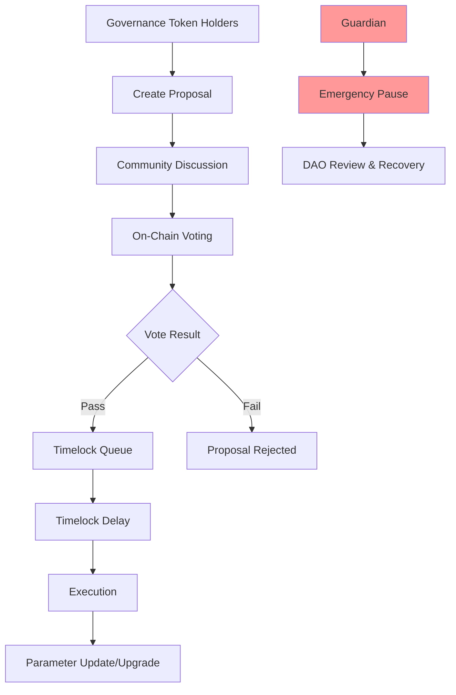
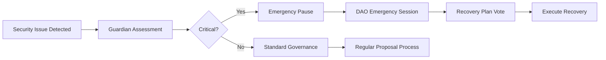

# Olla DAO Governance

## Overview
The Olla DAO provides decentralized governance for the liquid staking protocol, managing key parameters, upgrades, and strategic decisions while maintaining security and transparency.

## Governance Architecture

### Governance Flow


### Core Components

#### ERC20Votes Governance Token
- **Voting Power**: Token-weighted voting with delegation support
- **Delegation**: Token holders can delegate voting power to experts
- **Snapshot**: Historical balance tracking for vote integrity
- **Self-Delegation**: Automatic or manual delegation setup

```solidity
interface IGovernanceToken {
    function delegate(address delegatee) external;
    function getCurrentVotes(address account) external view returns (uint96);
    function getPriorVotes(address account, uint blockNumber) external view returns (uint96);
}
```

#### OpenZeppelin Governor
- **Proposal Lifecycle**: Create → Vote → Queue → Execute
- **Voting Parameters**: Configurable voting period, quorum, proposal threshold
- **Multiple Choice**: Support for complex governance decisions
- **Gas Optimization**: Efficient vote tallying and execution

#### Timelock Controller  
- **Delay Period**: Mandatory delay between vote passage and execution
- **Transparency**: Public visibility of queued operations
- **Cancellation**: Emergency cancellation for malicious proposals
- **Role Management**: Admin, proposer, and executor roles

## Governance Scope

### Protocol Parameters
Via **ParameterRegistry** contract:

#### Fee Structure
- **Staking Fees**: Percentage taken from staking rewards
- **Performance Fees**: Additional fees for exceptional returns
- **Insurance Fees**: Allocation to slashing insurance fund
- **Treasury Split**: Protocol development funding

#### Validator Management
- **Operator Caps**: Maximum stake per validator
- **Performance Thresholds**: Minimum performance requirements  
- **Slashing Parameters**: Penalty amounts and conditions
- **Selection Criteria**: Weights for validator selection algorithm

#### Risk Management
- **Withdrawal Buffer**: Minimum liquid reserves maintained
- **Insurance Ratios**: Coverage requirements for slashing events
- **Emergency Thresholds**: Automatic pause triggers
- **Rebalancing Rules**: Validator delegation adjustments

### Protocol Upgrades
- **Smart Contract Upgrades**: Proxy upgrade mechanisms
- **Oracle Updates**: Performance and price oracle changes
- **Integration Additions**: New DeFi protocol integrations
- **Feature Releases**: Major protocol enhancements

## Voting Mechanisms

### Proposal Types

#### Standard Proposals
- **Parameter Changes**: Adjust fees, caps, thresholds
- **Validator Updates**: Add/remove operators, update weights
- **Treasury Management**: Fund allocation and spending
- **Voting Period**: 7 days standard, 3 days quorum

#### Emergency Proposals
- **Fast Track**: Reduced voting period for urgent issues
- **Higher Quorum**: Increased participation requirements
- **Guardian Coordination**: Integration with emergency pause system
- **Use Cases**: Security incidents, critical bug fixes

#### Meta-Governance
- **Governance Updates**: Changes to voting parameters
- **Constitutional Changes**: Fundamental protocol rules
- **Higher Thresholds**: Super-majority requirements
- **Extended Periods**: Longer consideration time

### Participation Incentives

#### Vote Rewards
- **Participation Rewards**: Small rewards for consistent voting
- **Delegation Rewards**: Incentives for effective delegation
- **Proposal Rewards**: Compensation for quality governance proposals

#### Reputation System
- **Voting History**: Track participation and decision quality
- **Expertise Tags**: Domain-specific voting delegation
- **Community Recognition**: Highlight valuable contributors

## Multi-Signature Integration

### ERC-1271 Support
Enables smart contract wallets and multisigs to participate:

```solidity
function isValidSignature(bytes32 hash, bytes memory signature) 
    external view returns (bytes4)
```

**Use Cases:**
- **DAO Treasuries**: Other protocols can hold governance tokens
- **Institutional Participation**: Multisig wallet governance
- **Delegation Services**: Professional governance services
- **Cross-Protocol**: Integration with other governance systems

### Account Abstraction
- **Gasless Voting**: Meta-transactions for vote submission
- **Batch Operations**: Multiple governance actions in single transaction
- **Social Recovery**: Governance participation recovery mechanisms

## Guardian System

### Emergency Powers
- **Pause Protocol**: Immediate halt of deposits/withdrawals
- **Limited Scope**: Cannot access user funds or change parameters
- **Time Limits**: Guardian powers expire automatically
- **DAO Override**: Community can revoke guardian status

### Guardian Selection
- **Multi-Party**: Distributed among trusted entities
- **Technical Expertise**: Security and protocol knowledge required
- **Accountability**: Regular reporting and review by DAO
- **Rotation**: Periodic guardian replacement

### Incident Response


## Development Phases
**Note:** V1 ships without DAO governance; the phases below are post-V1 planning.

### Phase 0 - DAO-Lite
- **Multisig Control**: Initial parameter management
- **Limited Scope**: Basic operational parameters
- **Preparation**: DAO infrastructure development

### Phase 1 - Hybrid Governance  
- **Parameter DAO**: Community control of non-critical parameters
- **Multisig Backup**: Security-critical decisions still centralized
- **Gradual Transition**: Increasing community control

### Phase 2 - Governance Token (If Needed)
- **Token Distribution**: Fair launch or airdrop mechanism  
- **Initial Parameters**: Conservative voting thresholds
- **Guardian Period**: Maintaining emergency controls

### Phase 3 - Full Decentralization
- **Complete DAO Control**: All parameters community-managed
- **Advanced Features**: Complex proposal types and delegation
- **Cross-Protocol**: Integration with broader Aztec ecosystem

## Governance Token Design (Future)

### Distribution Strategy
- **Stakeholders**: Users, operators, developers, treasury
- **Vesting**: Long-term alignment incentives
- **Fair Launch**: No pre-mine or insider allocation
- **Ongoing Rewards**: Inflation for participation incentives

### Token Utility
- **Voting Rights**: Primary utility is governance participation
- **Fee Discounts**: Reduced protocol fees for holders
- **Insurance Claims**: Priority in insurance payouts
- **Yield Boosts**: Enhanced staking rewards for governors

### Tokenomics Integration
- **Dual Token Model**: Governance token separate from [[stAztec-token-design|stAztec utility token]]
- **Cross-Benefits**: Governance token holders may receive stAztec rewards
- **Synergy**: Aligned incentives between token holders and stakers

---

**Tags:** #governance #dao #voting #parameters #security #decentralization #erc-standards

**Links:**
- [[liquid-staking-mechanics]] - Parameters governed by DAO
- [[node-operator-framework]] - Validator selection governance  
- [[risk-assessment]] - Governance risk management
- [[emergency-procedures]] - Guardian and emergency systems
- [[parameter-registry]] - Technical parameter management

**Last Updated:** 2025-10-15
