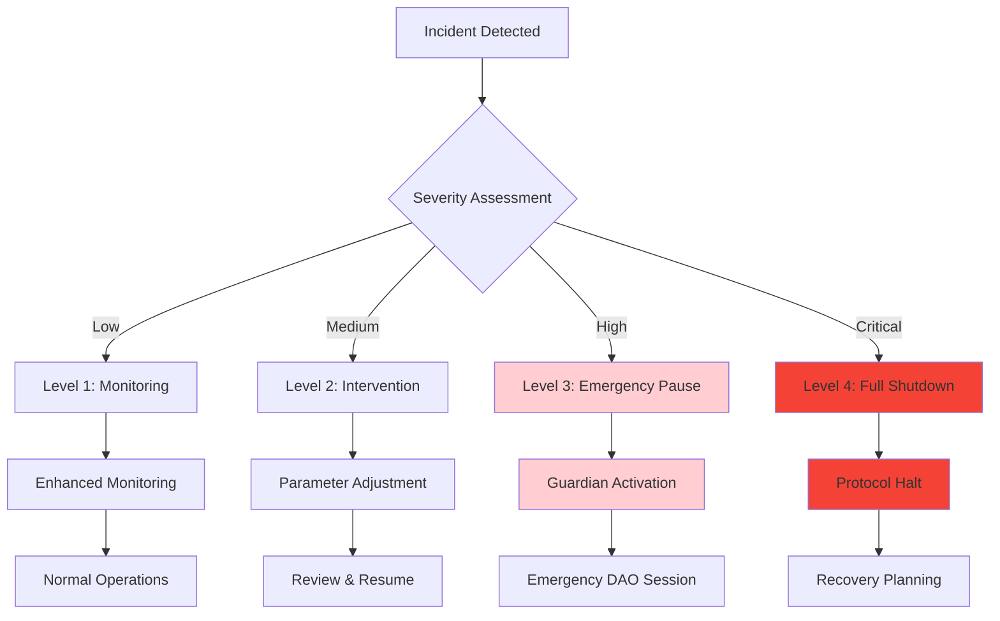
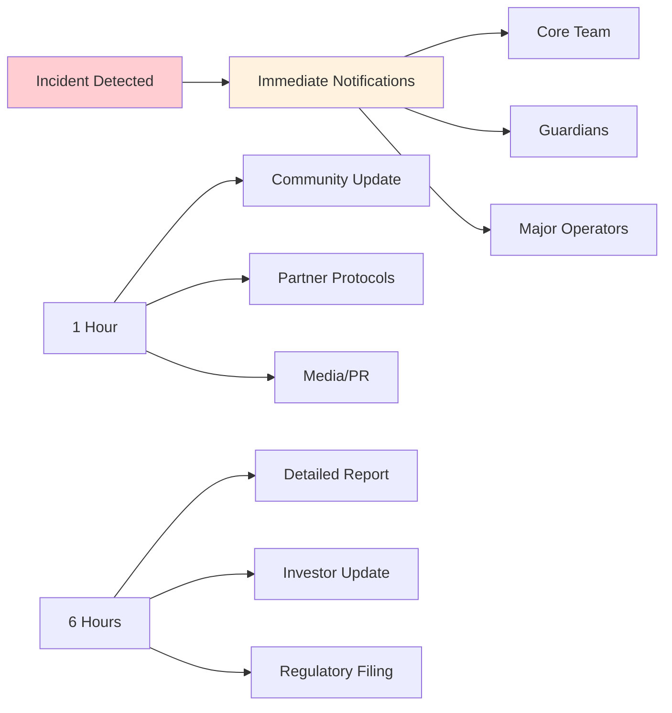

# Emergency Procedures

## Overview
Comprehensive emergency response framework for the Olla protocol, covering incident detection, response procedures, recovery mechanisms, and communication protocols for various crisis scenarios.

## Emergency Classification System



## Guardian System

### Guardian Powers and Limitations
```solidity
contract GuardianSystem {
    enum GuardianAction {
        PAUSE_DEPOSITS,      // Stop new deposits
        PAUSE_WITHDRAWALS,   // Stop withdrawals (emergency only)
        PAUSE_REBALANCING,   // Stop operator rebalancing
        PAUSE_ALL_OPERATIONS,// Complete protocol pause
        FORCE_WITHDRAWAL_BUFFER, // Increase buffer from operators
        BLACKLIST_OPERATOR   // Emergency operator removal
    }
    
    struct GuardianPowers {
        bool canPauseDeposits;      // Yes - prevent new exposure
        bool canPauseWithdrawals;   // Limited - only extreme cases
        bool canAccessFunds;        // No - guardians cannot touch user funds
        bool canChangeParameters;   // No - only DAO can change parameters
        bool canUpgradeContracts;   // No - upgrades require DAO + timelock
        uint256 maxActionDuration;  // 7 days maximum before auto-expire
    }
}
```

### Guardian Selection Criteria
- **Technical Expertise**: Deep understanding of liquid staking and DeFi protocols
- **Security Background**: Proven track record in protocol security and incident response
- **Geographic Distribution**: Guardians spread across multiple timezones for 24/7 coverage
- **Independence**: No conflicting interests with operators or large stakeholders
- **Community Trust**: Established reputation and community confidence

### Multi-Guardian Requirements
```solidity
contract MultiGuardianSystem {
    mapping(address => bool) public guardians;
    mapping(bytes32 => mapping(address => bool)) public actionVotes;
    mapping(bytes32 => uint256) public actionVoteCount;
    
    uint256 public constant GUARDIAN_COUNT = 5;
    uint256 public constant REQUIRED_VOTES = 3; // 3-of-5 multisig
    
    function executeGuardianAction(
        GuardianAction action,
        bytes memory data
    ) external onlyGuardian {
        bytes32 actionHash = keccak256(abi.encode(action, data, block.timestamp));
        
        require(!actionVotes[actionHash][msg.sender], "Already voted");
        actionVotes[actionHash][msg.sender] = true;
        actionVoteCount[actionHash]++;
        
        if (actionVoteCount[actionHash] >= REQUIRED_VOTES) {
            _executeAction(action, data);
            emit GuardianActionExecuted(action, data, block.timestamp);
        }
    }
}
```

## Incident Response Procedures

### Level 1: Enhanced Monitoring
**Triggers:**
- Validator performance below 95%
- Oracle data delays >10 minutes  
- Unusual withdrawal patterns
- Market volatility affecting exchange rates

**Response Actions:**
- Activate enhanced monitoring dashboards
- Notify core team and guardians
- Prepare detailed incident reports
- Monitor for escalation triggers

**Procedures:**
```yaml
Level_1_Response:
  detection:
    - automated_alerts: true
    - manual_reporting: true
    - community_reports: true
  
  response_team:
    - core_developers: 2
    - guardians: 1
    - communications: 1
  
  actions:
    - assess_threat_level: immediate
    - document_findings: within_1_hour
    - notify_stakeholders: within_2_hours
    - prepare_escalation: if_needed
```

### Level 2: Active Intervention
**Triggers:**
- Single operator slashing event
- Oracle consensus failure
- Withdrawal buffer depletion
- Significant stAztec depeg (>5%)

**Response Actions:**
```solidity
contract Level2Response {
    function handleOperatorSlashing(address operator, uint256 amount) external {
        // Immediate stake reduction
        delegationRouter.emergencyReduceStake(operator, amount);
        
        // Insurance assessment
        uint256 insuranceClaim = calculateInsuranceClaim(operator, amount);
        slashingInsurance.processEmergencyClaim(operator, insuranceClaim);
        
        // Exchange rate update
        updateExchangeRateForSlashing(amount, insuranceClaim);
        
        // Operator review
        operatorRegistry.flagForReview(operator, "Slashing event");
    }
    
    function handleOracleFailure() external onlyGuardian {
        // Switch to backup oracle sources
        performanceOracle.enableBackupSources();
        
        // Pause rebalancing until consensus restored
        delegationRouter.pauseRebalancing();
        
        // Notify development team
        emit OracleEmergency("Consensus failure", block.timestamp);
    }
}
```

### Level 3: Emergency Pause
**Triggers:**
- Multiple validator slashing events
- Smart contract vulnerability discovered
- Oracle manipulation detected
- Coordinated economic attack

**Response Actions:**
```solidity
function executeEmergencyPause(string memory reason) external onlyGuardian {
    // Immediate pause of all operations
    liquidStakingPool.pause();
    delegationRouter.pause();
    rewardsCollector.pause();
    
    // Preserve withdrawal buffer
    withdrawalBuffer.lockBuffer();
    
    // Notify all stakeholders
    emit EmergencyPause(msg.sender, reason, block.timestamp);
    
    // Trigger emergency DAO session
    governor.triggerEmergencySession();
    
    // Start recovery timer
    emergencyStartTime = block.timestamp;
}
```

### Level 4: Full Protocol Shutdown
**Triggers:**
- Critical smart contract exploit
- Majority of validators compromised
- Fundamental protocol design flaw
- Regulatory shutdown order

**Response Actions:**
```solidity
contract ProtocolShutdown {
    bool public shutdownInitiated = false;
    uint256 public shutdownTimestamp;
    
    function initiateShutdown(string memory reason) external onlyGuardian {
        require(!shutdownInitiated, "Already shutting down");
        
        shutdownInitiated = true;
        shutdownTimestamp = block.timestamp;
        
        // Pause all operations permanently
        _pauseAllOperations();
        
        // Begin orderly liquidation
        _startLiquidationProcess();
        
        // Freeze exchange rate
        _freezeExchangeRate();
        
        emit ProtocolShutdown(reason, block.timestamp);
    }
    
    function processUserExit(address user) external {
        require(shutdownInitiated, "Not in shutdown");
        require(!userExited[user], "Already processed");
        
        uint256 userShares = stAztecToken.balanceOf(user);
        uint256 userAssets = convertToAssetsAtShutdown(userShares);
        
        // Burn shares and return assets
        stAztecToken.burn(user, userShares);
        payable(user).transfer(userAssets);
        
        userExited[user] = true;
        emit UserExit(user, userShares, userAssets);
    }
}
```

## Recovery Procedures

### Emergency DAO Sessions
```solidity
contract EmergencyGovernance {
    struct EmergencyProposal {
        string description;
        bytes[] actions;
        uint256 emergencyDeadline; // Shorter voting period
        bool executed;
        mapping(address => bool) votes;
        uint256 forVotes;
        uint256 againstVotes;
    }
    
    uint256 public constant EMERGENCY_VOTING_PERIOD = 24 hours; // vs 7 days normal
    uint256 public constant EMERGENCY_QUORUM = 15; // vs 4% normal
    
    function createEmergencyProposal(
        string memory description,
        bytes[] memory actions
    ) external onlyGuardian returns (uint256) {
        require(emergencyActive, "No emergency active");
        
        uint256 proposalId = nextProposalId++;
        EmergencyProposal storage proposal = emergencyProposals[proposalId];
        
        proposal.description = description;
        proposal.actions = actions;
        proposal.emergencyDeadline = block.timestamp + EMERGENCY_VOTING_PERIOD;
        
        emit EmergencyProposalCreated(proposalId, description);
        return proposalId;
    }
}
```

### Recovery Scenarios

#### Scenario 1: Single Operator Failure
```yaml
Single_Operator_Failure:
  immediate_response:
    - reduce_stake_allocation: 100%
    - redistribute_to_others: automatic
    - process_insurance_claim: if_slashing
    - update_exchange_rate: if_needed
  
  recovery_steps:
    - assess_damage: within_1_hour
    - communicate_to_users: within_2_hours
    - rebalance_remaining_operators: within_24_hours
    - review_operator_criteria: within_1_week
  
  prevention_improvements:
    - stricter_performance_monitoring: true
    - increased_collateral_requirements: consider
    - faster_rebalancing_triggers: implement
```

#### Scenario 2: Oracle Manipulation
```yaml
Oracle_Manipulation:
  immediate_response:
    - pause_rebalancing: immediate
    - freeze_exchange_rate: temporary
    - switch_backup_oracles: automatic
    - investigate_attack_vector: parallel
  
  recovery_steps:
    - validate_backup_data: within_30_minutes
    - restore_correct_rates: within_2_hours
    - resume_operations: within_24_hours
    - implement_additional_safeguards: within_1_week
  
  long_term_improvements:
    - multi_oracle_validation: implement
    - circuit_breaker_tuning: optimize
    - attack_simulation_testing: regular
```

#### Scenario 3: Smart Contract Vulnerability
```yaml
Contract_Vulnerability:
  immediate_response:
    - emergency_pause: all_operations
    - assess_exploit_potential: critical_path
    - secure_remaining_funds: priority
    - prepare_patch_deployment: parallel
  
  recovery_steps:
    - deploy_fixed_contracts: ASAP
    - migrate_user_positions: coordinated
    - restore_operations: gradual
    - conduct_post_mortem: thorough
  
  compensation_framework:
    - insurance_fund_usage: first_priority
    - treasury_compensation: if_needed
    - user_communication: transparent
```

## Communication Protocols

### Stakeholder Notification Matrix


### Communication Templates

#### Immediate Alert (Internal)
```markdown
EMERGENCY ALERT - OLLA PROTOCOL

Incident Level: [1-4]
Time: [UTC timestamp]
Reporter: [Name/Role]

SITUATION:
- [Brief description of issue]
- [Current impact assessment]
- [Systems affected]

IMMEDIATE ACTIONS TAKEN:
- [ ] Guardian notification sent
- [ ] Emergency pause activated (if applicable)
- [ ] User funds secured
- [ ] Incident response team activated

NEXT STEPS:
- [Specific next actions]
- [Timeline expectations]
- [Responsible parties]

STATUS PAGE: [Link]
INCIDENT CHANNEL: [Discord/Slack link]
```

#### Public Communication (Community)
```markdown
Olla Protocol Incident Update

We are currently investigating [brief description] that occurred at [time] UTC.

CURRENT STATUS:
✅ User funds are secure
✅ Emergency procedures activated
🔄 Investigation ongoing
🔄 Resolution in progress

ACTIONS TAKEN:
- [Specific protective measures]
- [Systems paused/secured]
- [Expert team activated]

We will provide updates every [frequency] until resolved.
Next update: [specific time]

For real-time updates: [status page link]
Support: [contact information]
```

## Testing and Drills

### Regular Emergency Drills
```yaml
Emergency_Drill_Schedule:
  guardian_response_test:
    frequency: monthly
    scenarios: [oracle_failure, operator_slashing, contract_bug]
    participants: [all_guardians, core_team, operators]
    success_criteria: [response_time_under_15min, correct_procedures]
  
  communication_test:
    frequency: quarterly  
    scenarios: [various_incident_levels]
    participants: [full_stakeholder_list]
    success_criteria: [message_delivery, clarity, timeline_adherence]
  
  recovery_simulation:
    frequency: semi_annually
    scenarios: [full_protocol_recovery]
    participants: [entire_ecosystem]
    success_criteria: [successful_recovery, user_fund_safety]
```

### Incident Response Metrics
- **Detection Time**: Time from incident to first alert
- **Response Time**: Time from alert to guardian action
- **Resolution Time**: Time from response to full recovery
- **Communication Time**: Time to stakeholder notification
- **User Impact**: Percentage of users affected and duration

### Post-Incident Analysis
```yaml
Post_Incident_Review:
  timeline_reconstruction:
    - incident_root_cause: detailed_analysis
    - response_effectiveness: guardian_actions
    - communication_quality: stakeholder_feedback
    - system_performance: technical_metrics
  
  improvement_identification:
    - process_gaps: identify_and_document
    - system_weaknesses: technical_improvements
    - training_needs: team_development
    - policy_updates: procedure_refinements
  
  implementation_tracking:
    - improvement_prioritization: impact_based
    - implementation_timeline: specific_dates
    - effectiveness_measurement: ongoing_monitoring
    - knowledge_sharing: ecosystem_wide
```

---

**Tags:** #emergency #incident-response #guardian-system #recovery #communication #crisis-management

**Links:**
- [[risk-assessment]] - Risk scenarios requiring emergency response
- [[dao-governance]] - Emergency governance procedures
- [[guardian-system]] - Guardian powers and limitations
- [[technical-architecture]] - System pause and recovery mechanisms
- [[node-operator-framework]] - Operator emergency procedures
- [[oracle-design]] - Oracle failure response

**Last Updated:** 2025-10-15
