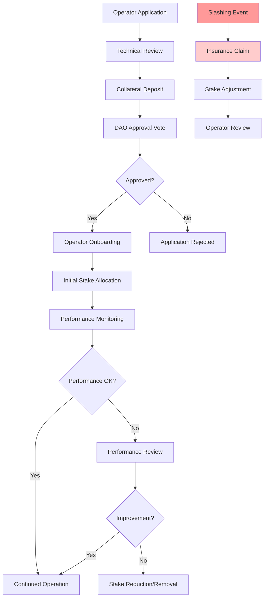
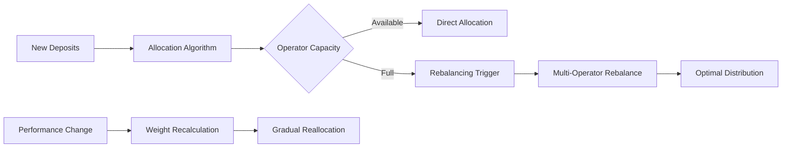
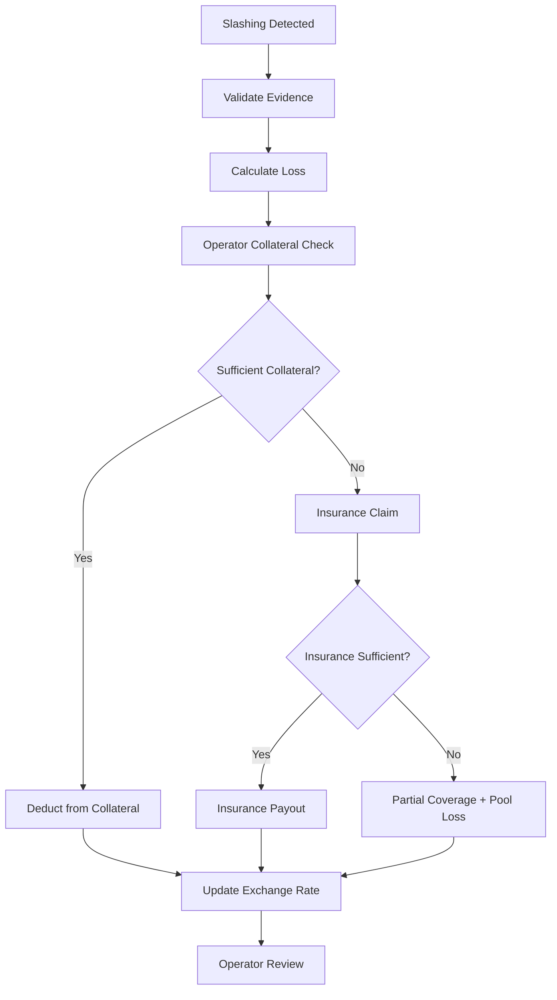

# Node Operator Framework

## Overview
Node operators are the backbone of Olla's staking infrastructure, running validator nodes that secure the Aztec network and generate staking rewards. The framework ensures decentralization, performance, and accountability.

## Operator Lifecycle



## Operator Registry

### Core Registry Contract
```solidity
contract OperatorRegistry {
    struct Operator {
        address operatorAddress;        // Operator wallet address
        string metadata;               // IPFS hash for operator info
        uint256 totalStake;           // Current delegated stake
        uint256 maxCapacity;          // Maximum stake limit
        uint256 commission;           // Operator commission rate
        uint256 collateralAmount;     // Security deposit
        OperatorStatus status;        // Current operational status
        uint256 registrationTime;    // When operator was approved
        uint256 lastPerformanceUpdate; // Last performance metric update
    }
    
    enum OperatorStatus { 
        Pending,      // Application submitted
        Active,       // Operating normally
        Warning,      // Performance issues
        Suspended,    // Temporarily inactive
        Removed       // Permanently removed
    }
    
    mapping(address => Operator) public operators;
    mapping(uint256 => address) public operatorsByIndex;
    uint256 public totalOperators;
}
```

### Registration Requirements

#### Technical Requirements
- **Infrastructure**: Dedicated validator hardware meeting Aztec specs
- **Network**: Reliable internet with 99.5%+ uptime SLA  
- **Security**: Secure key management and operational procedures
- **Monitoring**: Comprehensive monitoring and alerting systems
- **Backup**: Redundant systems and disaster recovery plans

#### Financial Requirements
- **Collateral Deposit**: Minimum stake required as security deposit
- **Insurance Coverage**: Optional additional coverage for enhanced trust
- **Operational Costs**: Demonstrated ability to fund ongoing operations
- **Commission Structure**: Competitive and transparent fee structure

#### Operational Requirements
- **Identity Verification**: KYC/KYB for regulatory compliance (if required)
- **Technical Expertise**: Proven experience in validator operations
- **Community Engagement**: Participation in governance and community
- **Reporting**: Regular performance and operational reports

### Operator Selection Algorithm

#### Weighted Delegation Strategy
```solidity
function calculateOperatorWeight(address operator) public view returns (uint256) {
    Operator memory op = operators[operator];
    
    uint256 performanceScore = getPerformanceScore(operator);
    uint256 capacityAvailable = op.maxCapacity - op.totalStake;
    uint256 collateralRatio = op.collateralAmount * 1e18 / op.totalStake;
    
    // Weight = Performance * Capacity * Collateral * Decentralization
    uint256 weight = performanceScore 
        * capacityAvailable 
        * collateralRatio 
        * getDecentralizationBonus(operator);
        
    return weight / 1e18; // Normalize
}
```

#### Selection Factors
- **Performance History**: Uptime, reward efficiency, slashing record
- **Available Capacity**: Remaining stake capacity before hitting caps
- **Collateral Strength**: Higher collateral = higher trustworthiness
- **Decentralization**: Bonus for underrepresented operators/regions
- **Commission Rates**: Lower commission may receive preference

## Performance Monitoring

### Key Performance Indicators
```solidity
struct PerformanceMetrics {
    uint256 uptimePercentage;      // Validator uptime (basis points)
    uint256 rewardEfficiency;     // Actual vs expected rewards  
    uint256 slashingEvents;       // Number of slashing incidents
    uint256 blocksMissed;         // Missed block proposals/attestations
    uint256 networkParticipation; // Consensus participation rate
    uint256 avgResponseTime;      // Network response latency
}
```

### Performance Scoring
```solidity
function calculatePerformanceScore(address operator) public view returns (uint256) {
    PerformanceMetrics memory metrics = getLatestMetrics(operator);
    
    uint256 uptimeScore = metrics.uptimePercentage; // Max 10000 (100%)
    uint256 rewardScore = metrics.rewardEfficiency; // 0-10000 scale
    uint256 slashingPenalty = metrics.slashingEvents * 1000; // -1000 per slash
    
    uint256 totalScore = (uptimeScore + rewardScore) / 2;
    if (totalScore > slashingPenalty) {
        return totalScore - slashingPenalty;
    }
    return 0;
}
```

### Monitoring Infrastructure
- **Automated Tracking**: Integration with [[oracle-design|PerformanceOracle]]
- **Real-time Alerts**: Immediate notifications for performance issues
- **Historical Analysis**: Long-term performance trends and patterns
- **Benchmarking**: Comparison against network averages and peers

### Performance Thresholds
- **Minimum Uptime**: 95% required, 99%+ preferred
- **Reward Efficiency**: Must achieve >90% of theoretical maximum
- **Slashing Tolerance**: Zero tolerance for attributable slashing
- **Response Time**: Network latency requirements for timely consensus

## Stake Management

### Dynamic Allocation


### Capacity Management
- **Maximum Limits**: Individual operator stake caps to prevent centralization
- **Minimum Thresholds**: Ensure operators have sufficient stake for security
- **Dynamic Adjustments**: Caps can be adjusted based on performance and network needs
- **Emergency Limits**: Rapid stake reduction for underperforming operators

### Rebalancing Logic
```solidity
contract DelegationRouter {
    function rebalanceStake() external {
        // Calculate optimal distribution
        uint256[] memory targetAllocations = calculateOptimalAllocation();
        
        // Execute rebalancing
        for (uint i = 0; i < operators.length; i++) {
            address operator = operators[i];
            uint256 currentStake = getOperatorStake(operator);
            uint256 targetStake = targetAllocations[i];
            
            if (targetStake > currentStake) {
                increaseStake(operator, targetStake - currentStake);
            } else if (targetStake < currentStake) {
                decreaseStake(operator, currentStake - targetStake);
            }
        }
    }
}
```

## Slashing and Insurance

### Slashing Events
```solidity
enum SlashingReason {
    DoubleVoting,        // Validator voted for conflicting blocks
    Downtime,           // Extended absence from consensus
    InvalidBlock,       // Proposed invalid block
    NetworkAttack       // Participated in network attack
}

struct SlashingEvent {
    address operator;
    SlashingReason reason;
    uint256 amount;        // Amount slashed
    uint256 timestamp;
    bytes32 evidence;      // Proof of misbehavior
    bool insuranceClaimed; // Whether insurance covered the loss
}
```

### Insurance Waterfall
1. **Operator Collateral**: First line of defense from security deposits
2. **Protocol Insurance**: Pool-funded insurance for excess losses  
3. **Socialized Loss**: Final backstop through pool dilution
4. **DAO Treasury**: Emergency fund for extreme scenarios

### Slashing Response Process


## Operator Incentives

### Commission Structure
- **Base Commission**: Standard rate for all operators (e.g., 5-10%)
- **Performance Bonus**: Additional rewards for top performers
- **Volume Incentives**: Higher rates for operators managing more stake
- **Loyalty Rewards**: Long-term operator retention bonuses

### Reputation System
```solidity
struct OperatorReputation {
    uint256 lifetimeUptime;      // Historical uptime percentage
    uint256 totalRewardsGenerated; // Cumulative rewards for stakers
    uint256 slashingHistory;     // Historical slashing events
    uint256 stakersCount;        // Number of individual stakers
    uint256 communityRating;     // Community governance rating
}
```

### Operator Benefits
- **Priority Allocation**: Top performers receive stake preference
- **Reduced Collateral**: Lower security deposits for proven operators
- **Governance Rights**: Participation in protocol governance decisions
- **Marketing Support**: Protocol marketing and business development aid

## Decentralization Measures

### Geographic Distribution
- **Regional Caps**: Maximum percentage of stake per geographic region
- **Incentive Bonuses**: Higher rewards for underrepresented regions
- **Infrastructure Diversity**: Encourage different hosting providers
- **Timezone Coverage**: Ensure global coverage for 24/7 operations

### Entity Diversity
- **Corporate Limits**: Caps on stake controlled by single entities
- **Identity Verification**: Prevent sybil attacks through multiple identities
- **Cross-Ownership**: Disclosure requirements for related operators
- **Community Operators**: Support for smaller, community-run validators

### Technical Diversity
- **Client Diversity**: Support for different validator client implementations
- **Hardware Diversity**: Prevent monoculture in hardware/software stacks
- **Network Diversity**: Multiple ISPs and hosting providers
- **Operational Diversity**: Different operational practices and procedures

## Development Phases

### Phase 0 - Internal Operations
- **Single Operator**: Protocol team runs initial validator
- **Basic Monitoring**: Simple uptime and reward tracking
- **Manual Management**: Direct operator control without registry

### Phase 1 - Multi-Operator Registry
- **OperatorRegistry Contract**: On-chain operator management
- **Application Process**: Community-driven operator selection
- **Performance Monitoring**: Automated [[oracle-design|PerformanceOracle]] integration
- **Basic Slashing**: Simple penalty mechanisms

### Phase 2 - Advanced Operations
- **Dynamic Rebalancing**: Automated stake optimization
- **Insurance System**: Comprehensive slashing protection
- **Reputation Tracking**: Historical performance records
- **Community Governance**: DAO-controlled operator parameters

### Phase 3 - Full Decentralization
- **Permissionless Entry**: Open operator registration (with requirements)
- **Advanced Analytics**: ML-powered performance prediction
- **Cross-Protocol**: Integration with broader Aztec validator ecosystem
- **Self-Governance**: Operator-driven improvements and standards

## Operator Onboarding

### Application Process
1. **Technical Assessment**: Infrastructure and capability review
2. **Financial Verification**: Collateral deposit and financial stability
3. **Community Review**: Public discussion and feedback period
4. **DAO Vote**: Final approval through [[dao-governance|governance process]]
5. **Onboarding**: Technical setup and initial stake allocation

### Documentation Requirements
- **Technical Setup Guide**: Validator configuration and requirements
- **Operational Procedures**: Standard operating procedures and best practices  
- **Security Guidelines**: Key management and security protocols
- **Reporting Templates**: Performance and operational reporting formats

### Support Infrastructure
- **Technical Support**: 24/7 assistance for operator issues
- **Community Forums**: Peer-to-peer knowledge sharing
- **Training Programs**: Educational resources and certification
- **Incident Response**: Coordinated response to network issues

---

**Tags:** #node-operators #validator-management #performance-monitoring #decentralization #slashing #insurance

**Links:**
- [[liquid-staking-mechanics]] - Stake delegation and management
- [[dao-governance]] - Operator approval and parameter control
- [[oracle-design]] - Performance monitoring integration
- [[risk-assessment]] - Operator risks and mitigation
- [[emergency-procedures]] - Operator incident response

**Last Updated:** 2025-10-15
