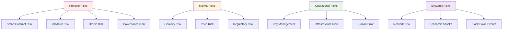
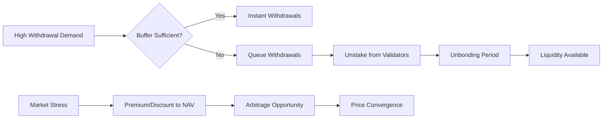
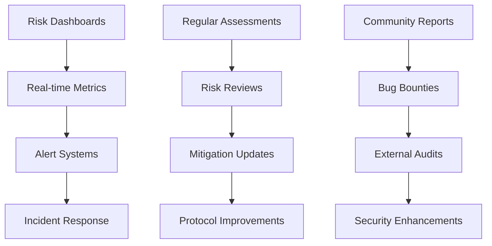

# Risk Assessment

## Overview
Comprehensive risk analysis for the Olla liquid staking protocol, identifying potential threats, their impact, and mitigation strategies across all system components.

## Risk Framework



## Smart Contract Risks

### Code Vulnerabilities
**Risk Level**: High
**Impact**: Protocol-wide fund loss

#### Potential Issues
- **Reentrancy Attacks**: Malicious contracts calling back during execution
- **Integer Overflow/Underflow**: Arithmetic errors causing incorrect calculations
- **Access Control Bugs**: Unauthorized access to privileged functions
- **Logic Errors**: Incorrect implementation of staking/withdrawal mechanics

#### Mitigation Strategies
```solidity
// Example reentrancy protection
modifier nonReentrant() {
    require(_status != _ENTERED, "ReentrancyGuard: reentrant call");
    _status = _ENTERED;
    _;
    _status = _NOT_ENTERED;
}

// Safe math operations
using SafeMath for uint256;

// Access control
modifier onlyRole(bytes32 role) {
    require(hasRole(role, msg.sender), "Access denied");
    _;
}
```

#### Risk Mitigation
- **Multiple Audits**: Independent security audits from reputable firms
- **Formal Verification**: Mathematical proofs for critical functions
- **Bug Bounty Programs**: Incentivized community security testing  
- **Gradual Rollout**: Phased deployment with increasing stake limits
- **Emergency Pause**: [[emergency-procedures|Guardian pause mechanism]]

### Upgrade Risks
**Risk Level**: Medium
**Impact**: Protocol disruption or fund loss

#### Concerns
- **Malicious Upgrades**: Compromised upgrade keys could deploy harmful code
- **Buggy Upgrades**: New code introducing vulnerabilities or breaking existing functionality
- **Centralization**: Too much upgrade power concentrated in few hands

#### Mitigation
- **Timelock Controls**: Mandatory delays for upgrade execution via [[dao-governance|DAO governance]]
- **Multi-Signature**: Multiple parties required for upgrade approval
- **Upgrade Testing**: Comprehensive testing on testnets before mainnet
- **Community Review**: Public review period for all proposed upgrades

## Validator Risks

### Slashing Risk
**Risk Level**: High  
**Impact**: Direct loss of staked funds

```solidity
enum SlashingType {
    DOUBLE_VOTING,    // 5% slash
    DOWNTIME,        // 0.1% slash  
    INVALID_BLOCK,   // 10% slash
    NETWORK_ATTACK   // 100% slash
}

struct SlashingEvent {
    SlashingType slashType;
    uint256 percentageLoss;
    uint256 affectedStake;
    bool insuranceCovered;
}
```

#### Root Causes
- **Operator Misbehavior**: Intentional malicious actions by validators
- **Technical Failures**: Software bugs or hardware failures causing violations
- **Key Compromise**: Stolen validator keys used for malicious purposes
- **Network Partitions**: Validators voting on conflicting chains during splits

#### Protection Mechanisms
- **Diversification**: Stake spread across multiple [[node-operator-framework|operators]]
- **Insurance Fund**: Pool-funded coverage for slashing events
- **Operator Collateral**: Security deposits from validators
- **Performance Monitoring**: Real-time tracking via [[oracle-design|PerformanceOracle]]

### Validator Performance Risk
**Risk Level**: Medium
**Impact**: Reduced staking rewards

#### Performance Issues
- **Low Uptime**: Validators offline missing consensus participation
- **Poor Efficiency**: Suboptimal reward generation compared to network average
- **High Commission**: Operators taking excessive fees
- **Geographic Concentration**: Too many validators in same region/provider

#### Mitigation
- **Dynamic Rebalancing**: Automatic stake redistribution based on performance
- **Performance Thresholds**: Minimum requirements for continued operation
- **Operator Competition**: Market-driven selection of best performers
- **Geographic Diversification**: Incentives for global validator distribution

## Oracle Risks

### Price Feed Manipulation  
**Risk Level**: High
**Impact**: Incorrect exchange rates, arbitrage losses

#### Attack Vectors
- **Flash Loan Attacks**: Temporary price manipulation through large borrows
- **Exchange Manipulation**: Coordinated attacks on price feed sources
- **Oracle Node Compromise**: Malicious data from compromised oracle infrastructure
- **MEV Attacks**: Front-running oracle updates for profit

#### Protection Measures
```solidity
contract PriceOracle {
    uint256 constant MAX_PRICE_DEVIATION = 1000; // 10% max change
    uint256 constant MIN_UPDATE_INTERVAL = 3600; // 1 hour minimum
    
    function updatePrice(uint256 newPrice) external {
        require(
            abs(newPrice - lastPrice) * 10000 / lastPrice < MAX_PRICE_DEVIATION,
            "Price deviation too large"
        );
        require(
            block.timestamp - lastUpdate >= MIN_UPDATE_INTERVAL,
            "Update too frequent"
        );
        
        lastPrice = newPrice;
        lastUpdate = block.timestamp;
    }
}
```

- **Circuit Breakers**: Maximum allowed price changes per update
- **Multi-Source Aggregation**: Multiple independent price sources
- **Time-Weighted Averages**: Smoothing to prevent short-term manipulation
- **Manual Override**: Emergency price corrections via governance

### Oracle Downtime Risk
**Risk Level**: Medium
**Impact**: Stale data, operational delays

#### Scenarios
- **Network Partitions**: Oracle nodes unable to reach consensus
- **Infrastructure Failures**: Hosting provider or network outages
- **Malicious Attacks**: DDoS or other attacks on oracle infrastructure
- **Data Source Failures**: Underlying price/performance feeds unavailable

#### Resilience Measures
- **Geographic Distribution**: Oracle nodes across multiple regions
- **Redundant Infrastructure**: Multiple backup systems and failover
- **Graceful Degradation**: Protocol continues operating with stale data temporarily
- **Emergency Procedures**: Manual intervention capabilities for extended outages

## Market Risks

### Liquidity Risk
**Risk Level**: Medium
**Impact**: Withdrawal delays, price depegging

#### Liquidity Scenarios


#### Risk Factors
- **Validator Unbonding**: Long unstaking periods limit immediate liquidity
- **Market Panic**: Coordinated exit events overwhelming withdrawal buffers
- **Secondary Market**: Insufficient DEX liquidity for [[oAztec-token-design|oAztec trading]]
- **Seasonal Patterns**: Predictable high-demand periods

#### Mitigation Strategies
- **Withdrawal Buffers**: Maintain liquid reserves for immediate redemptions
- **[[erc-standards-analysis|ERC-7540]]**: Async withdrawal queues for fair processing
- **Market Making**: Incentivized liquidity provision on secondary markets
- **Communication**: Clear user education about liquidity mechanics

### Depeg Risk  
**Risk Level**: Medium
**Impact**: oAztec trading below intrinsic value

#### Depeg Causes
- **Liquidity Constraints**: Insufficient withdrawal buffers
- **Market Sentiment**: Fear, uncertainty, doubt about protocol
- **Technical Issues**: Smart contract bugs or oracle failures
- **Regulatory Concerns**: Legal uncertainty affecting demand

#### Depeg Response
- **Arbitrage Mechanisms**: Economic incentives for price convergence
- **Communication**: Transparent reporting of protocol health
- **Liquidity Support**: Protocol or DAO treasury market making
- **Technical Fixes**: Rapid response to underlying issues

## Governance Risks

### Governance Attacks
**Risk Level**: High
**Impact**: Protocol capture, malicious parameter changes

#### Attack Vectors
- **Token Accumulation**: Large holders gaining disproportionate control
- **Vote Buying**: Temporary control through borrowed tokens
- **Proposal Spam**: Overwhelming governance with trivial proposals
- **Bribery**: Off-chain coordination to influence votes

#### Governance Protections
```solidity
contract GovernanceGuard {
    uint256 constant MIN_PROPOSAL_THRESHOLD = 100000e18; // 1% of supply
    uint256 constant QUORUM_PERCENTAGE = 400; // 4% participation required
    uint256 constant VOTING_DELAY = 17280; // 3 days in blocks
    uint256 constant VOTING_PERIOD = 40320; // 1 week in blocks
    uint256 constant TIMELOCK_DELAY = 172800; // 2 days in seconds
    
    modifier validProposal(uint256 proposalId) {
        require(
            proposals[proposalId].proposer.balance >= MIN_PROPOSAL_THRESHOLD,
            "Insufficient proposal threshold"
        );
        _;
    }
}
```

- **Proposal Thresholds**: Minimum token requirements for proposals
- **Quorum Requirements**: Minimum participation for valid votes  
- **Timelock Delays**: Mandatory delays for proposal execution
- **[[emergency-procedures|Guardian Powers]]**: Emergency intervention capabilities

### Parameter Risk
**Risk Level**: Medium
**Impact**: Suboptimal protocol performance

#### Dangerous Parameter Changes
- **Excessive Fees**: Reducing competitiveness and user adoption
- **Inadequate Buffers**: Insufficient liquidity reserves
- **Poor Validator Selection**: Choosing underperforming operators
- **Weak Security**: Reducing collateral or insurance requirements

#### Parameter Safeguards
- **Bounded Ranges**: Hard-coded minimum/maximum values for critical parameters
- **Gradual Changes**: Step-wise adjustments rather than dramatic shifts
- **Economic Modeling**: Impact analysis before parameter changes
- **Community Review**: Public discussion periods for all changes

## Regulatory Risks

### Compliance Risk
**Risk Level**: Medium-High
**Impact**: Legal challenges, restricted access

#### Regulatory Concerns
- **Securities Classification**: oAztec potentially classified as security
- **AML/KYC Requirements**: Know-your-customer obligations
- **Staking Regulations**: Evolving legal framework for liquid staking
- **Cross-Border Issues**: Different regulations across jurisdictions

#### Compliance Strategies
- **Legal Analysis**: Ongoing regulatory assessment and compliance
- **Jurisdictional Planning**: Strategic deployment across friendly jurisdictions
- **Compliance Infrastructure**: KYC/AML systems if required
- **Industry Engagement**: Participation in regulatory discussions

### Regulatory Change Risk
**Risk Level**: Medium
**Impact**: Operational restrictions, compliance costs

#### Potential Changes
- **Staking Prohibitions**: Outright bans on liquid staking in some jurisdictions
- **Tax Treatment**: Unfavorable tax classification
- **Operational Requirements**: Licensing or registration mandates
- **Consumer Protection**: Additional disclosure or protection requirements

#### Adaptation Strategies
- **Regulatory Monitoring**: Active tracking of regulatory developments
- **Flexible Architecture**: Protocol design allowing for compliance adaptations
- **Geographic Diversification**: Multi-jurisdictional approach
- **Industry Cooperation**: Collaborative regulatory engagement

## Systemic Risks

### Aztec Network Risk
**Risk Level**: High
**Impact**: Total protocol failure

#### Network Threats
- **Consensus Failures**: Fundamental blockchain issues
- **Economic Attacks**: 51% attacks or other consensus manipulation
- **Protocol Bugs**: Core Aztec network vulnerabilities
- **Governance Capture**: Malicious control of underlying network

#### Protocol Dependencies
- **Network Upgrades**: Compatibility with Aztec network changes
- **Consensus Changes**: Adaptation to new consensus mechanisms
- **Economic Model**: Alignment with network incentive changes
- **Security Model**: Dependence on overall network security

#### Mitigation Approaches
- **Network Monitoring**: Continuous assessment of Aztec network health
- **Upgrade Readiness**: Preparation for network changes and upgrades
- **Diversification**: Potential multi-network strategy (long-term)
- **Emergency Procedures**: Protocol shutdown procedures if needed

### Economic Attack Risk
**Risk Level**: Medium
**Impact**: Protocol manipulation, fund extraction

#### Attack Scenarios
- **MEV Extraction**: Systematic extraction of maximal extractable value
- **Sandwich Attacks**: Front-running and back-running user transactions
- **Arbitrage Attacks**: Exploiting temporary price inefficiencies
- **Flash Loan Exploits**: Using borrowed funds to manipulate protocol state

#### Economic Defenses
- **MEV Protection**: Integration with MEV protection services
- **Fair Ordering**: Transaction ordering that prevents front-running
- **Rate Limiting**: Restrictions on large transactions in short periods
- **Economic Analysis**: Game-theoretic analysis of attack incentives

## Risk Management Framework

### Risk Monitoring


### Risk Metrics
- **TVL Concentration**: Percentage of stake with single operators
- **Withdrawal Buffer Ratio**: Liquid reserves vs total stake
- **Oracle Deviation**: Price/performance data variance
- **Governance Participation**: Voting participation and token distribution
- **Performance Tracking**: Validator and protocol performance metrics

### Incident Response
1. **Detection**: Automated monitoring and community reporting
2. **Assessment**: Rapid evaluation of threat severity and impact
3. **Response**: Coordinated response including guardian powers if needed
4. **Communication**: Transparent reporting to community and stakeholders
5. **Recovery**: Implementation of fixes and prevention measures
6. **Post-Mortem**: Detailed analysis and protocol improvements

### Insurance and Contingency
- **Protocol Insurance**: On-chain insurance for slashing and oracle events
- **Treasury Reserves**: DAO treasury for emergency funding
- **Contingency Plans**: Detailed procedures for various risk scenarios
- **Recovery Mechanisms**: Technical and governance procedures for crisis response

---

**Tags:** #risk-management #security #slashing #oracle-risk #governance-risk #regulatory #liquidity #systemic-risk

**Links:**
- [[liquid-staking-mechanics]] - Core protocol risks and mitigations
- [[node-operator-framework]] - Validator and slashing risks
- [[oracle-design]] - Oracle-specific risk analysis  
- [[dao-governance]] - Governance and parameter risks
- [[emergency-procedures]] - Crisis response and recovery
- [[oAztec-token-design]] - Token-specific risks

**Last Updated:** 2025-10-15
