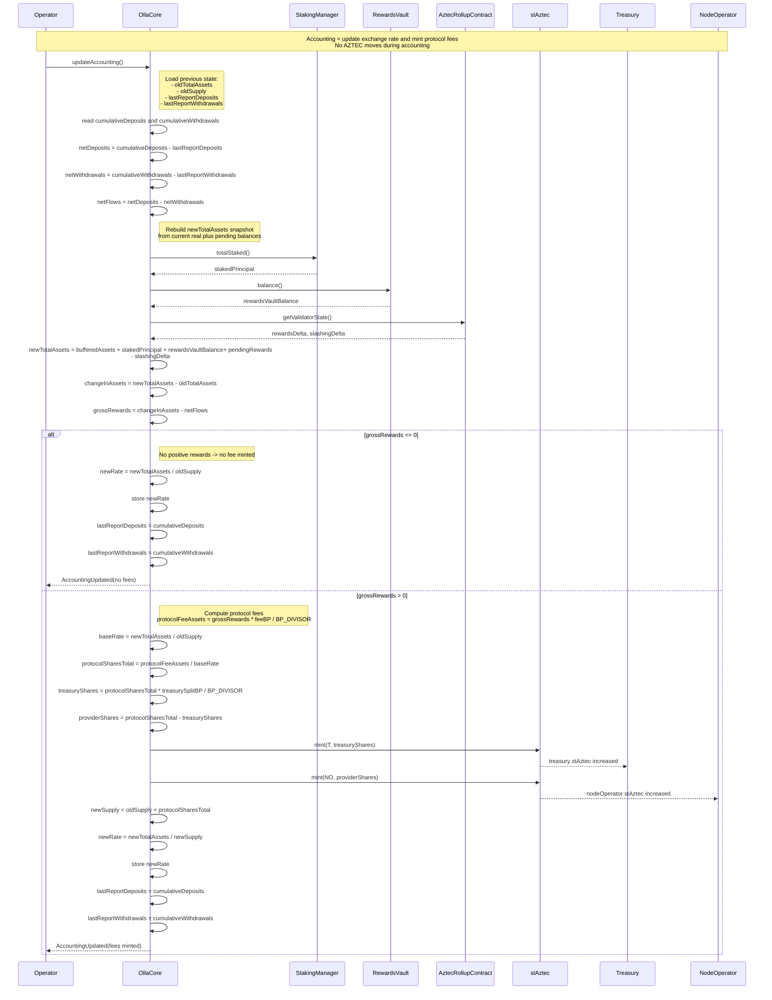

# Core Invariants and Accounting

## Main invariant

```solidity
// Must hold after each updateAccounting
uint256 exchangeRate = totalAssets() / stAztec.totalSupply();
```

```solidity
function totalAssets() internal view returns (uint256) {
    return bufferedAssets          // idle AZTEC sitting in OllaCore
        + stakedPrincipal          // from StakingManager.totalStaked()
        + rewardsVaultBalance      // RV.balance()
        + rewardsDelta             // from AztecRollupContract (claimable)
        - slashingDelta;           // net slashing impact (>= 0)
}
```

## Deposit

```solidity
uint256 stAztecReceived = depositAmount * stAztec.totalSupply() / totalAssets();

bufferedAssets      += depositAmount;
cumulativeDeposits  += depositAmount;
```

## User value

```solidity
uint256 userValue = userStAztecBalance * exchangeRate;
```

## Withdrawal

```solidity
uint256 assetsExpected = stAztecAmount * exchangeRateAtRequest;

cumulativeWithdrawals += assetsExpected;
```

## Accounting flow


