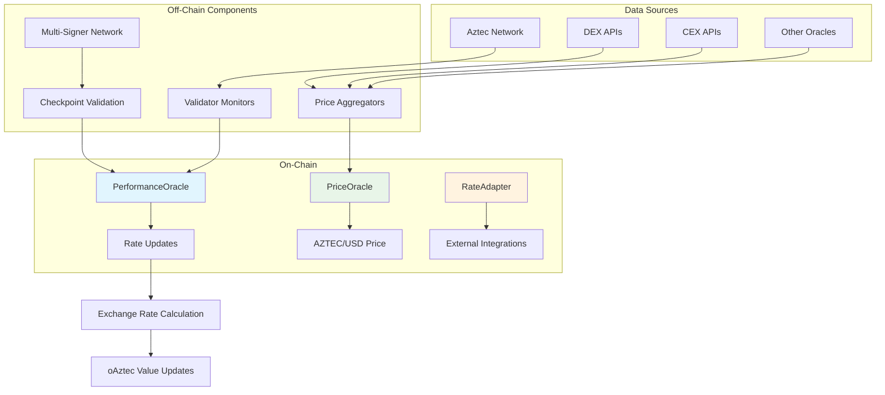
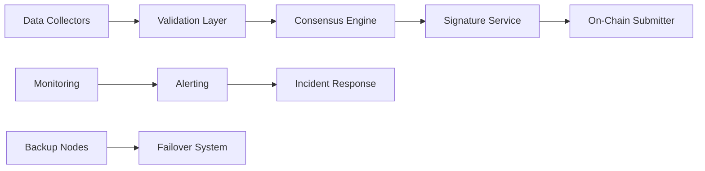

# Oracle Design

## Overview
Olla requires multiple oracle systems to provide accurate, timely data for protocol operations. The oracle architecture supports validator performance monitoring, exchange rate updates, and AZTEC price feeds.

## Oracle Architecture



## Performance Oracle

### Validator Performance Tracking
**Purpose**: Monitor validator uptime, rewards, and slashing events for [[node-operator-framework|operator management]]

#### Key Metrics
```solidity
struct ValidatorPerformance {
    uint256 totalStake;           // Current delegated stake
    uint256 totalRewards;         // Lifetime rewards earned  
    uint256 uptime;              // Percentage uptime (basis points)
    uint256 slashingEvents;      // Number of slashing incidents
    uint256 lastUpdate;          // Timestamp of last data update
    bool isActive;               // Current validator status
}
```

#### Data Sources
- **Aztec Network RPC**: Direct validator state queries
- **Block Explorers**: Historical performance data
- **Network Metrics**: Consensus participation tracking
- **Validator APIs**: Self-reported metrics (verified)

#### Update Frequency
- **Real-time Events**: Slashing, validator status changes
- **Periodic Updates**: Hourly performance metrics
- **Epoch Summaries**: End-of-epoch reward calculations
- **Emergency Updates**: Immediate updates for critical events

### Multi-Signer Validation
**Architecture**: Decentralized oracle network with multiple signers

```solidity
contract PerformanceOracle {
    struct Checkpoint {
        bytes32 dataHash;
        uint256 timestamp;
        address[] signers;
        bytes[] signatures;
    }
    
    mapping(uint256 => Checkpoint) public checkpoints;
    mapping(address => bool) public authorizedSigners;
    uint256 public requiredSignatures;
}
```

#### Signer Selection
- **Technical Expertise**: Proven track record in validator operations
- **Geographic Distribution**: Global signer network for 24/7 coverage
- **Economic Incentives**: Staking requirements and reward mechanisms
- **Rotation Policy**: Regular signer updates to prevent centralization

#### Validation Process
1. **Data Collection**: Each signer independently gathers performance data
2. **Consensus Check**: Compare data across signers for consistency  
3. **Signature Generation**: Create cryptographic proof of data validity
4. **On-Chain Submission**: Submit validated checkpoints to oracle contract
5. **Verification**: Contract validates signatures and updates state

## Price Oracle

### AZTEC Price Feeds
**Purpose**: Accurate AZTEC/USD pricing for [[risk-assessment|liquidation calculations]] and [[defi-integrations|DeFi integrations]]

#### Price Sources
- **Decentralized Exchanges**: Uniswap, SushiSwap, Curve
- **Centralized Exchanges**: Major CEX APIs for volume-weighted pricing  
- **Other Oracles**: Chainlink, Band Protocol for redundancy
- **On-Chain Calculators**: Real-time DEX price calculations

#### Price Aggregation Algorithm
```solidity
function calculateWeightedPrice() external view returns (uint256) {
    uint256 totalWeight = 0;
    uint256 weightedSum = 0;
    
    for (uint i = 0; i < priceSources.length; i++) {
        (uint256 price, uint256 confidence, uint256 volume) = sources[i].getPrice();
        uint256 weight = calculateWeight(confidence, volume, lastUpdate);
        
        weightedSum += price * weight;
        totalWeight += weight;
    }
    
    return weightedSum / totalWeight;
}
```

#### Price Quality Metrics
- **Confidence Intervals**: Statistical confidence in price accuracy
- **Volume Weighting**: Higher weights for high-volume sources
- **Freshness Scoring**: Recent data weighted more heavily
- **Outlier Detection**: Automatic filtering of suspicious prices

### Circuit Breakers
**Purpose**: Protect against oracle manipulation and extreme price movements

#### Protection Mechanisms
- **Price Deviation Limits**: Maximum % change per update period
- **Volume Thresholds**: Minimum trading volume for price inclusion
- **Time-Weighted Averages**: Smooth out short-term volatility
- **Manual Override**: Emergency price updates by [[dao-governance|DAO governance]]

## Rate Oracle (Exchange Rate)

### oAztec Exchange Rate Calculation
**Purpose**: Provide accurate oAztec/Aztec exchange rate for [[oAztec-token-design|token valuation]]

#### Rate Calculation Formula
```solidity
function calculateExchangeRate() public view returns (uint256) {
    uint256 totalAztecValue = getTotalPoolValue();
    uint256 totalOAztecSupply = oAztec.totalSupply();
    
    if (totalOAztecSupply == 0) return 1e18; // Initial 1:1 rate
    
    return (totalAztecValue * 1e18) / totalOAztecSupply;
}

function getTotalPoolValue() internal view returns (uint256) {
    uint256 stakingRewards = getAccumulatedRewards();
    uint256 withdrawalBuffer = getBufferBalance();
    uint256 pendingWithdrawals = getPendingWithdrawalAmount();
    
    return stakingRewards + withdrawalBuffer - pendingWithdrawals;
}
```

#### Update Triggers
- **Reward Distribution**: After validator rewards are collected
- **Large Deposits/Withdrawals**: Significant pool balance changes
- **Slashing Events**: Immediate rate updates after penalties
- **Scheduled Updates**: Regular rate refreshes for accuracy

### Rate Adapter Interface
**Purpose**: Standard interface for external protocols to read oAztec value

```solidity
interface IRateAdapter {
    // Core rate functions
    function getExchangeRate() external view returns (uint256);
    function getLatestRateUpdate() external view returns (uint256 timestamp);
    
    // Convenience functions for integrations
    function convertToAssets(uint256 shares) external view returns (uint256);
    function convertToShares(uint256 assets) external view returns (uint256);
    
    // Historical data
    function getRateAtBlock(uint256 blockNumber) external view returns (uint256);
    function getRateHistory(uint256 periods) external view returns (uint256[] memory);
}
```

## Off-Chain Infrastructure

### Oracle Node Architecture


#### Component Responsibilities
- **Data Collectors**: Gather raw data from multiple sources
- **Validation Layer**: Verify data quality and detect anomalies
- **Consensus Engine**: Coordinate between multiple oracle nodes
- **Signature Service**: Generate cryptographic proofs
- **On-Chain Submitter**: Submit validated data to contracts

### High Availability Design
- **Geographic Distribution**: Oracle nodes in multiple regions
- **Redundancy**: Multiple backup nodes per region
- **Load Balancing**: Distribute requests across healthy nodes
- **Failover**: Automatic switching to backup systems

### Security Measures
- **Access Control**: Secure key management and API access
- **Data Validation**: Multiple validation layers before submission
- **Monitoring**: 24/7 monitoring of oracle health and performance
- **Incident Response**: Procedures for oracle failures or attacks

## Development Phases

### Phase 0 - MVP
- **Internal Oracles**: Basic reward tracking without external oracles
- **Manual Updates**: Operator-controlled rate updates
- **Simple Monitoring**: Basic validator performance tracking

### Phase 1 - Multi-Operator Integration
- **Performance Oracle**: Automated validator monitoring
- **Multi-Signer System**: Decentralized oracle validation
- **Slashing Detection**: Real-time penalty tracking

### Phase 2 - Full Oracle Network
- **Price Oracles**: AZTEC price feeds for external use
- **Rate Adapter**: Public interface for DeFi integrations  
- **Historical Data**: On-chain rate and performance history

### Phase 3 - Advanced Features
- **Cross-Chain Oracles**: Multi-network price and performance data
- **Prediction Markets**: Future performance and price predictions
- **AI/ML Integration**: Predictive analytics for validator selection

## Risk Management

### Oracle Failure Scenarios
- **Data Source Failures**: Individual price/performance feed issues
- **Network Partitions**: Oracle nodes unable to reach consensus
- **Malicious Actors**: Coordinated attacks on oracle infrastructure
- **Smart Contract Bugs**: Oracle contract vulnerabilities

### Mitigation Strategies
- **Circuit Breakers**: Automatic protections against extreme data
- **Fallback Systems**: Secondary oracle networks and manual overrides
- **Insurance Fund**: Coverage for oracle-related losses
- **Governance Controls**: DAO oversight of oracle parameters

### Monitoring and Alerting
- **Health Dashboards**: Real-time oracle status monitoring
- **Performance Metrics**: SLA tracking and uptime monitoring
- **Anomaly Detection**: Automated alerts for unusual patterns
- **Incident Management**: Structured response to oracle issues

---

**Tags:** #oracle-design #off-chain #performance-monitoring #price-feeds #exchange-rates #risk-management

**Links:**
- [[liquid-staking-mechanics]] - Oracle integration in staking flow
- [[node-operator-framework]] - Performance monitoring usage
- [[oAztec-token-design]] - Exchange rate oracle
- [[risk-assessment]] - Oracle risk analysis
- [[smart-contract-architecture]] - Technical implementation

**Last Updated:** 2025-10-15
