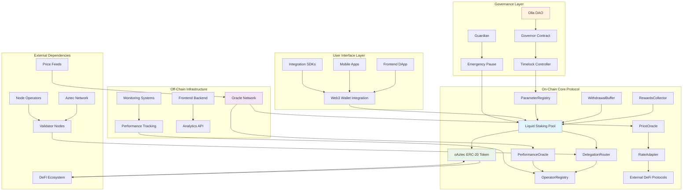
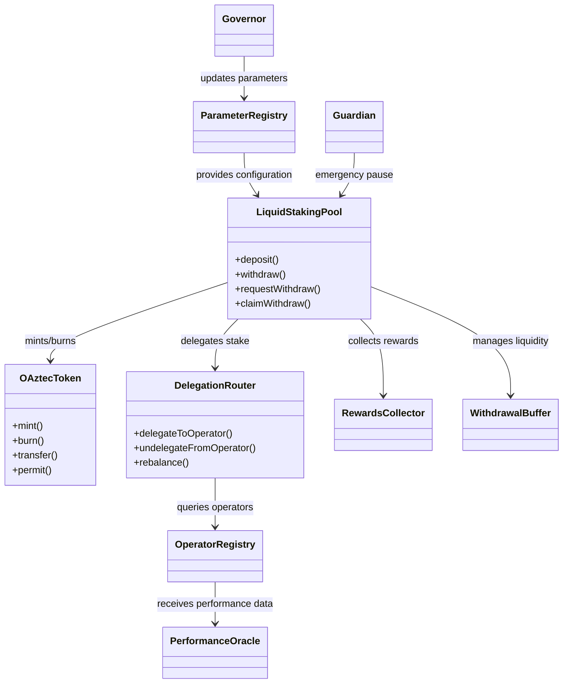
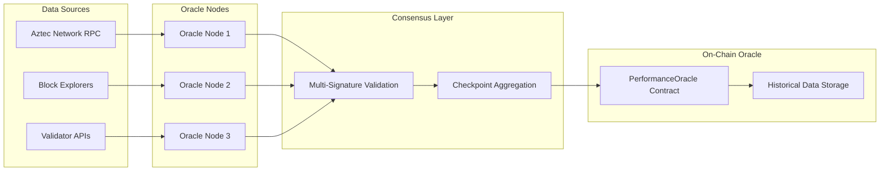
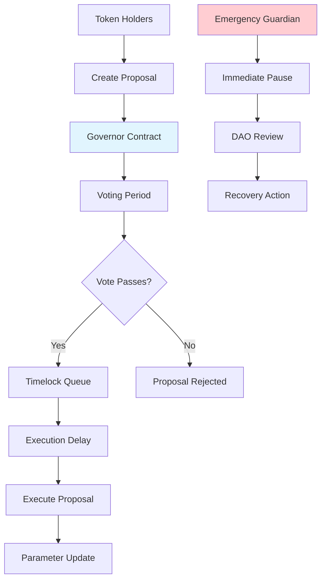
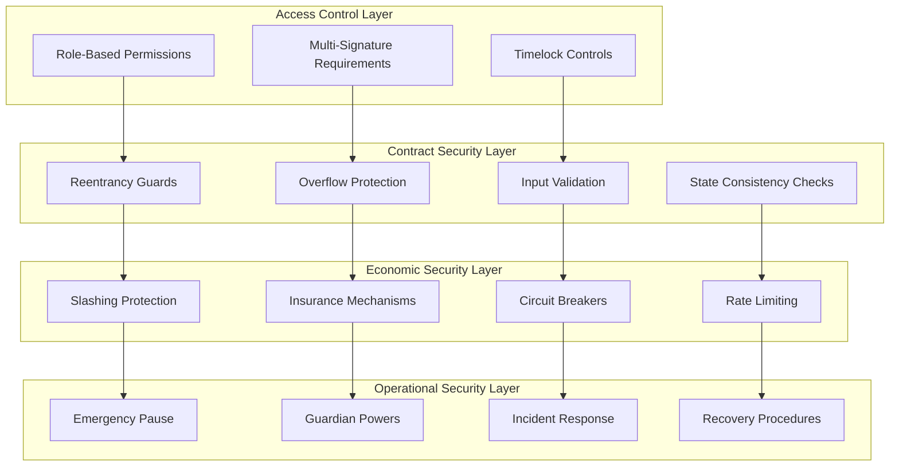
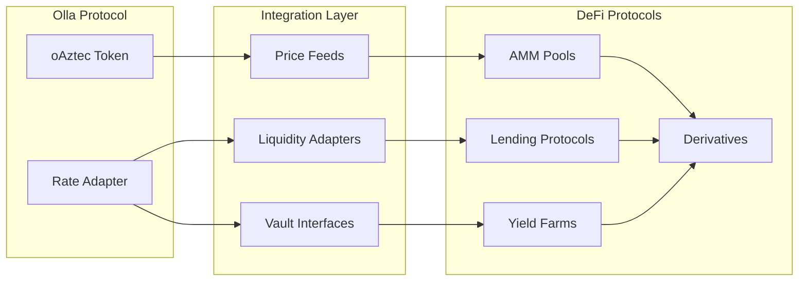
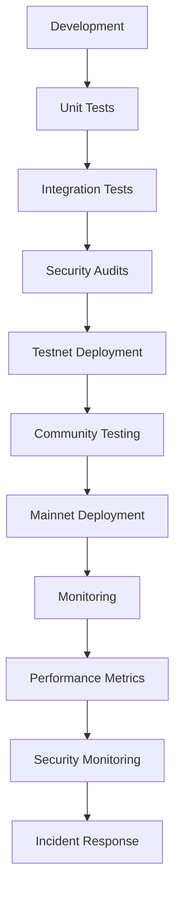

# Technical Architecture

## Overview

Comprehensive technical architecture of the Olla liquid staking protocol, showing the interaction between on-chain contracts, off-chain components, and external integrations.

## System Architecture



## Core Contract Architecture

### Liquid Staking Pool (Core Contract)

**Role**: Central hub for all staking operations

```solidity
contract LiquidStakingPool is ERC7540, AccessControl, Pausable {
    // Core state variables
    uint256 public totalAssets;           // Total Aztec tokens under management
    uint256 public totalShares;          // Total oAztec shares issued
    uint256 public exchangeRate;         // Current oAztec/Aztec rate
    
    // Contract dependencies
    IOAztecToken public oAztecToken;      // Liquid staking token
    IDelegationRouter public delegationRouter;  // Validator delegation
    IRewardsCollector public rewardsCollector;  // Reward management
    IWithdrawalBuffer public withdrawalBuffer;  // Liquidity management
    
    // Core functions
    function deposit(uint256 assets, address receiver) external returns (uint256 shares);
    function withdraw(uint256 assets, address receiver, address owner) external returns (uint256 shares);
    function requestWithdraw(uint256 assets, address receiver) external returns (uint256 requestId);
    function claimWithdraw(address receiver) external returns (uint256 assets);
}
```

### Contract Relationships



## Token Architecture

### oAztec Token Implementation

```solidity
contract OAztecToken is ERC20, ERC20Permit, ERC1271, AccessControl {
    bytes32 public constant MINTER_ROLE = keccak256("MINTER_ROLE");
    bytes32 public constant BURNER_ROLE = keccak256("BURNER_ROLE");
    
    ILiquidStakingPool public stakingPool;
    IRateAdapter public rateAdapter;
    
    // ERC-20 with yield-bearing semantics
    function balanceOf(address account) public view override returns (uint256) {
        return super.balanceOf(account); // Returns shares, not underlying value
    }
    
    // Convenience functions for underlying value
    function balanceOfUnderlying(address account) public view returns (uint256) {
        return rateAdapter.convertToAssets(balanceOf(account));
    }
    
    // ERC-2612 permit functionality
    function permit(
        address owner, address spender, uint256 value,
        uint256 deadline, uint8 v, bytes32 r, bytes32 s
    ) public override {
        // Standard permit implementation
    }
    
    // ERC-1271 for smart contract wallets
    function isValidSignature(bytes32 hash, bytes memory signature) 
        public view returns (bytes4) {
        // Smart wallet signature validation
    }
}
```

## Oracle Architecture

### Performance Oracle Network



### Oracle Contract Structure

```solidity
contract PerformanceOracle is AccessControl {
    struct ValidatorMetrics {
        uint256 uptime;              // Basis points (0-10000)
        uint256 rewardEfficiency;   // Basis points vs network average
        uint256 slashingEvents;     // Count of slashing incidents
        uint256 lastUpdate;        // Timestamp of last update
    }
    
    struct Checkpoint {
        bytes32 metricsHash;        // Hash of performance data
        uint256 timestamp;          // When checkpoint was created
        address[] signers;          // Oracle signers
        bytes[] signatures;         // Cryptographic proofs
        bool finalized;            // Whether checkpoint is accepted
    }
    
    mapping(address => ValidatorMetrics) public validatorMetrics;
    mapping(uint256 => Checkpoint) public checkpoints;
    mapping(address => bool) public authorizedSigners;
    
    uint256 public requiredSignatures = 3;
    uint256 public checkpointInterval = 3600; // 1 hour
    
    function submitCheckpoint(
        bytes32 metricsHash,
        address[] memory signers,
        bytes[] memory signatures
    ) external {
        require(signers.length >= requiredSignatures, "Insufficient signatures");
        
        // Validate signatures and update metrics
        validateAndUpdateMetrics(metricsHash, signers, signatures);
    }
}
```

## Delegation Architecture

### Multi-Operator Delegation System

```solidity
contract DelegationRouter is AccessControl {
    struct DelegationTarget {
        address operator;           // Validator operator address
        uint256 currentStake;      // Currently delegated amount
        uint256 targetStake;       // Desired delegation amount
        uint256 lastRebalance;     // Last rebalancing timestamp
    }
    
    mapping(address => DelegationTarget) public delegations;
    address[] public activeOperators;
    
    IOperatorRegistry public operatorRegistry;
    IPerformanceOracle public performanceOracle;
    
    function calculateOptimalAllocation() public view returns (uint256[] memory) {
        uint256[] memory weights = new uint256[](activeOperators.length);
        
        for (uint i = 0; i < activeOperators.length; i++) {
            address operator = activeOperators[i];
            
            // Get performance score
            uint256 performance = performanceOracle.getPerformanceScore(operator);
            
            // Get available capacity
            uint256 capacity = operatorRegistry.getAvailableCapacity(operator);
            
            // Calculate weight based on performance and capacity
            weights[i] = performance * capacity / 1e18;
        }
        
        return normalizeWeights(weights);
    }
    
    function rebalance() external onlyRole(REBALANCER_ROLE) {
        uint256[] memory targetAllocations = calculateOptimalAllocation();
        
        // Execute stake movements
        for (uint i = 0; i < activeOperators.length; i++) {
            address operator = activeOperators[i];
            uint256 currentStake = delegations[operator].currentStake;
            uint256 targetStake = targetAllocations[i];
            
            if (targetStake != currentStake) {
                executeStakeMovement(operator, currentStake, targetStake);
            }
        }
    }
}
```

## Governance Architecture

### DAO Governance Structure



### Governance Contracts

```solidity
contract OllaGovernor is 
    Governor,
    GovernorSettings,
    GovernorCountingSimple, 
    GovernorVotes,
    GovernorVotesQuorumFraction,
    GovernorTimelockControl 
{
    constructor(
        IVotes _token,
        TimelockController _timelock
    ) 
        Governor("OllaGovernor")
        GovernorSettings(7200, 50400, 0) // 1 day delay, 1 week voting, 0 threshold
        GovernorVotes(_token)
        GovernorVotesQuorumFraction(4) // 4% quorum
        GovernorTimelockControl(_timelock)
    {}
    
    // Override required functions
    function quorum(uint256 blockNumber) public view override returns (uint256) {
        return super.quorum(blockNumber);
    }
    
    function proposalThreshold() public view override returns (uint256) {
        return super.proposalThreshold();
    }
}
```

## Security Architecture

### Multi-Layer Security Model



### Emergency Systems

```solidity
contract EmergencySystem is AccessControl {
    bytes32 public constant GUARDIAN_ROLE = keccak256("GUARDIAN_ROLE");
    bytes32 public constant EMERGENCY_ROLE = keccak256("EMERGENCY_ROLE");
    
    bool public emergencyPaused = false;
    uint256 public pausedAt;
    uint256 public constant MAX_PAUSE_DURATION = 7 days;
    
    event EmergencyPause(address guardian, string reason);
    event EmergencyUnpause(address authority);
    
    modifier onlyGuardian() {
        require(hasRole(GUARDIAN_ROLE, msg.sender), "Not guardian");
        _;
    }
    
    modifier whenNotEmergencyPaused() {
        require(!emergencyPaused, "Emergency paused");
        _;
    }
    
    function emergencyPause(string calldata reason) external onlyGuardian {
        require(!emergencyPaused, "Already paused");
        
        emergencyPaused = true;
        pausedAt = block.timestamp;
        
        emit EmergencyPause(msg.sender, reason);
        
        // Pause all main operations
        _pauseStakingPool();
        _pauseWithdrawals();
        _pauseRebalancing();
    }
    
    function emergencyUnpause() external {
        require(emergencyPaused, "Not paused");
        require(
            hasRole(EMERGENCY_ROLE, msg.sender) || 
            block.timestamp > pausedAt + MAX_PAUSE_DURATION,
            "Unauthorized unpause"
        );
        
        emergencyPaused = false;
        pausedAt = 0;
        
        emit EmergencyUnpause(msg.sender);
        
        // Resume operations
        _unpauseStakingPool();
        _unpauseWithdrawals(); 
        _unpauseRebalancing();
    }
}
```

## Integration Architecture

### DeFi Integration Points



### Rate Adapter for Integrations

```solidity
interface IRateAdapter {
    // Core rate information
    function getExchangeRate() external view returns (uint256);
    function getLatestUpdate() external view returns (uint256);
    
    // Conversion utilities
    function convertToAssets(uint256 shares) external view returns (uint256);
    function convertToShares(uint256 assets) external view returns (uint256);
    
    // Historical data for analytics
    function getRateAtBlock(uint256 blockNumber) external view returns (uint256);
    function getAverageRate(uint256 periods) external view returns (uint256);
    
    // Integration metadata
    function getTokenInfo() external view returns (
        address token,
        string memory name,
        string memory symbol,
        uint8 decimals
    );
}
```

## Development Architecture

### Deployment Pipeline



### Upgrade Architecture

- **Proxy Patterns**: Upgradeable contracts for protocol evolution
- **Version Management**: Semantic versioning and backward compatibility
- **Migration Scripts**: Automated data migration between versions
- **Rollback Procedures**: Emergency rollback capabilities

---

**Tags:** #technical-architecture #smart-contracts #system-design #security #governance #oracles #integration

**Links:**

- [[liquid-staking-mechanics]] - Core protocol implementation
- [[oAztec-token-design]] - Token contract architecture
- [[dao-governance]] - Governance system technical details
- [[oracle-design]] - Oracle network architecture
- [[node-operator-framework]] - Validator integration
- [[risk-assessment]] - Security considerations
- [[emergency-procedures]] - Emergency system architecture

**Last Updated:** 2025-10-15
